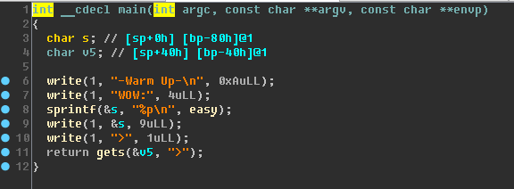
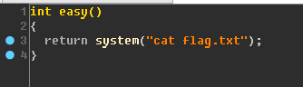
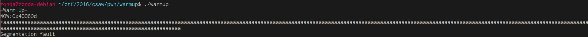

# warm up [50]

## Problem

## Solution

將檔案丟進IDA:   

發現第8行有個叫easy的奇怪東西，跟過去看，發現他會返回system("cat flag.txt")後，再將它的記憶體位址輸出出來。      

實際把程式跑起來看:   
發現它會真的會輸出一個記憶體位址   

再來TryTry，發現它有Buffer OverFlow的漏洞   

然後現在得知它會輸出system("cat flag.txt")的位址，以及它有BOF的漏洞，因此我們只要把RIP控制成他輸出給我們的位址，就能得到flag了。   

Exploit:[pass.py](pass.py)

