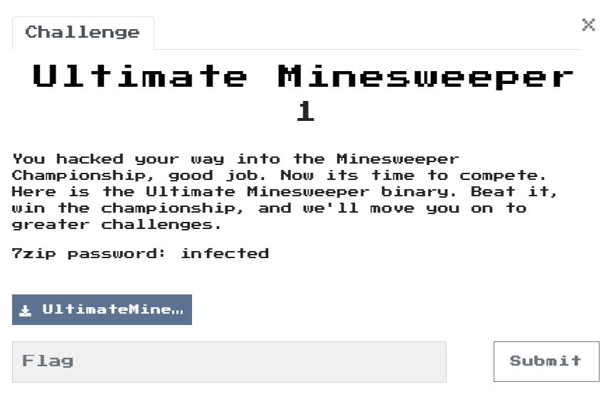
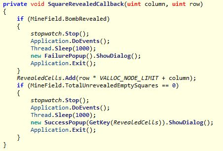
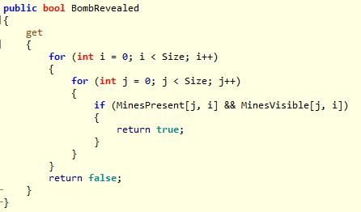
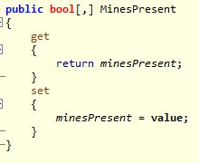
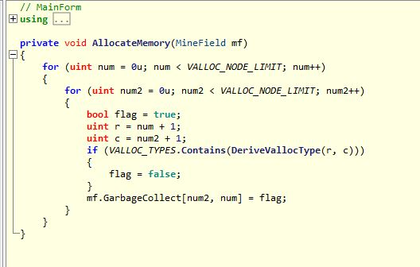
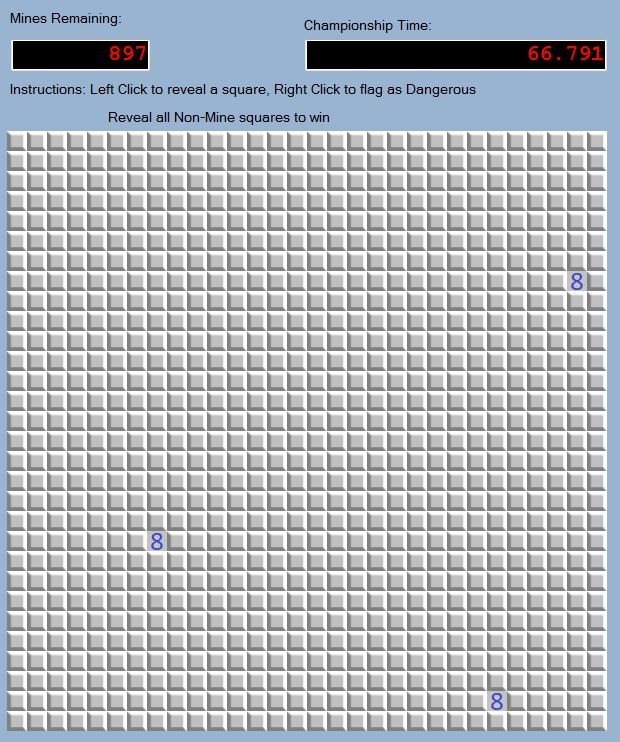

# Ultimate Minesweeper 1

## Program
  

## Solution
利用ILSPY分析
首先看到判斷要不要跳出失敗與成功視窗的地方　　
  
發現他會去看MineField.BombRevealed裡面的東西，來判斷是不是地雷。  

追進去看  
  
發現他會去看MinesPresent這個array是不是被標記成地雷。  

接下來找在哪裡設定他是不是地雷的。  
過程中都沒發現MinesPresent在哪裡有設定地雷，之後才發現有另一個叫做GarbageCollect的東西，跟它存取一樣的array。  
  
  
改尋找GarbageCollect，就發現到設定的地方了。  
  
分析完，寫出下面的東西來找出那些是我們要的座標，flag就蹦出來了。  

```c
#include <stdio.h>
#include <stdlib.h>

unsigned int VALLOC_TYPES[] = {
    4294966400,
    4294966657,
    4294967026
};
unsigned int VALLOC_NODE_LIMIT = 30;

unsigned int DeriveVallocType (int x, int y){
    return ~(x * VALLOC_NODE_LIMIT + y);
}

int main() {

    for (int x = 0; x < VALLOC_NODE_LIMIT; x++) {
        for (int y = 0; y < VALLOC_NODE_LIMIT; y++) {
            unsigned int result = DeriveVallocType(x+1, y+1);
            if (VALLOC_TYPES[0] == result || VALLOC_TYPES[1] == result || VALLOC_TYPES[2] == result) {
                printf("%d,%d\n", x, y);
            }
        }
    }

    return 0;
}
```
座標:  
7,28  
20,7  
28,24  

  
  

Flag: `Ch3aters_Alw4ys_W1n@flare-on.com`  