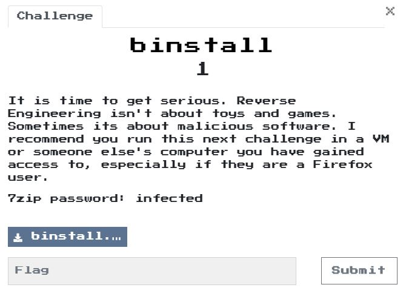
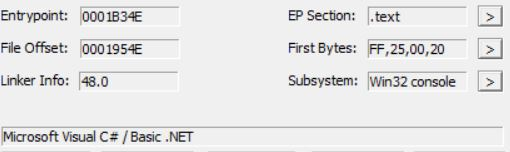
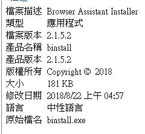
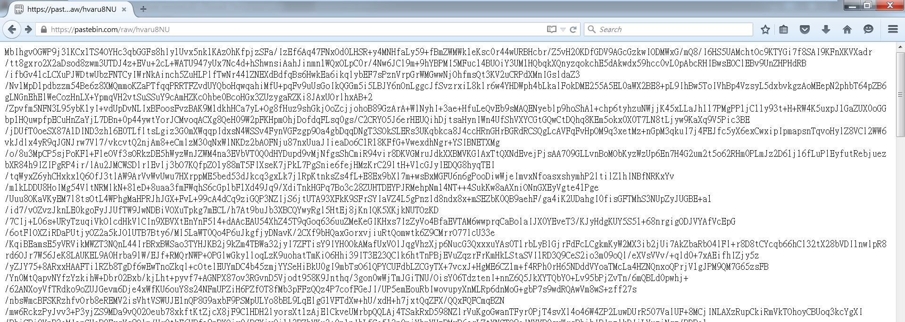
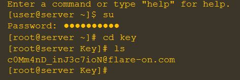

# binstall 1

## Program
  

## Solution

### Info
PEID:  
  
檔案內容->詳細資料:  
  
在這可以看到它是一個browser assistant installer以及題目中提及firefox，因此將重點放在firefox上。  


procmon:
- read:
  - C:\Users\a\AppData\Roaming\Mozilla\Firefox\profiles.ini  

- create file:
  - C:\Users\a\AppData\Local\Mozilla\Firefox\Profiles\90ffa2di.default\cache2\entries  
  - C:\Windows\Prefetch\BINSTALL.EXE-D647D415.pf  
  - C:\Users\a\AppData\Roaming\Microsoft\Internet Explorer\browserassist.dll  

- read reg:
  - HKLM\SOFTWARE\Microsoft\Windows NT\CurrentVersion\Image File Execution Options\DisableUserModeCallbackFilter  
  - HKLM\System\CurrentControlSet\Control\Session Manager  
  - HKLM\SOFTWARE\Wow6432Node\Microsoft\.NETFramework\Policy  

C:\Windows\Prefetch
C:\Users\a\AppData\Roaming\MICROS~1\INTERN~1\BROWSE~1.DLL


reg:
C:\Users\a\AppData\Roaming\MICROS~1\INTERN~1\BROWSE~1.DLL

`browserassist.dll`這個檔案看起來就很可疑。  
用procexp觀察，發現firefox會載入它。  
在x32dbg firefox的過程中，無意間發現有一個網址`pastebin.com`，繼續往下追發現`/raw/hvaru8NU`，感覺可能一個網址，就改成`https://pastebin.com/raw/hvaru8NU`發現竟然真的有這段網址。  

  
繼續分析後發現它是一段javascript加密後decode成base64的樣子，繼續trace程式，他後面會把他還原，分析後，發現他達成某些條件時，會去修改一些js檔案，猜測官網可以符合條件，進入後發現model.js, view.js, controller.js被修改過。  

開始解析這3個js，發現以下關鍵(有整理過，註解為後半段javascript解析出的結果):

model.js:  
```javascript
prevDir: '~',root : -1, password : '', passwordEntered : false,
```

view.js:  
```javascript
function askPassword(){
  model.curIndex++, model.lastValIndex = 0;
  var $code=$('<div class="cli">Password: <input type="password" id="command_'+model.curIndex+'"></input></div>');
  model.passwordEntered =! 0, $("#cmd-window").append($code), $("#command_"+model.curIndex).focus(), $("#command_"+model.curIndex).select()
}
function de(instr){ 
  for(var zzzzz, password = model.password, decode_str = atob(instr), number_list=[], zzzz = 0, ret_str = "", idx = 0; idx < 256; idx++)
    number_list[idx] = idx;
  for(idx = 0; idx < 256; idx++) {
    zzzz = (zzzz + number_list[idx] + password.charCodeAt(idx % password.length)) % 256;
    zzzzz = number_list[idx];
    number_list[idx] = number_list[zzzz];
    number_list[zzzz] = zzzzz;
  }
  for(var y = zzzz = idx = 0; y < decode_str.length; y++) {
    zzzz = (zzzz + number_list[idx = (idx + 1) % 256]) % 256;
    zzzzz = number_list[idx];
    number_list[idx] = number_list[zzzz];
    number_list[zzzz] = zzzzz;
    ret_str += String.fromCharCode(decode_str.charCodeAt(y) ^ number_list[(number_list[idx] + number_list[zzzz]) % 256]);
  return ret_str
}
else if (d === /*Key*/(27).toString(36).toLowerCase().split('').map(function(A){return String.fromCharCode(A.charCodeAt()+(-39))}).join('')+(function(){var E=Array.prototype.slice.call(arguments),O=E.shift();return E.reverse().map(function(s,j){return String.fromCharCode(s-O-52-j)}).join('')})(7,160)+(34).toString(36).toLowerCase()) {
  $( '#cmd-window' ).append( de(/*gpIzGaQsgnuIY4xEef8/Gci1SJTqgMgGm5GXFufxXzl4jumXUNoL3QEWi4ZEO0jZ/vqQl7w=*/(function(){var A=Array.prototype.slice.call(arguments),f=A.shift();return A.reverse().map(function(E,v){return String.fromCharCode(E-f-22-v)}).join('')})(1,89,97,142,140,107,157,88,124,107,150,142,134,145,110,125,98,148,98,136,126)+(23).toString(36).toLowerCase().split('').map(function(S){return String.fromCharCode(S.charCodeAt()+(-39))}).join('')+(16201).toString(36).toLowerCase()+(1286).toString(36).toLowerCase().split('').map(function(v){return String.fromCharCode(v.charCodeAt()+(-39))}).join('')+(10).toString(36).toLowerCase().split('').map(function(p){return String.fromCharCode(p.charCodeAt()+(-13))}).join('')+(function(){var V=Array.prototype.slice.call(arguments),P=V.shift();return V.reverse().map(function(i,f){return String.fromCharCode(i-P-11-f)}).join('')})(59,171,202,183,197,149,166,148,129,184,145,176,149,174,183)+(2151800446).toString(36).toLowerCase()+(515).toString(36).toLowerCase().split('').map(function(Z){return String.fromCharCode(Z.charCodeAt()+(-13))}).join('')+(30).toString(36).toLowerCase().split('').map(function(G){return String.fromCharCode(G.charCodeAt()+(-39))}).join('')+(24).toString(36).toLowerCase()+(28).toString(36).toLowerCase().split('').map(function(W){return String.fromCharCode(W.charCodeAt()+(-39))}).join('')+(3).toString(36).toLowerCase()+(1209).toString(36).toLowerCase().split('').map(function(u){return String.fromCharCode(u.charCodeAt()+(-39))}).join('')+(13).toString(36).toLowerCase().split('').map(function(U){return String.fromCharCode(U.charCodeAt()+(-13))}).join('')+(652).toString(36).toLowerCase()+(16).toString(36).toLowerCase().split('').map(function(l){return String.fromCharCode(l.charCodeAt()+(-13))}).join('')+(function(){var D=Array.prototype.slice.call(arguments),R=D.shift();return D.reverse().map(function(L,H){return String.fromCharCode(L-R-50-H)}).join('')})(36,159,216,151,203,175,206,210,138,180,195,136,166,155)) );
  view.addCmd();
}
```

controller.js:  
```javascript
if (model.passwordEntered =! 1 , 10===p.length&&123==(16^p.charCodeAt(0))&&p.charCodeAt(1)<<2==228&&p.charCodeAt(2)+44===142&&p.charCodeAt(3)>>3==14&&p.charCodeAt(4)===parseInt(function(){var h=Array.prototype.slice.call(arguments),k=h.shift();return h.reverse().map(function(m,W){return String.fromCharCode(m-k-24-W)}).join("")}(50,124)+4..toString(36).toLowerCase(),31)&&p.charCodeAt(5)-109==-22&&64==(p.charCodeAt(3)<<4&255)&&5*p.charCodeAt(6)===parseInt(function(){var n=Array.prototype.slice.call(arguments),M=n.shift();return n.reverse().map(function(r,U){return String.fromCharCode(r-M-16-U)}).join("")}(22,107)+9..toString(36).toLowerCase(),19)&&p.charCodeAt(7)+14==="xyz".charCodeAt(1)&&3*(6*(p.charCodeAt(8)-50)+14)==17+parseInt(function(){var l=Array.prototype.slice.call(arguments),f=l.shift();return l.reverse().map(function(O,o){return String.fromCharCode(O-f-30-o)}).join("")}(14,93)+6..toString(36).toLowerCase(),8)-1+12&&3+(p.charCodeAt(9)+88-1)/2===p.charCodeAt(0))
  model.root=1,model.password=p;
```
解析結果:  
p.charCodeAt(0) = 107 = "k"  
p.charCodeAt(1) = 57 = "9"  
p.charCodeAt(2) = 98 = "b"  
p.charCodeAt(3) = 116 = "t"  
p.charCodeAt(4) = 66 = "B"  
p.charCodeAt(5) = 87 = "W"  
p.charCodeAt(6) = 55 = "7"  
p.charCodeAt(7) = 107 = "k"  
p.charCodeAt(8) = 50 = "2"  
p.charCodeAt(9) = 121 = "y"  
model.password = "k9btBW7k2y"

最終:
```javascript
model.password = "k9btBW7k2y"
de("gpIzGaQsgnuIY4xEef8/Gci1SJTqgMgGm5GXFufxXzl4jumXUNoL3QEWi4ZEO0jZ/vqQl7w=")
"<div class="cli">c0Mm4nD_inJ3c7ioN@flare-on.com</div>"
```

依據分析過程發現，可以用cmd來操作取得flag。  
  

Flag: `c0Mm4nD_inJ3c7ioN@flare-on.com`