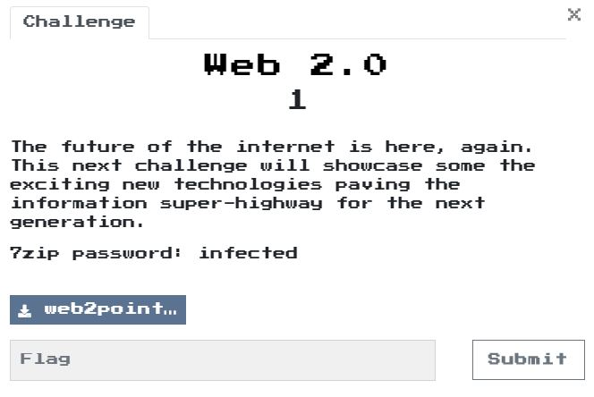

# Web 2.0 1

## Program
  

## Solution
剛開始傻傻的一個一個人工decomplier，後來受不了才找到JEB有出wasm的decomplier，就反來分析。  

```c
int global_var = 66592;

int Match (pa, a.byteLength, pb, b.byteLength) {
int Match (var0, var1, var2, var3) {
    int var6 = global_var - 32;
    global_var = 66560;
    var6[11] = 0;
    if ((func9(pa, a.byteLength, pb, b.byteLength, &var6[11]) != 0) == 0) {
        var6[28] = 0;
    }
    else {
        var6[28] = 1 & var6[11];
    }
    global_var = 32 + var6;
    return var6[28];
}

int f9(int pa, int a.length, int pb, int b.length, int par4) {
    int r2 = g0 - 64;
    r2[32] = 0;
    pa_ptr = pa;
    r2[24] = 0;
    while (1) {
        int r14 = 0
        if (pa + a.length > pa_ptr) {
            r14 = r2[24] < b.length;
        }
        
        if ((r14 & 1) != 0) {
            r2[63] = *pa_ptr;
            r2[23] = r2[63] & 15;
            
            if (r2[23] >= 7) {
                r2[56] = 112;
                goto loc_50000C21;
            }
            else {
                r2[16] = *(r2[23] * 4 + 1024);
                r2[15] = 0
                r2[8] = 0;
                int var144 = *(r2[16] * 4 + gvar_40000000)(r2[8], r2[15], a.length - (pa_ptr - pa), pa_ptr);
                if (var144 != 0) {
                    break;
                }
                else {
                    if (*(pb + r2[24]) == r2[15]) {
                        r2[32] = r2[32] + 1;
                    }
                    pa_ptr = pa_ptr + r2[8];
                    r2[24] = r2[24] + 1;
                }
            }
        }
        else {
            break;
        }
    }
    
    *par4 = pa + a.length != pa_ptr ? 0: r2[32] != b.length? 0: 1;
    r2[56] = 0;
loc_50000C21:
    return r2[56]
}
```

發現他在f9的`*(pb + r2[24]) == r2[15]`這裡，會去判斷pb[?]是否等於r2[15]，猜測就是flag，因此用chrome在下面的地方下斷點，將r2[15]一一dump出來，就等於flag了。
```
set_local 83
get_local 82
get_local 83
i32.eq
```

dump出:  
```
[119, 97, 115, 109, 95, 114, 117, 108, 101, 122,
95, 106, 115, 95, 100, 114, 111, 111, 108, 122,
64, 102, 108, 97, 114, 101, 45, 111, 110, 46,
99, 111, 109]  
```

Flag: `wasm_rulez_js_droolz@flare-on.com`  

## Reference
[WABT: The WebAssembly Binary Toolkit](https://github.com/WebAssembly/wabt)  
  - [wasm2wat demo](https://cdn.rawgit.com/WebAssembly/wabt/aae5a4b7/demo/wasm2wat/)  
  - [wat2wasm demo](https://cdn.rawgit.com/WebAssembly/wabt/aae5a4b7/demo/wat2wasm/)  

[WebAssembly Studio](https://github.com/wasdk/WebAssemblyStudio)  
[了解 WebAssembly 的基礎使用方法](https://blog.techbridge.cc/2017/06/17/webassembly-js-future/)  
[走近WebAssembly之調試大法](https://hk.saowen.com/a/08c2537da50b6ee6bc15d77db5d8ffb628c7a55786f3d7ba108680f6529f254e)  
[JEB](https://www.pnfsoftware.com/jeb/demowasm)  