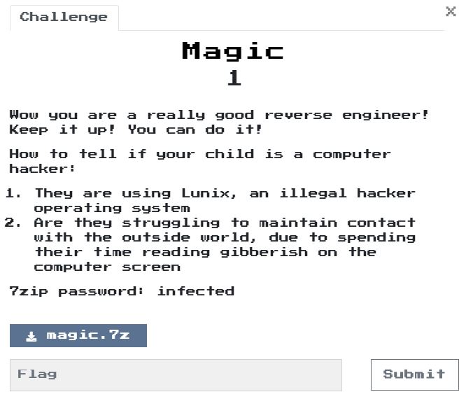

# Magic 1

## Program
  

## Solution
分析後就是，他總共會執行666次input的判斷，而總共有7種判斷，每次執行完都會去修改自己，讓每次的7種判斷順序都不一樣。  

後來寫了個GDB Script([script_magic.py](script_magic.py))搭配[magic_pass.py](magic_pass.py)去幫我執行。　　

Flag: `mag!iC_mUshr00ms_maY_h4ve_g!ven_uS_Santa_ClaUs@flare-on.com`  

# Reference  
[[ERROR] IDA 加载dump binary 报错 + 反编译报错wrong basic type sizes in compiler settings](https://blog.csdn.net/think_ycx/article/details/80465624)  