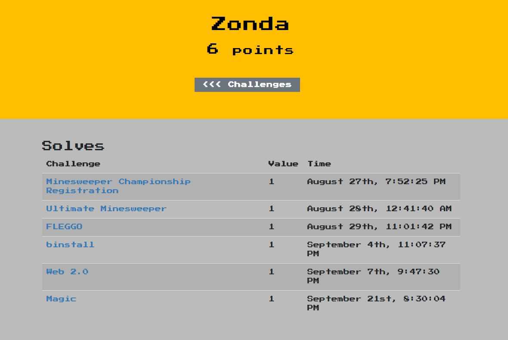

# 2018 Flare-On

最終成績:  
  

大概3年前知道FireEye每年會舉辦這個Challenge，  
本來是去年就要參加來玩玩看，但剛好去當兵，而今年本來差點忘記有這挑戰，剛好看到有人po相關訊息才跟到，所以就利用下班時間來玩玩瞜!  
從解題過程中真的學到蠻多東西(web assembly, gdb script等等...)，題目也蠻好玩的，雖然沒達到自己的目標8題，但還是覺得很開心~  
