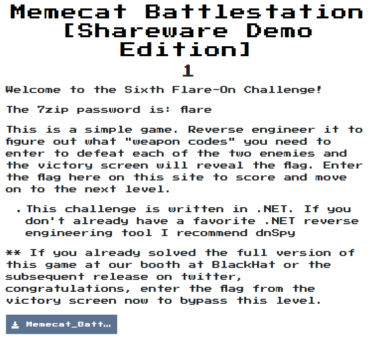
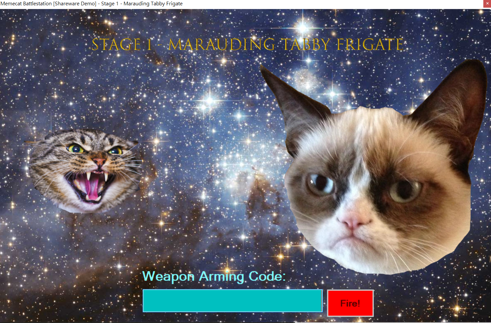
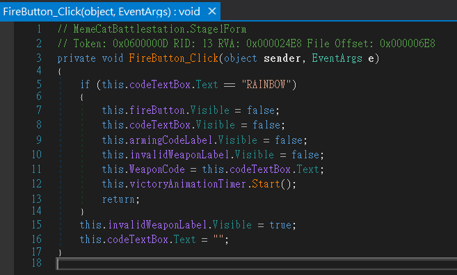
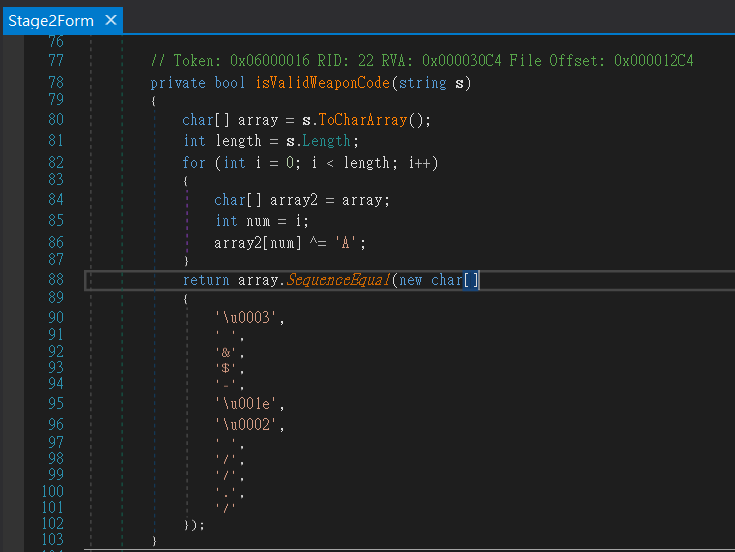

# Memecat Battlestation [Shareware Demo Edition]

## Problem
  

## Solution

打開檔案，是一個遊戲  
  

用dnSpy掃過一次圖檔，發現共有兩關。  
分析一下檔案結構後，會看到Stage1Form, Stage2Form，猜測主要的code應該分別在這2個檔案中，  
再仔細看一下找到2個關鍵的code  
Stage1From:  
  
Stage2Form:
  

Stage1很簡單的輸入`RAINBOW`就過關  
然後Stage2就稍微算一下:  
```python
encode_list = ['\u0003', ' ', '&', '$', '-', '\u001e', '\u0002', ' ', '/', '/', '.', '/']
answer = ""
for i in encode_list:
    answer += chr(ord(i) ^ ord('A'))
# answer = Bagel_Cannon
```
輸入`Bagel_Cannon`後就拿到flag了。  

  
