# Mugatu

## Problem
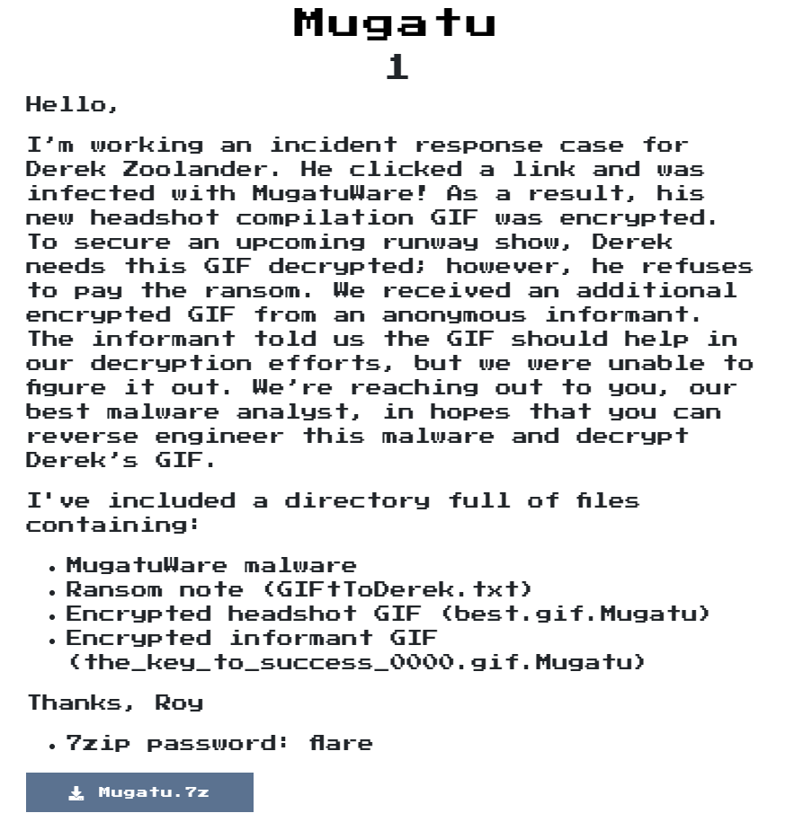  

## Solution

會將`SAMELO0K`放到memory中  
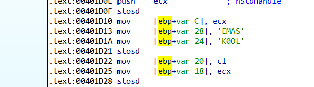  

發現他call CreateMutexA，用`handle -a |findstr /C:Mutant /C:pid:`或`handle -a -p %YOUR_PID`，的確看到他Create了一個`CrazyPills!!!`的Mutex  

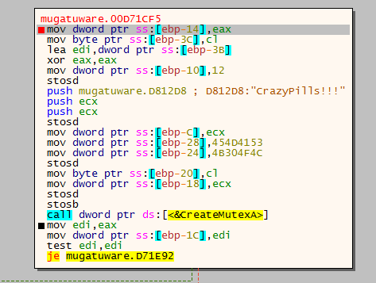  
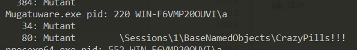  

他會將現在的process id轉成hex格式，並將它設為環境變數的名稱和值  
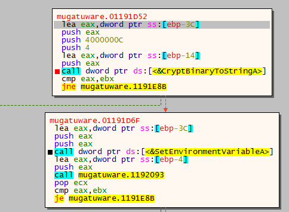  

他會去init WSAStartUP，因此猜測會用到socket，以及拿取hostname  
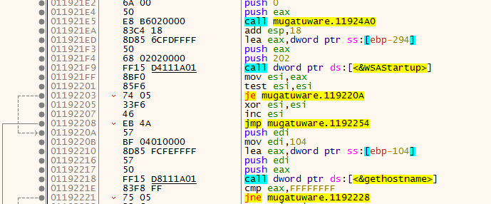  

再拿取host的ip address並存在`0x00417255`  

取得系統版本，我是用Win7，而getVersionExW取得:
* dwMajorVersion: 6 = The operating system is Windows Vista or Windows Server 2008.
* dwMinorVersion: 1 = The operating system is Windows XP.
* dwBuildNumber: 0x1D1B
轉存成6-1-7601到`0x41735A`中  
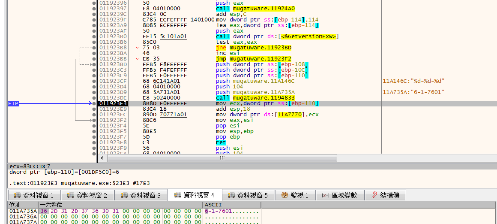  


分析完他做的事情後，他會將剛剛收集到的訊息存起來  
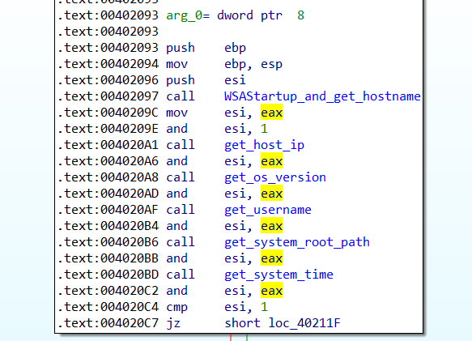  
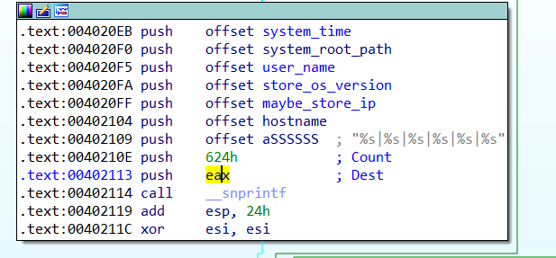  
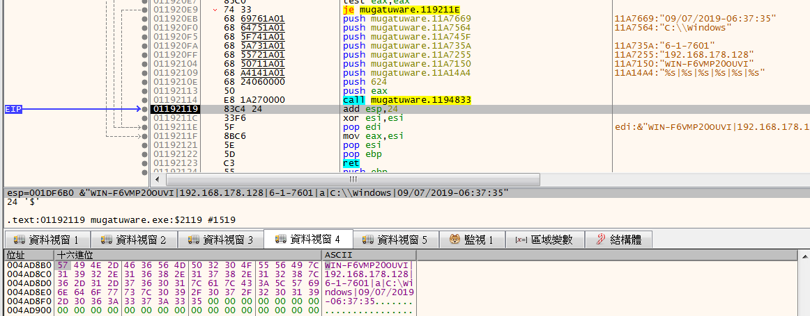  

抓取`http://twitrss.me/twitter_user_to_rss/?user=ACenterForAnts`的[內容](twitrss.me.xml)  
拿到第一個item跟pudata的位址後，他會將剛剛取得的system info和item內容做xor  
也就是將`WIN-F6VMP20oUVI|192.168.197.132|6-1-7601|a|C:\Windows|09/07/2019-07:33:05`與`I&#x27;m done,Jaco. I got a prostate the size of a honeydew...and a head full of bad memories.`做xor，目的應該是為了混淆system info  
(PS: 我system info IP有改變是因為原本是run在無網路下做分析，後來發現他會抓檔案後，重開對外網路，因此IP有改變)  
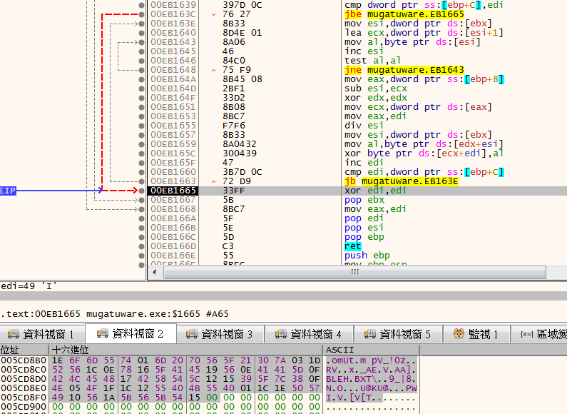  

之後會將0x1faeeee + system info length + xor後的值做base64成`7u6sH0kAAAAeb21VdAFtIHBWXyEwegMdUlYcDngWX0FFGVYOQUFdD0JMRUgXQlhUXBIVOV98OA9OBU8fHBJVQEtVQAEcHlBXSRBWGltWW1QV`  
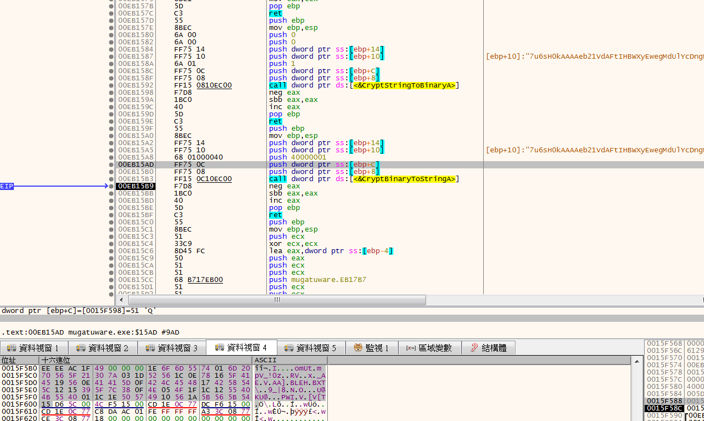  

將日期轉成widchar後，組一個新字串  
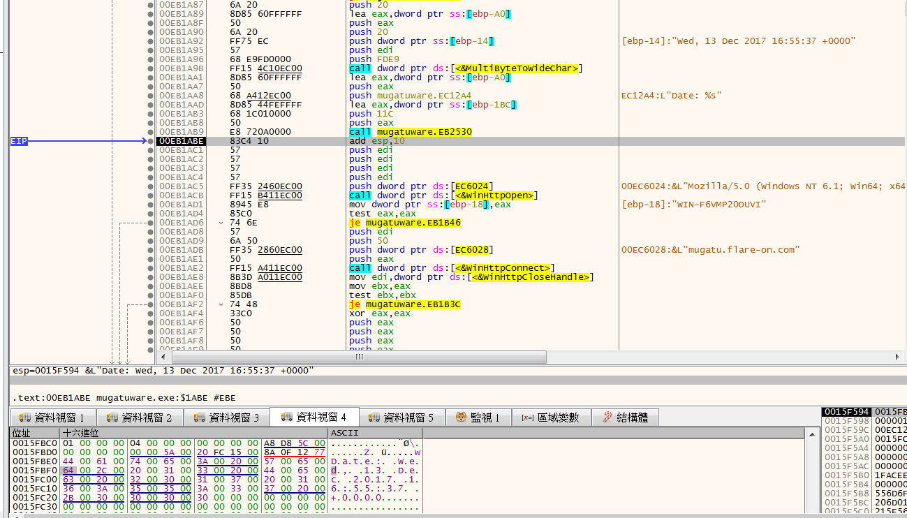  

之後會對mugatu.flare-on.com:80發出POST的Request，並將header設為剛剛的日期字串以及送出base64過的字串
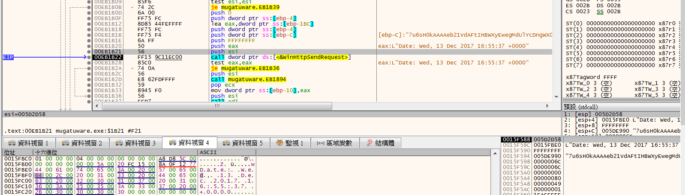  

拿到返回的字串後，先decode base64然後對0x19個字xor M，然後再比較與`orange mocha frappuccino`是否相同，相同的話就會去Create一個thread  

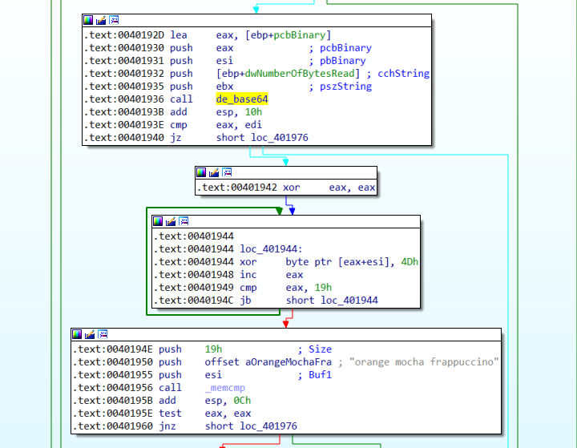  
所以寫個simplehttpserver來當假的CC server  

```python
from http.server import BaseHTTPRequestHandler, HTTPServer
import time
import cgi
import base64

host_name = "localhost"
host_port = 80

key_prefix = "orange mocha frappuccino\x00"
encode_key_prefix = ""
for i in key_prefix:
    encode_key_prefix += chr(ord(i) ^ 0x4d)


class MyServer(BaseHTTPRequestHandler):
    def _set_response(self):
        self.send_response(200)
        self.send_header('Content-type', 'text/html')
        self.end_headers()

    def do_GET(self):
        self.send_response(200)
        self.send_header("Content-type", "text/html")
        self.end_headers()
        self.wfile.write("yoooooooooooooooo".encode())

    def do_POST(self):
        content_length = int(self.headers['Content-Length'])
        post_data = self.rfile.read(content_length)
        print(f"POST request,\nPath: {str(self.path)}\nHeaders:\n{str(self.headers)}\n\nBody:\n{post_data.decode('utf-8')}\n")

        self._set_response()
        send_message = (encode_key_prefix + ("A" * 0x40)).encode('utf-8')
        self.wfile.write(base64.b64encode(send_message))

myServer = HTTPServer((host_name, host_port), MyServer)
print(f"{time.asctime()} Server Starts - {host_name}:{host_port}")

try:
    myServer.serve_forever()
except KeyboardInterrupt:
    pass

myServer.server_close()
print(f"{time.asctime()} Server Stops - {host_name}:{host_port}")
```

之後trace到這段code時，發現他會產生一個dll檔  
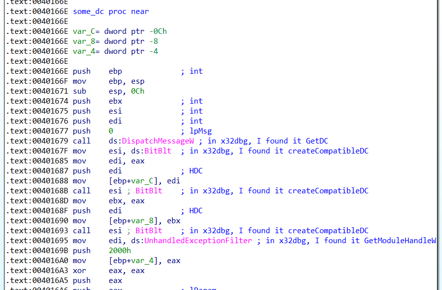  

之後他會去parse他的export table 找到一個叫做BlueSteel的function，並creat 一個thread去執行BlueSteel("CrazyPills!!!")  
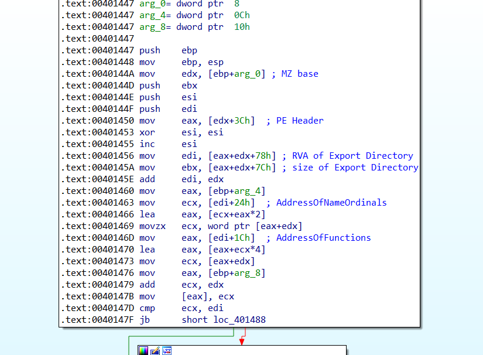  
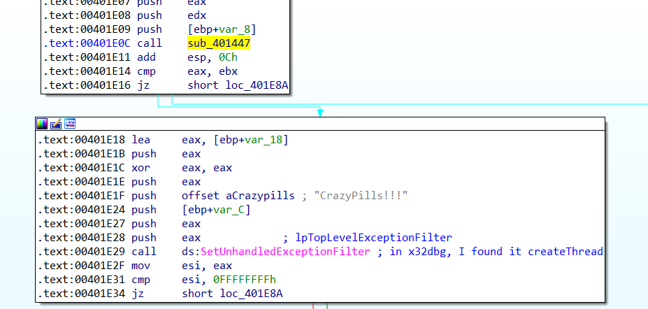  

並在memory中發現有意義的string  
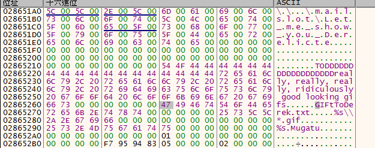  

剛開始他會去和之前開啟的mailSlot做通訊以及設置Event，
然後他會去尋找可以用的硬碟drive  
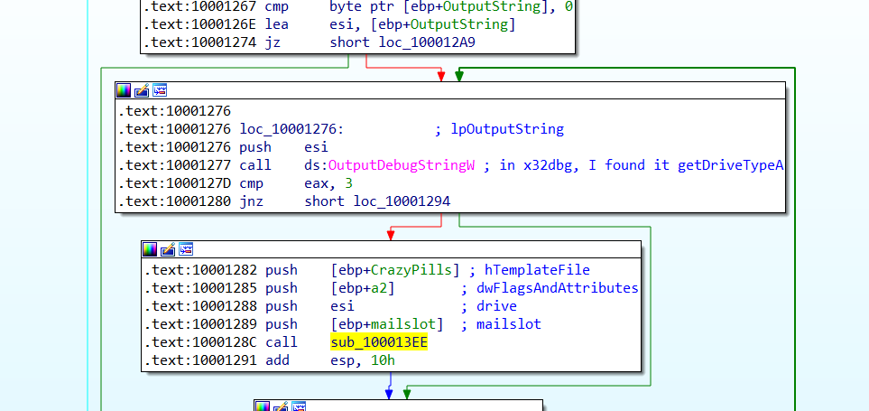  

找到硬碟drive後，會開始搜尋硬碟下的所有資料夾與檔案，然後將資料夾名跟`really, really, really, ridiculously good looking gifs`做比對，  
找到後，會去找這資料夾底下的所有gif檔，  
取得gif檔後，開始進行加密，他是以8bytes為單位對gif做加密，所使用的key是當初CC server回傳值`orange mocha frappuccino`後的14bytes + really, really, really, ridiculously good looking gifs

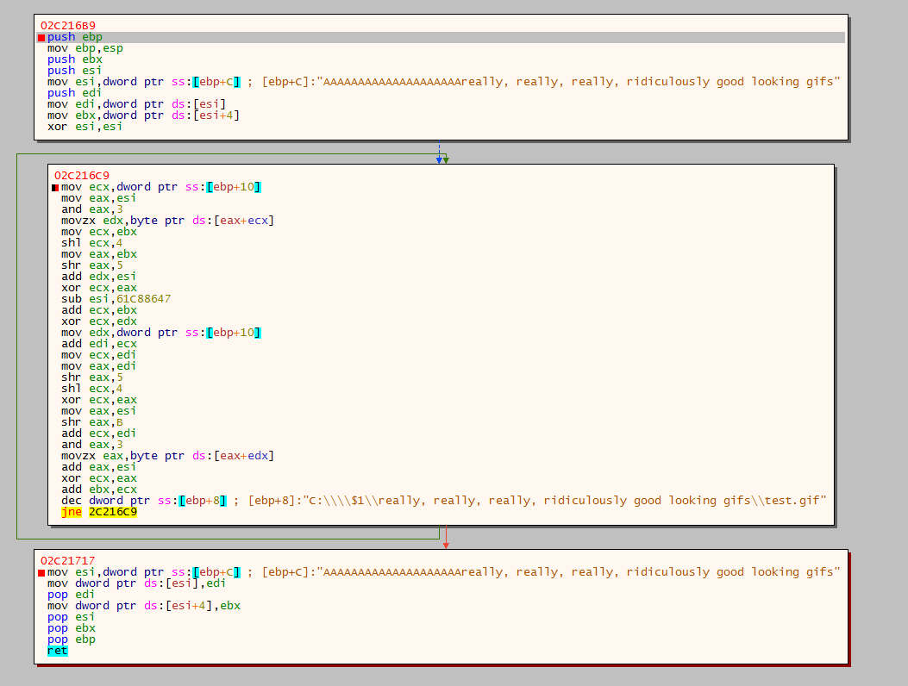  

example:
```python

edi = 0x38464947
ebx = 0x02c16139
esi = 0
key = "AAAA"
count = 0x20

for i in range(count):
    edx = ((ord(key[esi & 3]) & 0xff) + esi) & 0xffffffff
    esi = ((esi - 0x61c88647) + 0x100000000) & 0xffffffff
    edi = (((((ebx << 4) ^ (ebx >> 5)) + ebx) ^ edx) + edi) & 0xffffffff
    ecx = (((edi << 4) ^ (edi >> 5)) + edi) & 0xffffffff
    ecx = (((ord(key[(esi >> 0xb) & 3]) & 0xff) + esi) ^ ecx) & 0xffffffff
    ebx = (ebx + ecx) & 0xffffffff

print(f"gif 1: {hex(edi)}")
print(f"gif 2: {hex(ebx)}")
```

Decrypt: [XTEA](https://en.wikipedia.org/wiki/XTEA)  
```python
edi = 0x464bdbb1#0x38464947
ebx = 0x22bf0349#0x02c16139
esi = 0
key = "A" * 4
count = 0x20

esi = 0x9E3779B9 * count
for i in range(count):
    ecx = (((edi << 4) ^ (edi >> 5)) + edi) & 0xffffffff
    edx_2 = ((ord(key[(esi >> 0xb) & 3]) & 0xff) + esi) & 0xffffffff
    ebx = (ebx - (edx_2 ^ ecx)) & 0xffffffff

    esi = ((esi + 0x61c88647)) & 0xffffffff

    edx = ((ord(key[esi & 3]) & 0xff) + esi) & 0xffffffff
    edi = (edi - ((((ebx << 4) ^ (ebx >> 5)) + ebx) ^ edx)) & 0xffffffff

print(f"gif 1: {hex(edi)}")
print(f"gif 2: {hex(ebx)}")
print("=" * 35)
```

但因為python實在是太慢了，所以改用c寫  
```c
// decrypt.c
#include <stdio.h>
#include <stdlib.h>


void decipher(unsigned int num_rounds, unsigned int v[2], unsigned int key[4]) {
    unsigned int i;
    unsigned int v0 = v[0], v1 = v[1], delta = 0x9E3779B9, sum = delta * num_rounds;
    for (i=0; i < num_rounds; i++) {
        v1 -= (((v0 << 4) ^ (v0 >> 5)) + v0) ^ (sum + key[(sum>>11) & 3]);
        sum -= delta;
        v0 -= (((v1 << 4) ^ (v1 >> 5)) + v1) ^ (sum + key[sum & 3]);
    }
    v[0] = v0; v[1] = v1;
}


int main() {
    unsigned int edi = 0x4ee2f5c8;
    unsigned int ebx = 0x6b97f416;
    unsigned int v[2] = {edi, ebx};
    unsigned int key[4] = {'\x00', '\x00', '\x00', '\x00'};

    decipher(0x20, v, key);
    printf("%d: 0x%x\n", v[0], v[0]);
    printf("%d: 0x%x\n", v[1], v[1]);

    return 0;
}
```

```c
// find_key.c
#include <stdio.h>
#include <stdlib.h>


void decipher(unsigned int num_rounds, unsigned int v[2], unsigned int key[4]) {
    unsigned int i;
    unsigned int v0 = v[0], v1 = v[1], delta = 0x9E3779B9, sum = delta * num_rounds;
    for (i=0; i < num_rounds; i++) {
        v1 -= (((v0 << 4) ^ (v0 >> 5)) + v0) ^ (sum + key[(sum>>11) & 3]);
        sum -= delta;
        v0 -= (((v1 << 4) ^ (v1 >> 5)) + v1) ^ (sum + key[sum & 3]);
    }
    v[0] = v0; v[1] = v1;
}


int main() {
    unsigned int target = 0x38464947;
    unsigned int edi = 0x50b08e24;
    unsigned int ebx = 0x6f68b2e8;
    unsigned int v[2] = {edi, ebx};
    unsigned int key[4] = {'\x00', '\x00', '\x00', '\x00'};

    for (unsigned int i = 0; i <= 0xff; i++) {
        for (unsigned int j = 0; j <= 0xff; j++) {
            for (unsigned int x = 0; x <= 0xff; x++) {
                for (unsigned int y = 0; y <= 0xff; y++) {
                    v[0] = edi;
                    v[1] = ebx;
                    key[0] = i;
                    key[1] = j;
                    key[2] = x;
                    key[3] = y;
                    decipher(0x20, v, key);
                    if (v[0] == target) {
                        printf("key: 0x%x, 0x%x, 0x%x, 0x%x\n", key[0], key[1], key[2], key[3]);
                        i = 0x100;
                        j = 0x100;
                        x = 0x100;
                        y = 0x100;
                        break;
                    }
                }
            }
        }
    }
    return 0;
}
```

find key: 0x31, 0x73, 0x35, 0xb1

```c
// decrypt_file.c
#include <stdio.h>
#include <stdlib.h>


void decipher(unsigned int num_rounds, unsigned int v[2], unsigned char key[4]) {
    unsigned int i;
    unsigned int v0 = v[0], v1 = v[1], delta = 0x9E3779B9, sum = delta * num_rounds;
    for (i=0; i < num_rounds; i++) {
        v1 -= (((v0 << 4) ^ (v0 >> 5)) + v0) ^ (sum + key[(sum>>11) & 3]);
        sum -= delta;
        v0 -= (((v1 << 4) ^ (v1 >> 5)) + v1) ^ (sum + key[sum & 3]);
    }
    v[0] = v0; v[1] = v1;
}


int main() {
    unsigned int edi;
    unsigned int ebx;
    unsigned int v[2] = {edi, ebx};
    unsigned char key[4] = {'\x31', '\x73', '\x35', '\xb1'};

    FILE *fp;
    if((fp = fopen("best.gif.Mugatu", "rb")) == NULL) {
        printf("open file error!!\n");
        system("PAUSE");
        return 0;
    }

    FILE *fp_out;
    if((fp_out = fopen("best.gif", "wb")) == NULL) {
        printf("open file error!!\n");
        system("PAUSE");
        return 0;
    }

    while (!feof(fp)) {
        fread(v, sizeof(unsigned int), 2, fp);

        decipher(0x20, v, key);

        if (!feof(fp)) {
            fwrite(v, sizeof(unsigned int), 2, fp_out);
        }
    }

    fclose(fp);
    fclose(fp_out);
    return 0;
}
```

  