# vv_max

## Problem
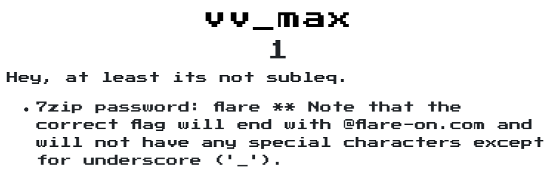  

## Solution

argc 必須等於 3，所以要輸入2個參數，  
第一個參數長度 4 ~ 32  
第二個參數長度 == 32  
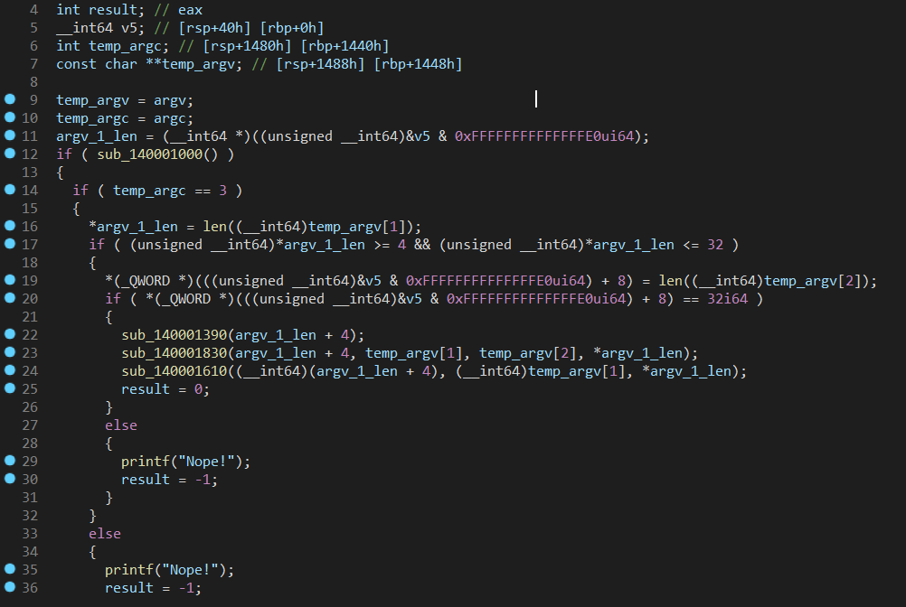  

他會去比較base_data_ptr + 0x800 + 0x280和base_data_ptr + 0x800 + 0x40一不一樣，而用不同參數輸入後比較，base_data_ptr + 0x800 + 0x280都不會變動，因此猜測我們要讓輸入的值計算後等於他  
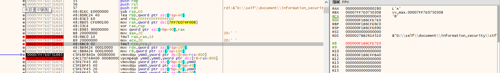  

發現33行中的程式是在比較第二個參數和第三個參數一不一樣，且長度為第四個參數，因此發現是比較a2和`FLARE2019`是否相等，而a2為主程式輸入的第一個參數  
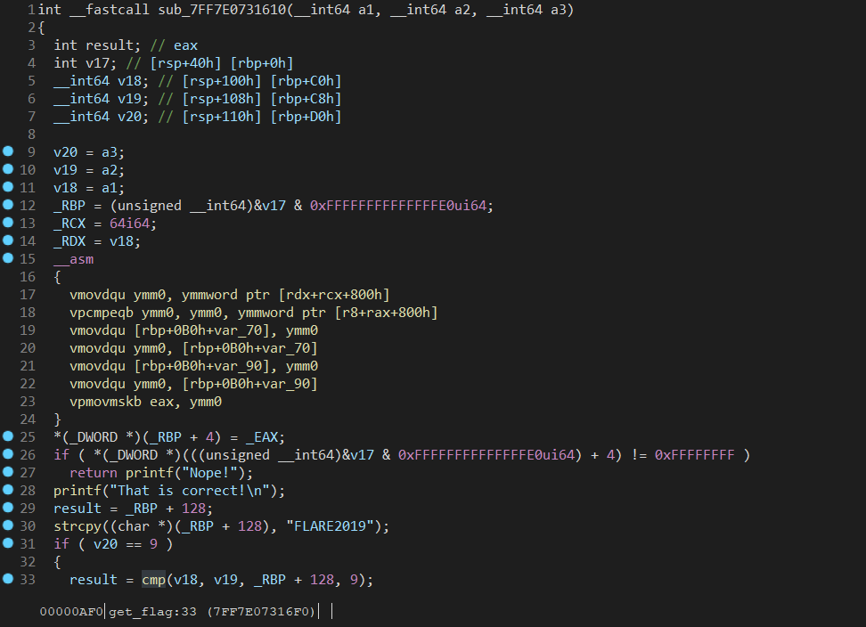  

後來修改了很多次輸入後，發現它會以第2個參數每4個bytes為一組編成3個bytes  

之後他會去init 一個function table，而在觀察call 的次數後，會發現很多function永遠不會執行，先把他們標注出來  
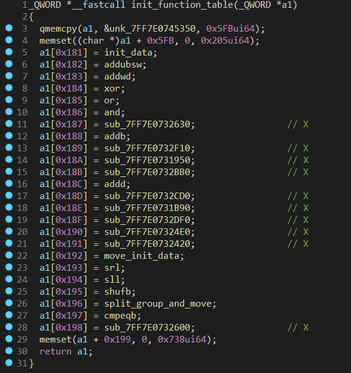  
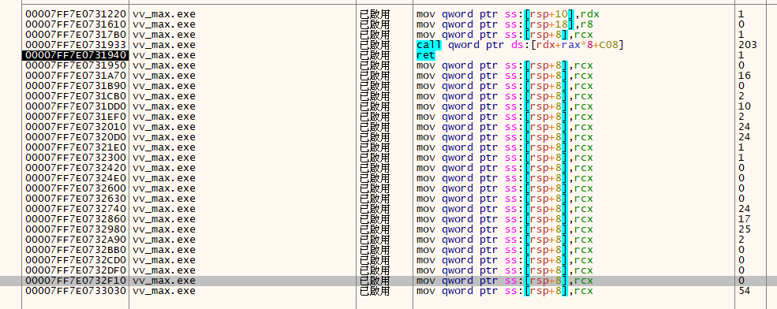  

首先，第一個被call的function(0x00007FF7E07317B0)，  
目的為: 將預設的Data搬進rbp + 0x20 和 rcx + 0x800 + rax中  
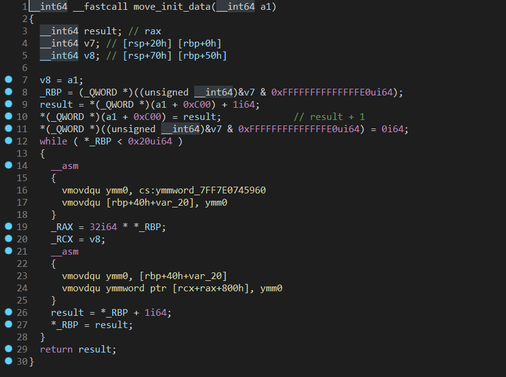  

第2個被call的function(0x00007FF7E0732010)，  
目的為: 搬運第一個參數->第二個參數->上面init data開頭為11 01後的data->上面init data開頭為11 02後的data->以此類推(當找不到11 xx時，補零)  
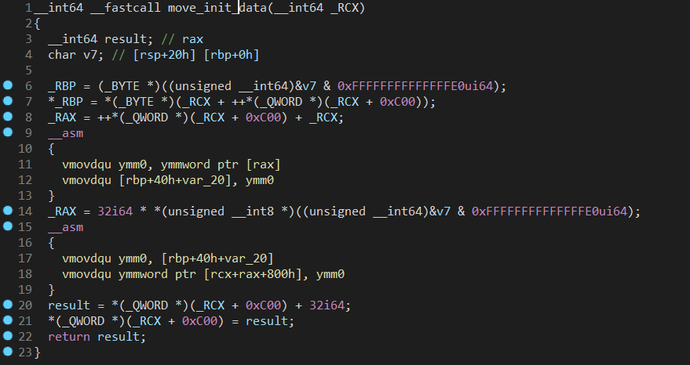  
Src:
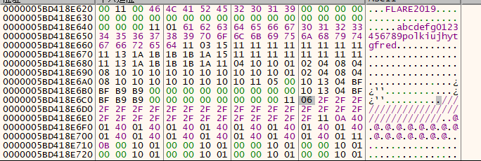  
Target:
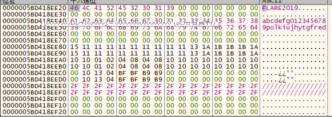  

第三個被call的function(0x00007FF7E0732860)，  
目的為: 將第一個參數切成每4個byte唯一組，並重複8次後放進memory中，總共做8次(因為第一個參數最大長度為32)，而他剛好也是依據data中0, 1, 2, 3...7的順序放入  
  
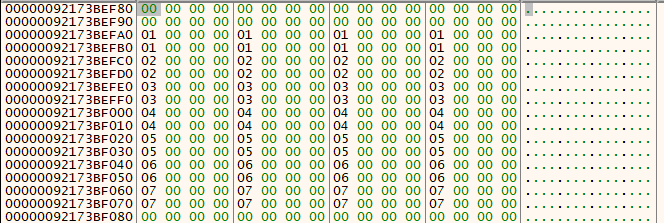  
  

第四個被call的function(0x00007FF7E0732980)，  
目的為: 將參數右移，他第一次被call時，是將第二個參數右移4位  
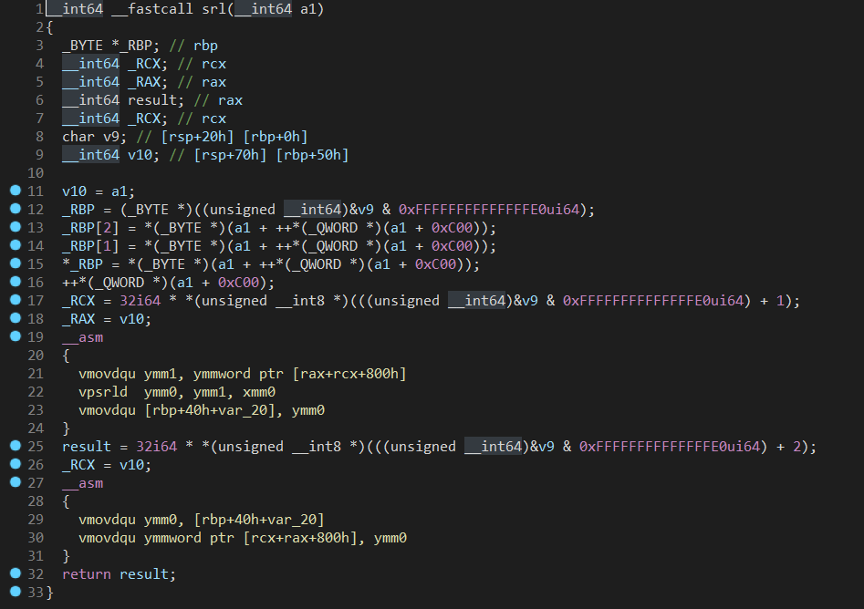  
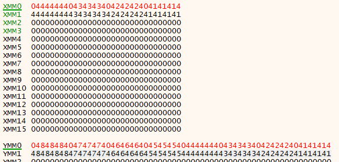  

第五個被call的function(0x0x00007FF7E0733030)，  
目的為: 將分組放入的資料做xor  
  
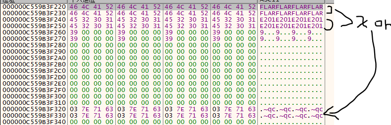  
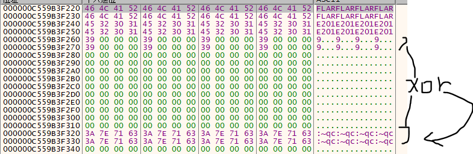  

第六個被call的functoin(0x0x00007FF7E0731DD0)，  
目的為: 將剛剛被右移的data跟某些數值做and  
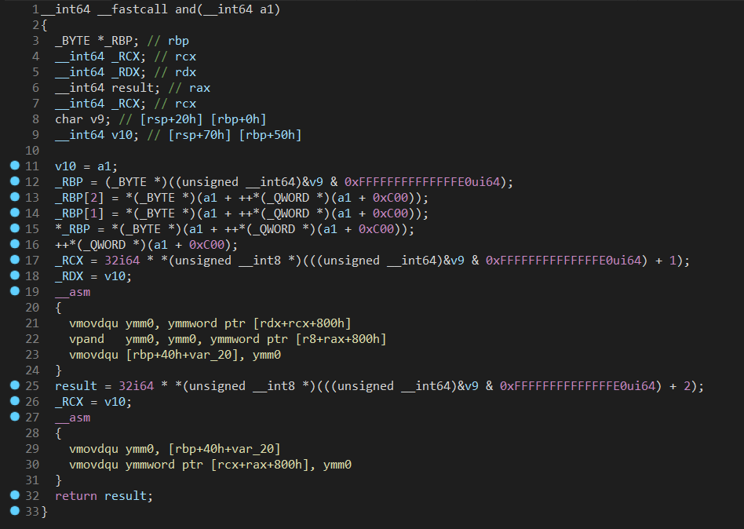  
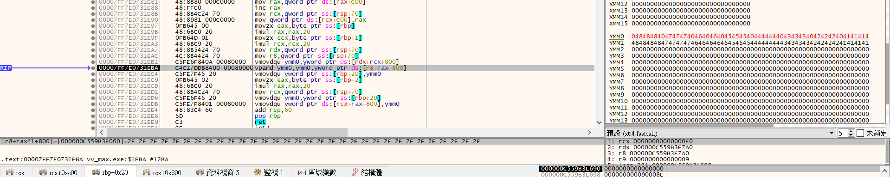  
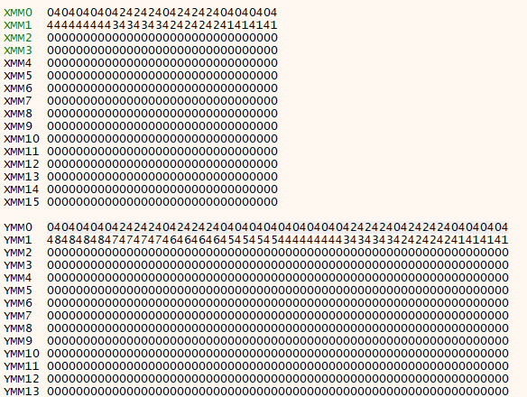  

分析到一半發現它應該只有部分跟arg2相關，因此先列出call function的順序表:
```text
  1 | 0x00007FF7E07317B0 | function name: init_data            | count:   1 | c00:   1
  2 | 0x00007FF7E0732010 | function name: move_init_data       | count:  22 | c00:  35
  3 | 0x00007FF7E0732860 | function name: ermd                 | count:   8 | c00:  39
  4 | 0x00007FF7E0732980 | function name: srl                  | count:   1 | c00:  43
  5 | 0x00007FF7E0733030 | function name: xor                  | count:   7 | c00:  47
  6 | 0x00007FF7E0731DD0 | function name: and                  | count:   1 | c00:  51
  7 | 0x00007FF7E07320D0 | function name: sll                  | count:   1 | c00:  55
  8 | 0x00007FF7E0732980 | function name: srl                  | count:   1 | c00:  59
  9 | 0x00007FF7E0732740 | function name: or                   | count:   1 | c00:  63
 10 | 0x00007FF7E0731EF0 | function name: cmpeqb               | count:   1 | c00:  67
 11 | 0x00007FF7E07320D0 | function name: sll                  | count:   1 | c00:  71
 12 | 0x00007FF7E0732980 | function name: srl                  | count:   1 | c00:  75
 13 | 0x00007FF7E0732740 | function name: or                   | count:   1 | c00:  79
 14 | 0x00007FF7E0733030 | function name: xor                  | count:   1 | c00:  83
 15 | 0x00007FF7E0731EF0 | function name: cmpeqb               | count:   1 | c00:  87
 16 | 0x00007FF7E07320D0 | function name: sll                  | count:   1 | c00:  91
 17 | 0x00007FF7E0732980 | function name: srl                  | count:   1 | c00:  95
 18 | 0x00007FF7E0732740 | function name: or                   | count:   1 | c00:  99
 19 | 0x00007FF7E0733030 | function name: xor                  | count:   2 | c00: 103
 20 | 0x00007FF7E0731DD0 | function name: and                  | count:   1 | c00: 107
 21 | 0x00007FF7E0733030 | function name: xor                  | count:   1 | c00: 111
 22 | 0x00007FF7E0731A70 | function name: addd                 | count:   2 | c00: 115
 23 | 0x00007FF7E0731CB0 | function name: addb                 | count:   1 | c00: 119
 24 | 0x00007FF7E0733030 | function name: xor                  | count:   1 | c00: 123
 25 | 0x00007FF7E0732860 | function name: ermd                 | count:   1 | c00: 127
 26 | 0x00007FF7E0732A90 | function name: shufb                | count:   1 | c00: 131
 27 | 0x00007FF7E07320D0 | function name: sll                  | count:   1 | c00: 135
 28 | 0x00007FF7E0732980 | function name: srl                  | count:   1 | c00: 139
 29 | 0x00007FF7E0732740 | function name: or                   | count:   1 | c00: 143
 30 | 0x00007FF7E07320D0 | function name: sll                  | count:   1 | c00: 147
 31 | 0x00007FF7E0732980 | function name: srl                  | count:   1 | c00: 151
 32 | 0x00007FF7E0732740 | function name: or                   | count:   1 | c00: 155
 33 | 0x00007FF7E0733030 | function name: xor                  | count:   1 | c00: 159
 34 | 0x00007FF7E07320D0 | function name: sll                  | count:   1 | c00: 163
 35 | 0x00007FF7E0732980 | function name: srl                  | count:   1 | c00: 167
 36 | 0x00007FF7E0732740 | function name: or                   | count:   1 | c00: 171
 37 | 0x00007FF7E0733030 | function name: xor                  | count:   1 | c00: 175
 38 | 0x00007FF7E0731CB0 | function name: addb                 | count:   1 | c00: 179
 39 | 0x00007FF7E0733030 | function name: xor                  | count:   1 | c00: 183
 40 | 0x00007FF7E0731DD0 | function name: and                  | count:   1 | c00: 187
 41 | 0x00007FF7E0733030 | function name: xor                  | count:   1 | c00: 191
 42 | 0x00007FF7E0731A70 | function name: addd                 | count:   2 | c00: 195
 43 | 0x00007FF7E0733030 | function name: xor                  | count:   1 | c00: 199
 44 | 0x00007FF7E0732860 | function name: ermd                 | count:   1 | c00: 203
 45 | 0x00007FF7E0733030 | function name: xor                  | count:   1 | c00: 207
 46 | 0x00007FF7E07320D0 | function name: sll                  | count:   1 | c00: 211
 47 | 0x00007FF7E0732980 | function name: srl                  | count:   1 | c00: 215
 48 | 0x00007FF7E0732740 | function name: or                   | count:   1 | c00: 219
 49 | 0x00007FF7E07320D0 | function name: sll                  | count:   1 | c00: 223
 50 | 0x00007FF7E0732980 | function name: srl                  | count:   1 | c00: 227
 51 | 0x00007FF7E0732740 | function name: or                   | count:   1 | c00: 231
 52 | 0x00007FF7E0733030 | function name: xor                  | count:   1 | c00: 235
 53 | 0x00007FF7E07320D0 | function name: sll                  | count:   1 | c00: 239
 54 | 0x00007FF7E0732980 | function name: srl                  | count:   1 | c00: 243
 55 | 0x00007FF7E0732740 | function name: or                   | count:   1 | c00: 247
 56 | 0x00007FF7E0733030 | function name: xor                  | count:   1 | c00: 251
 57 | 0x00007FF7E0732300 | function name: addubsw              | count:   1 | c00: 255
 58 | 0x00007FF7E0733030 | function name: xor                  | count:   1 | c00:   3
 59 | 0x00007FF7E0731DD0 | function name: and                  | count:   1 | c00:   7
 60 | 0x00007FF7E0733030 | function name: xor                  | count:   1 | c00:  11
 61 | 0x00007FF7E0731A70 | function name: addd                 | count:   2 | c00:  15
 62 | 0x00007FF7E0733030 | function name: xor                  | count:   1 | c00:  19
 63 | 0x00007FF7E0732860 | function name: ermd                 | count:   1 | c00:  23
 64 | 0x00007FF7E0733030 | function name: xor                  | count:   1 | c00:  27
 65 | 0x00007FF7E07320D0 | function name: sll                  | count:   1 | c00:  31
 66 | 0x00007FF7E0732980 | function name: srl                  | count:   1 | c00:  35
 67 | 0x00007FF7E0732740 | function name: or                   | count:   1 | c00:  39
 68 | 0x00007FF7E07320D0 | function name: sll                  | count:   1 | c00:  43
 69 | 0x00007FF7E0732980 | function name: srl                  | count:   1 | c00:  47
 70 | 0x00007FF7E0732740 | function name: or                   | count:   1 | c00:  51
 71 | 0x00007FF7E0733030 | function name: xor                  | count:   1 | c00:  55
 72 | 0x00007FF7E07320D0 | function name: sll                  | count:   1 | c00:  59
 73 | 0x00007FF7E0732980 | function name: srl                  | count:   1 | c00:  63
 74 | 0x00007FF7E0732740 | function name: or                   | count:   1 | c00:  67
 75 | 0x00007FF7E0733030 | function name: xor                  | count:   1 | c00:  71
 76 | 0x00007FF7E07321E0 | function name: addwd                | count:   1 | c00:  75
 77 | 0x00007FF7E0733030 | function name: xor                  | count:   1 | c00:  79
 78 | 0x00007FF7E0731DD0 | function name: and                  | count:   1 | c00:  83
 79 | 0x00007FF7E0733030 | function name: xor                  | count:   1 | c00:  87
 80 | 0x00007FF7E0731A70 | function name: addd                 | count:   2 | c00:  91
 81 | 0x00007FF7E0733030 | function name: xor                  | count:   1 | c00:  95
 82 | 0x00007FF7E0732860 | function name: ermd                 | count:   1 | c00:  99
 83 | 0x00007FF7E0733030 | function name: xor                  | count:   1 | c00: 103
 84 | 0x00007FF7E07320D0 | function name: sll                  | count:   1 | c00: 107
 85 | 0x00007FF7E0732980 | function name: srl                  | count:   1 | c00: 111
 86 | 0x00007FF7E0732740 | function name: or                   | count:   1 | c00: 115
 87 | 0x00007FF7E07320D0 | function name: sll                  | count:   1 | c00: 119
 88 | 0x00007FF7E0732980 | function name: srl                  | count:   1 | c00: 123
 89 | 0x00007FF7E0732740 | function name: or                   | count:   1 | c00: 127
 90 | 0x00007FF7E0733030 | function name: xor                  | count:   1 | c00: 131
 91 | 0x00007FF7E07320D0 | function name: sll                  | count:   1 | c00: 135
 92 | 0x00007FF7E0732980 | function name: srl                  | count:   1 | c00: 139
 93 | 0x00007FF7E0732740 | function name: or                   | count:   1 | c00: 143
 94 | 0x00007FF7E0733030 | function name: xor                  | count:   2 | c00: 147
 95 | 0x00007FF7E0731DD0 | function name: and                  | count:   1 | c00: 151
 96 | 0x00007FF7E0733030 | function name: xor                  | count:   1 | c00: 155
 97 | 0x00007FF7E0731A70 | function name: addd                 | count:   2 | c00: 159
 98 | 0x00007FF7E0733030 | function name: xor                  | count:   1 | c00: 163
 99 | 0x00007FF7E0732860 | function name: ermd                 | count:   1 | c00: 167
100 | 0x00007FF7E0733030 | function name: xor                  | count:   1 | c00: 171
101 | 0x00007FF7E07320D0 | function name: sll                  | count:   1 | c00: 175
102 | 0x00007FF7E0732980 | function name: srl                  | count:   1 | c00: 179
103 | 0x00007FF7E0732740 | function name: or                   | count:   1 | c00: 183
104 | 0x00007FF7E07320D0 | function name: sll                  | count:   1 | c00: 187
105 | 0x00007FF7E0732980 | function name: srl                  | count:   1 | c00: 191
106 | 0x00007FF7E0732740 | function name: or                   | count:   1 | c00: 195
107 | 0x00007FF7E0733030 | function name: xor                  | count:   1 | c00: 199
108 | 0x00007FF7E07320D0 | function name: sll                  | count:   1 | c00: 203
109 | 0x00007FF7E0732980 | function name: srl                  | count:   1 | c00: 207
110 | 0x00007FF7E0732740 | function name: or                   | count:   1 | c00: 211
111 | 0x00007FF7E0733030 | function name: xor                  | count:   2 | c00: 215
112 | 0x00007FF7E0731DD0 | function name: and                  | count:   1 | c00: 219
113 | 0x00007FF7E0733030 | function name: xor                  | count:   1 | c00: 223
114 | 0x00007FF7E0731A70 | function name: addd                 | count:   2 | c00: 227
115 | 0x00007FF7E0733030 | function name: xor                  | count:   1 | c00: 231
116 | 0x00007FF7E0732860 | function name: ermd                 | count:   1 | c00: 235
117 | 0x00007FF7E0733030 | function name: xor                  | count:   1 | c00: 239
118 | 0x00007FF7E0732A90 | function name: shufb                | count:   1 | c00: 243
119 | 0x00007FF7E07320D0 | function name: sll                  | count:   1 | c00: 247
120 | 0x00007FF7E0732980 | function name: srl                  | count:   1 | c00: 251
121 | 0x00007FF7E0732740 | function name: or                   | count:   1 | c00: 255
122 | 0x00007FF7E07320D0 | function name: sll                  | count:   1 | c00:   3
123 | 0x00007FF7E0732980 | function name: srl                  | count:   1 | c00:   7
124 | 0x00007FF7E0732740 | function name: or                   | count:   1 | c00:  11
125 | 0x00007FF7E0733030 | function name: xor                  | count:   1 | c00:  15
126 | 0x00007FF7E07320D0 | function name: sll                  | count:   1 | c00:  19
127 | 0x00007FF7E0732980 | function name: srl                  | count:   1 | c00:  23
128 | 0x00007FF7E0732740 | function name: or                   | count:   1 | c00:  27
129 | 0x00007FF7E0733030 | function name: xor                  | count:   2 | c00:  31
130 | 0x00007FF7E0731DD0 | function name: and                  | count:   1 | c00:  35
131 | 0x00007FF7E0733030 | function name: xor                  | count:   1 | c00:  39
132 | 0x00007FF7E0731A70 | function name: addd                 | count:   2 | c00:  43
133 | 0x00007FF7E0733030 | function name: xor                  | count:   1 | c00:  47
134 | 0x00007FF7E0732860 | function name: ermd                 | count:   1 | c00:  51
135 | 0x00007FF7E0733030 | function name: xor                  | count:   1 | c00:  55
136 | 0x00007FF7E07320D0 | function name: sll                  | count:   1 | c00:  59
137 | 0x00007FF7E0732980 | function name: srl                  | count:   1 | c00:  63
138 | 0x00007FF7E0732740 | function name: or                   | count:   1 | c00:  67
139 | 0x00007FF7E07320D0 | function name: sll                  | count:   1 | c00:  71
140 | 0x00007FF7E0732980 | function name: srl                  | count:   1 | c00:  75
141 | 0x00007FF7E0732740 | function name: or                   | count:   1 | c00:  79
142 | 0x00007FF7E0733030 | function name: xor                  | count:   1 | c00:  83
143 | 0x00007FF7E07320D0 | function name: sll                  | count:   1 | c00:  87
144 | 0x00007FF7E0732980 | function name: srl                  | count:   1 | c00:  91
145 | 0x00007FF7E0732740 | function name: or                   | count:   1 | c00:  95
146 | 0x00007FF7E0733030 | function name: xor                  | count:   1 | c00:  99
147 | 0x00007FF7E0732860 | function name: ermd                 | count:   1 | c00: 103
148 | 0x00007FF7E0733030 | function name: xor                  | count:   1 | c00: 107
149 | 0x00007FF7E0731DD0 | function name: and                  | count:   1 | c00: 111
150 | 0x00007FF7E0733030 | function name: xor                  | count:   1 | c00: 115
151 | 0x00007FF7E0731A70 | function name: addd                 | count:   2 | c00: 119
152 | 0x00007FF7E0733030 | function name: xor                  | count:   1 | c00: 123
153 | 0x00007FF7E0732860 | function name: ermd                 | count:   1 | c00: 127
154 | 0x00007FF7E0733030 | function name: xor                  | count:   1 | c00: 131
155 | 0x00007FF7E0732010 | function name: move_init_data       | count:   1 | c00: 165
156 | 0x00007FF7E0731DD0 | function name: and                  | count:   1 | c00: 169
```

然後繼續分析出相關的後，找出:

```text
a = arg2 >> 4 # 4
a &= 0x2f2f2f2f2f2f2f2f2f2f2f2f2f2f2f2f2f2f2f2f2f2f2f2f2f2f2f2f2f2f2f2f #6

b = arg2 (cmpeqb) 0x2f2f2f2f2f2f2f2f2f2f2f2f2f2f2f2f2f2f2f2f2f2f2f2f2f2f2f2f2f2f2f2f #10
b = arg2 (cmpeqb) 0x2f2f2f2f2f2f2f2f2f2f2f2f2f2f2f2f2f2f2f2f2f2f2f2f2f2f2f2f2f2f2f2f #15

a = a (add) b #23
a = a (shufb) 0x0000000000000000b9b9bfbf041310000000000000000000b9b9bfbf04131000 #26

c = arg2 (addb) a #38
a = c (addubsw) 0x0140014001400140014001400140014001400140014001400140014001400140 #57
c = a (addwd) 0x0001100000011000000110000001100000011000000110000001100000011000 #76
c = 0xFFFFFFFF0C0D0E08090A040506000102FFFFFFFF0C0D0E08090A040506000102 (shufb) c #118
c = c (ermb) 0xFFFFFFFFFFFFFFFF000000060000000500000004000000020000000100000000 #147
```

改寫成python  

```python
def srld(ymm1, xmm0):
    """
    srld ymm0, ymm1, xmm0
    return ymm0
    """
    ymm0 = 0
    for i in range(7, -1, -1):
        idx = i * (8 * 4)
        temp = ymm1 >> idx & 0xffffffff
        temp = temp >> xmm0
        ymm0 |= temp << idx
    return ymm0


def cmpeqb(ymm1, ymm2):
    """
    cmpeqb ymm0, ymm1, ymm2
    return ymm0
    """
    ymm0 = 0
    for i in range(31, -1, -1):
        idx = i * 8
        temp = (ymm1 >> idx) & 0xff
        temp2 = (ymm2 >> idx) & 0xff
        if temp == temp2:
            ymm0 |= 0xff << idx
    return ymm0


def addb(ymm1, ymm2):
    """
    addb ymm0, ymm1, ymm2
    return ymm0
    """
    ymm0 = 0
    for i in range(31, -1, -1):
        idx = i * 8
        temp = (ymm1 >> idx) & 0xff
        temp2 = (ymm2 >> idx) & 0xff
        temp3 = (temp + temp2) & 0xff
        ymm0 |= temp3 << idx
    return ymm0


def shufb(ymm1, ymm2):
    """
    shufb ymm0, ymm1, ymm2
    return ymm0
    """
    ymm0 = 0
    temp_ymm2 = ymm2 & 0xffffffffffffffffffffffffffffffff
    temp_ymm1 = ymm1 & 0xffffffffffffffffffffffffffffffff
    for i in range(15, -1, -1):
        idx = i * 8
        temp2 = ((temp_ymm2 >> idx) & 0xff) % 32
        temp3 = (temp_ymm1 >> (temp2 * 8)) & 0xff
        ymm0 |= temp3 << idx

    temp_ymm2 = ymm2 >> (16 * 8)
    temp_ymm1 = ymm1 >> (16 * 8)
    for i in range(15, -1, -1):
        idx = i * 8
        temp2 = ((temp_ymm2 >> idx) & 0xff) % 32
        temp3 = (temp_ymm1 >> (temp2 * 8)) & 0xff
        ymm0 |= temp3 << (idx + (16 * 8))
    return ymm0


def addubsw(ymm1, ymm2):
    """
    addubsw ymm0, ymm1, ymm2
    return ymm0
    """
    ymm0 = 0
    for i in range(30, -1, -2):
        idx = i * 8
        idx2 = (i + 1) * 8
        temp1_1 = (ymm1 >> idx) & 0xff
        temp1_2 = (ymm2 >> idx) & 0xff
        temp2_1 = (ymm1 >> idx2) & 0xff
        temp2_2 = (ymm2 >> idx2) & 0xff
        temp1 = temp1_1 * temp1_2
        temp2 = temp2_1 * temp2_2
        ymm0 |= ((temp1 + temp2) & 0xffff) << idx
    return ymm0


def addwd(ymm1, ymm2):
    """
    addwd ymm0, ymm1, ymm2
    return ymm0
    """
    ymm0 = 0
    for i in range(14, -1, -2):
        idx = i * 16
        idx2 = (i + 1) * 16
        temp1_1 = (ymm1 >> idx) & 0xffff
        temp1_2 = (ymm2 >> idx) & 0xffff
        temp2_1 = (ymm1 >> idx2) & 0xffff
        temp2_2 = (ymm2 >> idx2) & 0xffff
        temp1 = temp1_1 * temp1_2
        temp2 = temp2_1 * temp2_2
        ymm0 |= ((temp1 + temp2) & 0xffffffff) << idx
    return ymm0


def ermb(ymm1, ymm2):
    """
    ermb ymm0, ymm1, ymm2
    return ymm0
    """
    ymm0 = 0
    for i in range(7, -1, -1):
        idx = i * (8 * 4)
        temp = (ymm1 >> idx) & 0xffffffff
        temp2 = (ymm2 >> (temp * (8 * 4))) & 0xffffffff
        print(f"{idx}: {hex(temp)} {hex(temp2)}")
        ymm0 |= temp2 << idx
        print(hex(ymm0))
    return ymm0


temp_arg2 = "AABBABAB____________________??//"[::-1]
arg2 = int.from_bytes(temp_arg2.encode(), "big")

a = srld(arg2, 4) # 4
a &= 0x2f2f2f2f2f2f2f2f2f2f2f2f2f2f2f2f2f2f2f2f2f2f2f2f2f2f2f2f2f2f2f2f #6

b = cmpeqb(arg2, 0x2f2f2f2f2f2f2f2f2f2f2f2f2f2f2f2f2f2f2f2f2f2f2f2f2f2f2f2f2f2f2f2f) #10
b = cmpeqb(arg2, 0x2f2f2f2f2f2f2f2f2f2f2f2f2f2f2f2f2f2f2f2f2f2f2f2f2f2f2f2f2f2f2f2f) #15

a = addb(a, b) #23
a = shufb(0x0000000000000000b9b9bfbf041310000000000000000000b9b9bfbf04131000, a) #26

c = addb(arg2, a) # 38

a = addubsw(c, 0x0140014001400140014001400140014001400140014001400140014001400140) # 57
c = addwd(a, 0x0001100000011000000110000001100000011000000110000001100000011000) #76

c = shufb(c, 0xFFFFFFFF0C0D0E08090A040506000102FFFFFFFF0C0D0E08090A040506000102) #118
c = ermb(0xFFFFFFFFFFFFFFFF000000060000000500000004000000020000000100000000, c) #147
```

而目標是要找出0x00000000000000001EA1F3B229C845E81A861C08A82AA70A615ED201ACB27070  

開始逆推  

### 147

```text
    F         F        6        5         4        2       1         0  
0x00000000 00000000 1EA1F3B2 29C845E8 1A861C08 A82AA70A 615ED201 ACB27070  
=  
0xXXXXXXXX 1EA1F3B2 29C845E8 1A861C08 XXXXXXXX A82AA70A 615ED201 ACB27070  
```

### 118

```text
  FFFFFFFF 0C0D0E08 090A0405 06000102 FFFFFFFF 0C0D0E08 090A0405 06000102  
0xXXXXXXXX 1EA1F3B2 29C845E8 1A861C08 XXXXXXXX A82AA70A 615ED201 ACB27070  
=  
  0F0E0D0C 0B0A0908 07060504 03020100 0F0E0D0C 0B0A0908 07060504 03020100  
0xXXF3A11E XXC829B2 XX1AE845 XX081C86 XXA72AA8 XX5E610A XXAC01D2 XX7070B2  
````

### 76

每4bytes分2組互換每組為0??? 0???  

```text
0xXXF3A11E XXC829B2 XX1AE845 XX081C86 XXA72AA8 XX5E610A XXAC01D2 XX7070B2  
=  
0X011EXF3A 09B2XC82 0845x1AE 0C86X081 0AA8XA72 010AX5E6 01D2XAC0 00B2X707
````

### 57

目前只能得知

```text
0X011EXF3A 09B2XC82 0845x1AE 0C86X081 0AA8XA72 010AX5E6 01D2XAC0 00B2X707  
=  
0x E   A    2   2    5   E    6   1    8   2    A   6    2   0    2   7  
```

### 10 and 15

因為題目有說特殊符號只會有`_`，而0x2f是`/`，因此10和15永遠為0  

### 23

因15永遠為0，因此這裡不做改變  

### 26

會出現的數值00, 10, 13, 04, bf b9

經測試後:  

* 數字: 0x04
* 小寫字母: 0xb9
* 大寫字母: 0xbf
* 底線: 0xbf

### 38

|      組合    |    結果    |
|  ---------- | ------- |
|   0 + 0x4  | 0x34  |
|   1 + 0x4  | 0x35  |
|   2 + 0x4  | 0x36  |
|   3 + 0x4  | 0x37  |
|   4 + 0x4  | 0x38  |
|   5 + 0x4  | 0x39  |
|   6 + 0x4  | 0x3a  |
|   7 + 0x4  | 0x3b  |
|   8 + 0x4  | 0x3c  |
|   9 + 0x4  | 0x3d  |
|   a + 0xb9  | 0x1a  |
|   b + 0xb9  | 0x1b  |
|   c + 0xb9  | 0x1c  |
|   d + 0xb9  | 0x1d  |
|   e + 0xb9  | 0x1e  |
|   f + 0xb9  | 0x1f  |
|   g + 0xb9  | 0x20  |
|   h + 0xb9  | 0x21  |
|   i + 0xb9  | 0x22  |
|   j + 0xb9  | 0x23  |
|   k + 0xb9  | 0x24  |
|   l + 0xb9  | 0x25  |
|   m + 0xb9  | 0x26  |
|   n + 0xb9  | 0x27  |
|   o + 0xb9  | 0x28  |
|   p + 0xb9  | 0x29  |
|   q + 0xb9  | 0x2a  |
|   r + 0xb9  | 0x2b  |
|   s + 0xb9  | 0x2c  |
|   t + 0xb9  | 0x2d  |
|   u + 0xb9  | 0x2e  |
|   v + 0xb9  | 0x2f  |
|   w + 0xb9  | 0x30  |
|   x + 0xb9  | 0x31  |
|   y + 0xb9  | 0x32  |
|   z + 0xb9  | 0x33  |
|   A + 0xbf  | 0x0  |
|   B + 0xbf  | 0x1  |
|   C + 0xbf  | 0x2  |
|   D + 0xbf  | 0x3  |
|   E + 0xbf  | 0x4  |
|   F + 0xbf  | 0x5  |
|   G + 0xbf  | 0x6  |
|   H + 0xbf  | 0x7  |
|   I + 0xbf  | 0x8  |
|   J + 0xbf  | 0x9  |
|   K + 0xbf  | 0xa  |
|   L + 0xbf  | 0xb  |
|   M + 0xbf  | 0xc  |
|   N + 0xbf  | 0xd  |
|   O + 0xbf  | 0xe  |
|   P + 0xbf  | 0xf  |
|   Q + 0xbf  | 0x10  |
|   R + 0xbf  | 0x11  |
|   S + 0xbf  | 0x12  |
|   T + 0xbf  | 0x13  |
|   U + 0xbf  | 0x14  |
|   V + 0xbf  | 0x15  |
|   W + 0xbf  | 0x16  |
|   X + 0xbf  | 0x17  |
|   Y + 0xbf  | 0x18  |
|   Z + 0xbf  | 0x19  |
|   _ + 0xbf  | 0x1e  |

有了表，就可以開始猜測Flag囉!  

寫了一個python script幫我跑一下

```python
import string
from collections import defaultdict

orig_table = defaultdict(list)

value = 0x04
for i in string.digits:
    orig_table[(ord(i) + value) & 0xff].append(i)

value = 0xb9
for i in string.ascii_lowercase:
    orig_table[(ord(i) + value) & 0xff].append(i)

value = 0xbf
for i in string.ascii_uppercase:
    orig_table[(ord(i) + value) & 0xff].append(i)

value = 0xbf
i = "_"
orig_table[(ord(i) + value) & 0xff].append(i)


src = 0X011E0F3A09B20C82084501AE0C8600810AA80A72010A05E601D20AC000B20707

for i in range(30, -1, -2):
    idx = (8 * i)
    target = (src >> idx) & 0xffff
    temp_orig = target & 0xf

    print(f"== {hex(target)} ==")
    for y in range(0, 4):
        orig = temp_orig + (0x10 * y)
        if ((target - orig) % 0x40) == 0:
            orig2 = (target - orig) // 0x40

            if orig in orig_table.keys() and orig2 in orig_table.keys():
                print(f"{hex(orig)} {hex(orig2)}: {orig_table[orig]} {orig_table[orig2]}")
```

```text
== 0x11e ==
0x1e 0x4: ['e', '_'] ['E']
== 0xf3a ==
0x3a 0x3c: ['6'] ['8']
== 0x9b2 ==
0x32 0x26: ['y'] ['m']
== 0xc82 ==
0x2 0x32: ['C'] ['y']
== 0x845 ==
0x5 0x21: ['F'] ['h']
== 0x1ae ==
0x2e 0x6: ['u'] ['G']
== 0xc86 ==
0x6 0x32: ['G'] ['y']
== 0x81 ==
0x1 0x2: ['B'] ['C']
== 0xaa8 ==
0x28 0x2a: ['o'] ['q']
== 0xa72 ==
0x32 0x29: ['y'] ['p']
== 0x10a ==
0xa 0x4: ['K'] ['E']
== 0x5e6 ==
0x26 0x17: ['m'] ['X']
== 0x1d2 ==
0x12 0x7: ['S'] ['H']
== 0xac0 ==
0x0 0x2b: ['A'] ['r']
== 0xb2 ==
0x32 0x2: ['y'] ['C']
== 0x707 ==
0x7 0x1c: ['H'] ['c']
```

猜測arg2可能是`cHCyrAHSXmEKpyqoCByGGuhFyCmy86Ee`或`_HCyrAHSXmEKpyqoCByGGuhFyCmy86Ee`  

輸入後，flag就噴出來囉!!  

```text
λ .\vv_max.exe FLARE2019 cHCyrAHSXmEKpyqoCByGGuhFyCmy86Ee
That is correct!
Flag: AVX2_VM_M4K3S_BASE64_C0MPL1C4T3D@flare-on.com
```
