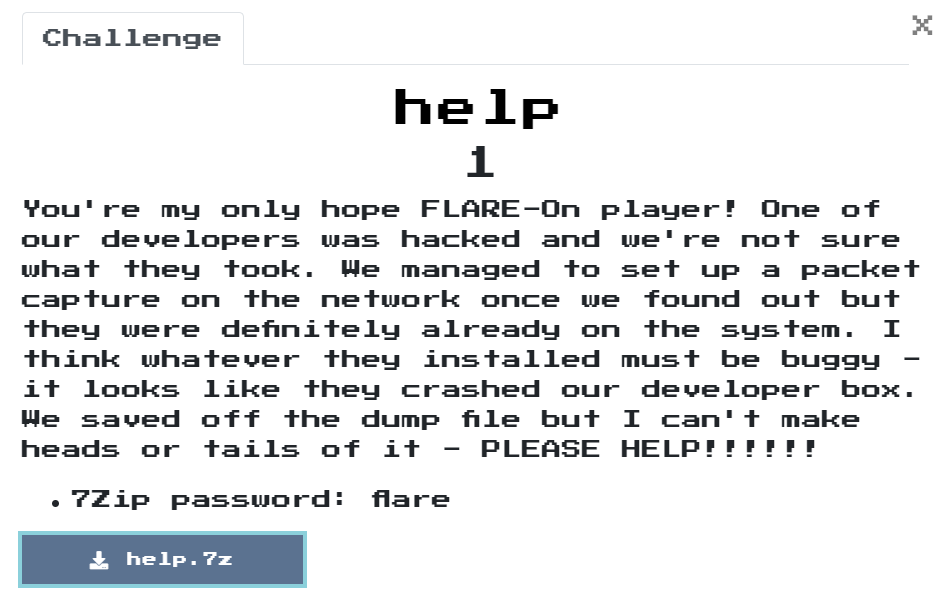
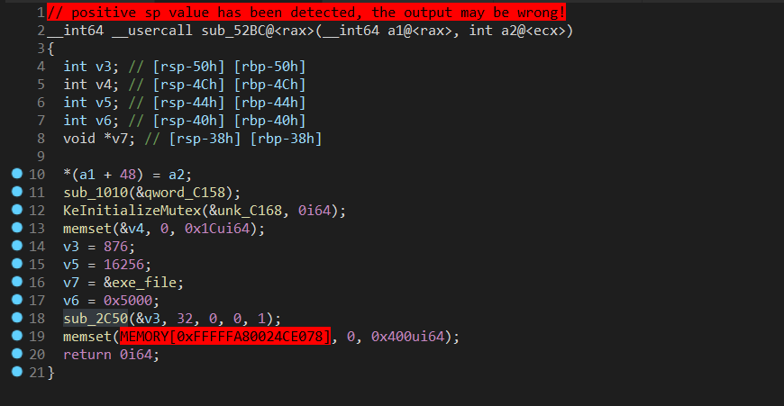
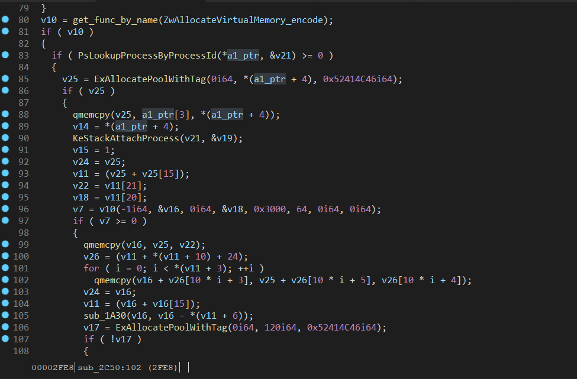
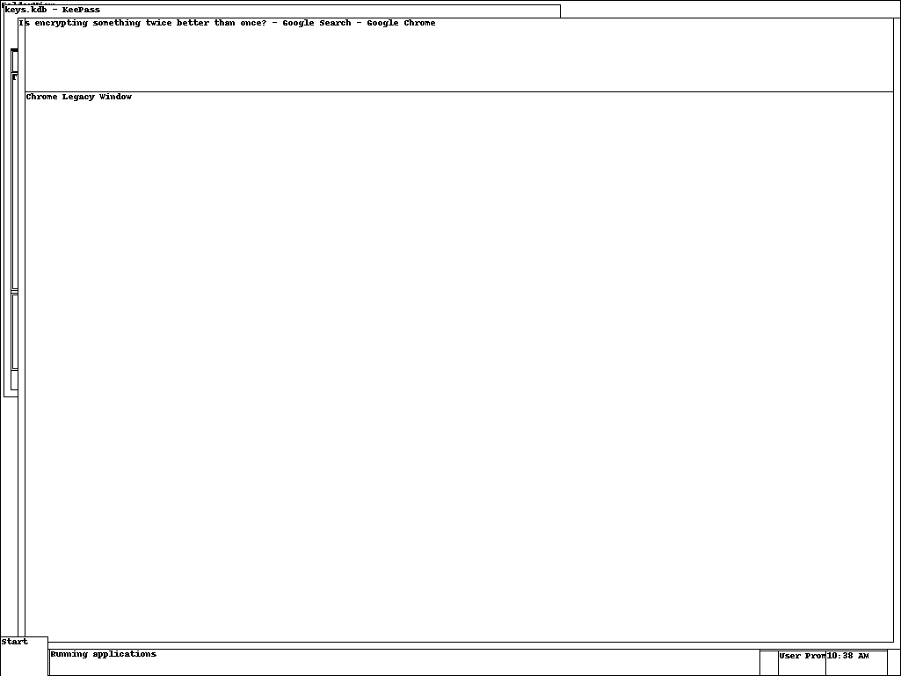
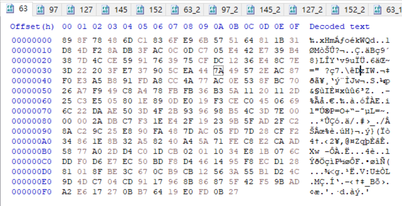
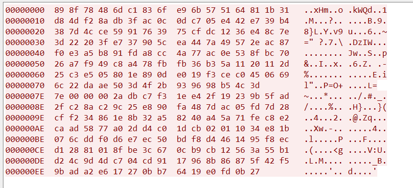
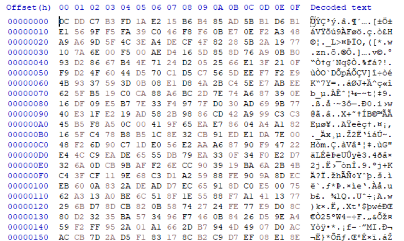
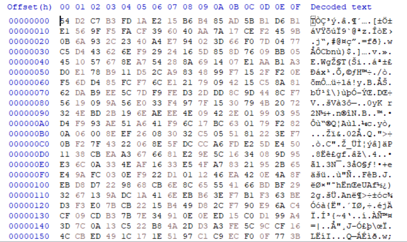
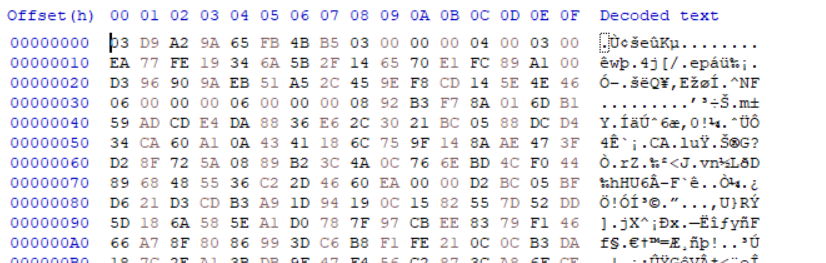
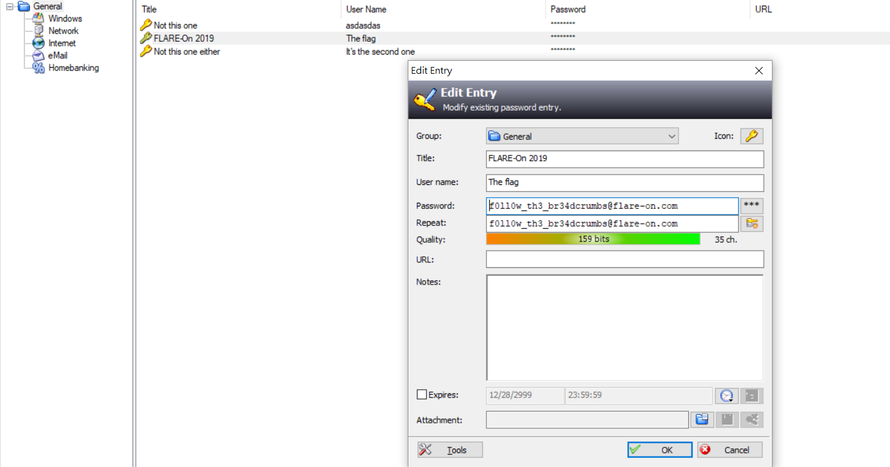

# help

## Problem
  

## Solution

拿到2個檔案help.pcapng和help.dmp，上網查dmp檔可以用windbg來分析，就來試試看囉!  

先用windbg 來分析  
取得OS版本為: Windows 7 Kernel Version 7601 (Service Pack 1) UP Free x64  
Crash的原因是: man.sys ( man+1ce7 )  

```text
Kernel Complete Dump File: Full address space is available

Symbol search path is: srv*
Executable search path is: 
Windows 7 Kernel Version 7601 (Service Pack 1) UP Free x64
Product: WinNt, suite: TerminalServer SingleUserTS Personal
Built by: 7601.18741.amd64fre.win7sp1_gdr.150202-1526
Machine Name:
Kernel base = 0xfffff800`02a49000 PsLoadedModuleList = 0xfffff800`02c8d890
Debug session time: Fri Aug  2 22:38:33.721 2019 (UTC + 8:00)
System Uptime: 0 days 0:49:18.389
Loading Kernel Symbols
...............................................................
................................................................
..............................
Loading User Symbols

Loading unloaded module list
...................

A fatal system error has occurred.
Debugger entered on first try; Bugcheck callbacks have not been invoked.

A fatal system error has occurred.

*******************************************************************************
*                                                                             *
*                        Bugcheck Analysis                                    *
*                                                                             *
*******************************************************************************

Use !analyze -v to get detailed debugging information.

BugCheck 7E, {ffffffffc0000005, fffffa8003f9c621, fffff88007c6b958, fffff88007c6b1b0}

*** WARNING: Unable to verify timestamp for man.sys
*** ERROR: Module load completed but symbols could not be loaded for man.sys
Probably caused by : man.sys ( man+1ce7 )

Followup:     MachineOwner
---------

```  

知道crash的原因後，試著dump man.sys出來分析

```text
kd> lmvm man
Browse full module list
start             end                 module name
fffff880`033bc000 fffff880`033cb000   man      T (no symbols)           
    Loaded symbol image file: man.sys
    Image path: \??\C:\Users\FLARE ON 2019\Desktop\man.sys
    Image name: man.sys
    Browse all global symbols  functions  data
    Timestamp:        unavailable (FFFFFFFE)
    CheckSum:         missing
    ImageSize:        0000F000
    Translations:     0000.04b0 0000.04e4 0409.04b0 0409.04e4
    Information from resource tables:
kd> ? fffff880`033cb000 - fffff880`033bc000
Evaluate expression: 61440 = 00000000`0000f000
kd> .writemem D:\self\document\information_security\ctf\2019\flare-on\help\temp.bin fffff880`033bc000 L?f000
Writing f000 bytes..............................
```

在dump出的man.sys中發現，有attach PID 876的code以及有一個變數存著一個PE檔案，猜測應該是inject一些code到PID 876中  
  
  

接著用volatility去分析各種內容

在netscan中可以分析一些跟PID 876相關流量

```text
volatility_2.6_win64_standalone.exe -f help.dmp --profile=Win7SP1x64 netscan
Offset(P)          Proto    Local Address                  Foreign Address      State            Pid      Owner          Created
0x7d62e770         UDPv4    192.168.1.244:1900             *:*                                   2984     svchost.exe    2019-08-02 14:18:24 UTC+0000
0x7d6a7cf0         UDPv4    127.0.0.1:56043                *:*                                   2984     svchost.exe    2019-08-02 14:18:24 UTC+0000
0x7d6b3ec0         UDPv4    0.0.0.0:0                      *:*                                   1020     svchost.exe    2019-08-02 14:18:16 UTC+0000
0x7d6be990         UDPv4    0.0.0.0:0                      *:*                                   1020     svchost.exe    2019-08-02 14:18:16 UTC+0000
0x7d6be990         UDPv6    :::0                           *:*                                   1020     svchost.exe    2019-08-02 14:18:16 UTC+0000
0x7d70c310         UDPv4    0.0.0.0:5353                   *:*                                   1336     chrome.exe     2019-08-02 14:18:31 UTC+0000
0x7d70c310         UDPv6    :::5353                        *:*                                   1336     chrome.exe     2019-08-02 14:18:31 UTC+0000
0x7d800260         UDPv4    0.0.0.0:50486                  *:*                                   532      svchost.exe    2019-07-02 03:40:07 UTC+0000
0x7d800260         UDPv6    :::50486                       *:*                                   532      svchost.exe    2019-07-02 03:40:07 UTC+0000
0x7d839010         UDPv6    ::1:1900                       *:*                                   2984     svchost.exe    2019-08-02 14:18:24 UTC+0000
0x7d85dda0         UDPv4    0.0.0.0:123                    *:*                                   1020     svchost.exe    2019-08-02 14:18:24 UTC+0000
0x7d85dda0         UDPv6    :::123                         *:*                                   1020     svchost.exe    2019-08-02 14:18:24 UTC+0000
0x7d85fda0         UDPv4    0.0.0.0:5355                   *:*                                   532      svchost.exe    2019-08-02 14:18:27 UTC+0000
0x7d85fda0         UDPv6    :::5355                        *:*                                   532      svchost.exe    2019-08-02 14:18:27 UTC+0000
0x7d861ec0         UDPv4    0.0.0.0:5355                   *:*                                   532      svchost.exe    2019-08-02 14:18:27 UTC+0000
0x7d862010         UDPv4    192.168.1.244:138              *:*                                   4        System         2019-08-02 14:18:24 UTC+0000
0x7d863010         UDPv4    192.168.1.244:137              *:*                                   4        System         2019-08-02 14:18:24 UTC+0000
0x7d880820         UDPv4    0.0.0.0:0                      *:*                                   532      svchost.exe    2019-08-02 14:18:24 UTC+0000
0x7d880820         UDPv6    :::0                           *:*                                   532      svchost.exe    2019-08-02 14:18:24 UTC+0000
0x7d9c1130         UDPv4    192.168.1.244:56042            *:*                                   2984     svchost.exe    2019-08-02 14:18:24 UTC+0000
0x7daf8a10         UDPv6    ::1:56038                      *:*                                   2984     svchost.exe    2019-08-02 14:18:24 UTC+0000
0x7d7c91d0         TCPv4    0.0.0.0:4444                   0.0.0.0:0            LISTENING        876      svchost.exe    
0x7d85bdc0         TCPv4    192.168.1.244:139              0.0.0.0:0            LISTENING        4        System         
0x7d8c5ad0         TCPv4    0.0.0.0:1029                   0.0.0.0:0            LISTENING        480      lsass.exe      
0x7d445010         TCPv4    192.168.1.244:1588             192.168.1.243:7777   FIN_WAIT1        876      svchost.exe    
0x7d626cf0         TCPv4    192.168.1.242:1578             192.168.1.232:8009   CLOSED           2660     chrome.exe     
0x7d62acf0         TCPv4    192.168.1.244:1586             192.168.1.243:7777   FIN_WAIT1        876      svchost.exe    
0x7d6686c0         TCPv4    192.168.1.244:4444             192.168.1.243:1060   CLOSE_WAIT       876      svchost.exe    
0x7d70d010         TCPv4    192.168.1.244:1633             192.168.1.243:8888   FIN_WAIT2        876      svchost.exe    
0x7d7d2010         TCPv4    -:0                            56.75.74.3:0         CLOSED           876      svchost.exe    
0x7d8bdae0         TCPv4    -:0                            56.107.135.1:0       CLOSED           1        0??????       
0x7d8bfcf0         TCPv6    -:0                            386b:8701:80fa:ffff:386b:8701:80fa:ffff:0 CLOSED           532      svchost.exe    
0x7d8dca90         TCPv4    -:0                            56.155.58.3:0        CLOSED           1        0??????       
0x7d8e3300         TCPv4    192.168.1.244:1636             192.168.1.243:8888   FIN_WAIT2        876      svchost.exe    
0x7d93b010         TCPv4    192.168.1.244:4444             192.168.1.243:1063   CLOSE_WAIT       876      svchost.exe    
0x7d94e930         TCPv4    192.168.1.242:1305             192.168.1.232:8009   CLOSED           2660     chrome.exe     
0x7d961010         TCPv4    192.168.1.244:1635             192.168.1.243:7777   FIN_WAIT1        876      svchost.exe    
0x7d96ecf0         TCPv4    192.168.1.244:1639             192.168.1.243:6666   FIN_WAIT2        876      svchost.exe    
0x7d96f3f0         TCPv4    192.168.1.244:1610             192.168.1.243:7777   FIN_WAIT1        876      svchost.exe    
0x7d98c010         TCPv4    192.168.1.242:1061             192.168.1.232:8009   CLOSED           2660     chrome.exe     
0x7db0a910         UDPv6    fe80::e472:88f6:c97a:3914:56039 *:*                                   2984     svchost.exe    2019-08-02 14:18:24 UTC+0000
0x7db2c1f0         UDPv4    0.0.0.0:500                    *:*                                   876      svchost.exe    2019-07-02 03:23:05 UTC+0000
0x7db2ca00         UDPv4    0.0.0.0:500                    *:*                                   876      svchost.exe    2019-07-02 03:23:05 UTC+0000
0x7db2ca00         UDPv6    :::500                         *:*                                   876      svchost.exe    2019-07-02 03:23:05 UTC+0000
0x7db2d870         UDPv4    0.0.0.0:0                      *:*                                   876      svchost.exe    2019-07-02 03:23:05 UTC+0000
0x7db2f9b0         UDPv4    0.0.0.0:4500                   *:*                                   876      svchost.exe    2019-07-02 03:23:05 UTC+0000
0x7db74d60         UDPv6    ::1:56040                      *:*                                   2984     svchost.exe    2019-08-02 14:18:24 UTC+0000
0x7defc600         UDPv6    ::1:1900                       *:*                                   2984     svchost.exe    2019-08-02 14:18:24 UTC+0000
0x7df49010         UDPv4    0.0.0.0:5353                   *:*                                   1336     chrome.exe     2019-08-02 14:18:31 UTC+0000
0x7df49010         UDPv6    :::5353                        *:*                                   1336     chrome.exe     2019-08-02 14:18:31 UTC+0000
0x7e0f34c0         UDPv4    127.0.0.1:1900                 *:*                                   2984     svchost.exe    2019-08-02 14:18:24 UTC+0000
0x7e1faec0         UDPv4    0.0.0.0:5353                   *:*                                   1336     chrome.exe     2019-08-02 14:18:31 UTC+0000
0x7e2d0d70         UDPv4    0.0.0.0:0                      *:*                                   2136     svchost.exe    2019-07-02 03:23:05 UTC+0000
0x7e2d14a0         UDPv4    0.0.0.0:0                      *:*                                   2136     svchost.exe    2019-07-02 03:23:05 UTC+0000
0x7e2d14a0         UDPv6    :::0                           *:*                                   2136     svchost.exe    2019-07-02 03:23:05 UTC+0000
0x7def31b0         TCPv4    0.0.0.0:445                    0.0.0.0:0            LISTENING        4        System         
0x7def31b0         TCPv6    :::445                         :::0                 LISTENING        4        System         
0x7def3560         TCPv4    0.0.0.0:1028                   0.0.0.0:0            LISTENING        464      services.exe   
0x7e09b9e0         TCPv4    0.0.0.0:1027                   0.0.0.0:0            LISTENING        876      svchost.exe    
0x7e09b9e0         TCPv6    :::1027                        :::0                 LISTENING        876      svchost.exe    
0x7e09bef0         TCPv4    0.0.0.0:1027                   0.0.0.0:0            LISTENING        876      svchost.exe    
0x7e244010         TCPv4    0.0.0.0:135                    0.0.0.0:0            LISTENING        696      svchost.exe    
0x7e24c9e0         TCPv4    0.0.0.0:135                    0.0.0.0:0            LISTENING        696      svchost.exe    
0x7e24c9e0         TCPv6    :::135                         :::0                 LISTENING        696      svchost.exe    
0x7e256360         TCPv4    0.0.0.0:1025                   0.0.0.0:0            LISTENING        352      wininit.exe    
0x7e258830         TCPv4    0.0.0.0:1025                   0.0.0.0:0            LISTENING        352      wininit.exe    
0x7e258830         TCPv6    :::1025                        :::0                 LISTENING        352      wininit.exe    
0x7e263230         TCPv4    0.0.0.0:1029                   0.0.0.0:0            LISTENING        480      lsass.exe      
0x7e263230         TCPv6    :::1029                        :::0                 LISTENING        480      lsass.exe      
0x7e28b9e0         TCPv4    0.0.0.0:1026                   0.0.0.0:0            LISTENING        740      svchost.exe    
0x7e28dc90         TCPv4    0.0.0.0:1026                   0.0.0.0:0            LISTENING        740      svchost.exe    
0x7e28dc90         TCPv6    :::1026                        :::0                 LISTENING        740      svchost.exe    
0x7e297a40         TCPv4    0.0.0.0:1031                   0.0.0.0:0            LISTENING        2136     svchost.exe    
0x7e298580         TCPv4    0.0.0.0:1031                   0.0.0.0:0            LISTENING        2136     svchost.exe    
0x7e298580         TCPv6    :::1031                        :::0                 LISTENING        2136     svchost.exe    
0x7e3db2b0         TCPv4    127.0.0.1:139                  0.0.0.0:0            LISTENING        4        System         
0x7db3f580         TCPv4    192.168.1.244:1638             192.168.1.243:6666   FIN_WAIT2        876      svchost.exe    
0x7db61010         TCPv4    192.168.1.244:1632             192.168.1.243:7777   FIN_WAIT1        876      svchost.exe    
0x7dee3550         TCPv6    -:0                            384b:4a03:80fa:ffff:384b:4a03:80fa:ffff:0 CLOSED           876      svchost.exe    
0x7e072010         TCPv4    192.168.1.244:1627             192.168.1.243:7777   FIN_WAIT1        876      svchost.exe    
0x7e12f730         TCPv4    -:1056                         -:443                CLOSED           2660     chrome.exe     
0x7e31fcf0         TCPv4    192.168.1.244:1582             192.168.1.232:8009   ESTABLISHED      2660     chrome.exe     
0x7e8106a0         UDPv4    127.0.0.1:138                  *:*                                   4        System         2019-07-02 03:22:20 UTC+0000
0x7ebd7ec0         UDPv4    127.0.0.1:137                  *:*                                   4        System         2019-07-02 03:22:20 UTC+0000
0x7e640740         TCPv4    0.0.0.0:1028                   0.0.0.0:0            LISTENING        464      services.exe   
0x7e640740         TCPv6    :::1028                        :::0                 LISTENING        464      services.exe   
0x7e63fab0         TCPv4    192.168.1.244:1590             192.168.1.243:7777   FIN_WAIT1        876      svchost.exe    
0x7f0a6ad0         UDPv4    192.168.1.244:63428            *:*                                   1336     chrome.exe     2019-08-02 14:38:28 UTC+0000
0x7f2fd010         UDPv4    0.0.0.0:123                    *:*                                   1020     svchost.exe    2019-08-02 14:18:24 UTC+0000
0x7f32a670         UDPv4    127.0.0.1:1900                 *:*                                   2984     svchost.exe    2019-08-02 14:18:24 UTC+0000
0x7f3673f0         UDPv6    fe80::e472:88f6:c97a:3914:1900 *:*                                   2984     svchost.exe    2019-08-02 14:18:24 UTC+0000
0x7f5dc250         UDPv4    127.0.0.1:56041                *:*                                   2984     svchost.exe    2019-08-02 14:18:24 UTC+0000
0x7f230cf0         TCPv4    192.168.1.244:1637             192.168.1.243:7777   FIN_WAIT1        876      svchost.exe    
0x7f290560         TCPv4    192.168.1.242:1576             192.168.1.232:8009   CLOSED           2660     chrome.exe     
0x7f310010         TCPv4    192.168.1.244:1587             192.168.1.243:7777   FIN_WAIT1        876      svchost.exe    
0x7f338010         TCPv4    192.168.1.244:1634             192.168.1.243:7777   FIN_WAIT1        876      svchost.exe    
0x7f339010         TCPv4    192.168.1.244:1629             192.168.1.243:7777   FIN_WAIT1        876      svchost.exe    
0x7fdecec0         UDPv4    0.0.0.0:0                      *:*                                   876      svchost.exe    2019-07-02 03:23:05 UTC+0000
0x7fdecec0         UDPv6    :::0                           *:*                                   876      svchost.exe    2019-07-02 03:23:05 UTC+0000
0x7fb3d4f0         TCPv4    192.168.1.244:1608             192.168.1.243:7777   FIN_WAIT1        876      svchost.exe    
0x7ffb4bb0         UDPv4    0.0.0.0:4500                   *:*                                   876      svchost.exe    2019-07-02 03:23:05 UTC+0000
0x7ffb4bb0         UDPv6    :::4500                        *:*                                   876      svchost.exe    2019-07-02 03:23:05 UTC+0000
```

在screenshots發現，跟KeePass相關
volatility_2.6_win64_standalone.exe -f help.dmp --profile=Win7SP1x64 screenshots  

  


用wireshark分析help.pacpang  

發現有Dropbox相關的流量，就在help.dmp中搜尋一下dropbox相關的字串，發現了keylogger的字串，猜測可能跟keylogger有關  


而綜合以上分析覺得跟PID 876有關，因此將用volatility dump PID 876的memory  
volatility_2.6_win64_standalone.exe -f help.dmp --profile=Win7SP1x64 memdump  

而在分析876.memdump時，發現以下字串  

```text
0x24D0A4: E:\Dropbox\Dropbox\flareon_2019\code\stmedit\sys\x64\Release\stmedit.pdb  
0x2934fc: e:\dropbox\dropbox\flareon_2019\code\cryptodll\objchk_win7_amd64\amd64\c.pdb  
0x29650c: e:\dropbox\dropbox\flareon_2019\code\networkdll\objchk_win7_amd64\amd64\n.pdb  
0x2a0508: e:\dropbox\dropbox\flareon_2019\code\keylogdll\objchk_win7_amd64\amd64\k.pdb  
0x2a74fc: e:\dropbox\dropbox\flareon_2019\code\screenshotdll\objchk_win7_amd64\amd64\s.pdb  
0x2ac4fc: e:\dropbox\dropbox\flareon_2019\code\filedll\objchk_win7_amd64\amd64\f.pdb  
0x3e1b4c: e:\dropbox\dropbox\flareon_2019\code\shellcodedriver\objchk_wxp_x86\i386\driver1.pdb  
0x6cbe124: e:\dropbox\dropbox\flareon_2019\code\id\objchk_win7_amd64\amd64\man.pdb  
0x6cbf600: e:\dropbox\dropbox\flareon_2019\code\cd\objchk_win7_amd64\amd64\m.pdb  
0x1af27b80: e:\dropbox\dropbox\flareon_2019\code\shellcodedriver\objchk_wxp_x86\i386\driver1.pdb  
```

用binwalk分析出那些range是PE file，然後比對上面字串落在哪裡，猜測就是那個dll檔  

開始分析各檔案後，發現

k.dll就是keylogger  
c.dll是一個加密的檔案，他會將資料用LZNT做壓縮後，在用RC4搭配username做加密  
s.dll是screenshot  
n.dll會將資料送給192.168.1.243的某個port
f.dll做一些file的相關操作  

首先寫個decrypt的script  

```c++
// deLZ.cpp
#include <iostream>
#include <windows.h>
using namespace std;


//typedef unsigned long NTSTATUS;

#define STATUS_SUCCESS                 ((NTSTATUS)0x00000000UL)
#define STATUS_BUFFER_ALL_ZEROS        ((NTSTATUS)0x00000117UL)
#define STATUS_INVALID_PARAMETER       ((NTSTATUS)0xC000000DUL)
#define STATUS_UNSUPPORTED_COMPRESSION ((NTSTATUS)0xC000025FUL)
#define STATUS_NOT_SUPPORTED_ON_SBS    ((NTSTATUS)0xC0000300UL)
#define STATUS_BUFFER_TOO_SMALL        ((NTSTATUS)0xC0000023UL)
#define STATUS_BAD_COMPRESSION_BUFFER  ((NTSTATUS)0xC0000242UL)

HMODULE ntdll = GetModuleHandle("ntdll.dll");

typedef NTSTATUS(__stdcall *_RtlCompressBuffer)(
   USHORT CompressionFormatAndEngine,
   PUCHAR UncompressedBuffer,
   ULONG UncompressedBufferSize,
   PUCHAR CompressedBuffer,
   ULONG CompressedBufferSize,
   ULONG UncompressedChunkSize,
   PULONG FinalCompressedSize,
   PVOID WorkSpace
);

typedef NTSTATUS(__stdcall *_RtlDecompressBuffer)(
   USHORT CompressionFormat,
   PUCHAR UncompressedBuffer,
   ULONG UncompressedBufferSize,
   PUCHAR CompressedBuffer,
   ULONG CompressedBufferSize,
   PULONG FinalUncompressedSize
);

typedef NTSTATUS(__stdcall *_RtlGetCompressionWorkSpaceSize)(
   USHORT CompressionFormatAndEngine,
   PULONG CompressBufferWorkSpaceSize,
   PULONG CompressFragmentWorkSpaceSize
);

char *ReadFileWs(const char *FilePath,DWORD &bufferLen){
    HANDLE File=CreateFileA(FilePath,GENERIC_READ,FILE_SHARE_READ,NULL,OPEN_EXISTING,0,NULL);

    if(File==INVALID_HANDLE_VALUE){
        return NULL;
    }

    DWORD _size=GetFileSize(File,0);
    char *Buffer=new char[_size+1];
    bool result=ReadFile(File,Buffer,_size,&bufferLen,0);
    CloseHandle(File);

    if(result)return Buffer;
    else return NULL;
}

bool WriteFileWs(const char *FilePath,char *Buffer,DWORD bufferLen,DWORD &numberBytesRead){
    HANDLE File=CreateFileA(FilePath,GENERIC_WRITE,FILE_SHARE_WRITE,0,CREATE_ALWAYS,0,0);

    if(File==INVALID_HANDLE_VALUE){
        return false;
    }

    bool result=WriteFile(File,Buffer,bufferLen,&numberBytesRead,NULL);
    CloseHandle(File);

    return result;
}


UCHAR *compress_buffer(const char *buffer, const ULONG bufferLen, ULONG compBufferLen, ULONG *compBufferSize)
{
   _RtlCompressBuffer RtlCompressBuffer = (_RtlCompressBuffer) GetProcAddress(ntdll, "RtlCompressBuffer");
   _RtlGetCompressionWorkSpaceSize RtlGetCompressionWorkSpaceSize = (_RtlGetCompressionWorkSpaceSize) GetProcAddress(ntdll, "RtlGetCompressionWorkSpaceSize");

   ULONG bufWorkspaceSize;  // Workspace Size
   ULONG fragWorkspaceSize; // Fragmented Workspace Size (Unused)
   NTSTATUS ret = RtlGetCompressionWorkSpaceSize(
                     COMPRESSION_FORMAT_LZNT1 | COMPRESSION_ENGINE_MAXIMUM, // CompressionFormatAndEngine
                     &bufWorkspaceSize,                                     // CompressBufferWorkSpaceSize
                     &fragWorkspaceSize                                     // CompressFragmentWorkSpaceSize
                  );

   if (ret != STATUS_SUCCESS) return 0;

   VOID *workspace = (VOID *)LocalAlloc(LMEM_FIXED, bufWorkspaceSize);
   if (workspace == NULL) return 0;

   UCHAR *compBuffer = new UCHAR[compBufferLen];
   NTSTATUS result = RtlCompressBuffer(
                        COMPRESSION_FORMAT_LZNT1 | COMPRESSION_ENGINE_MAXIMUM, // CompressionFormatAndEngine
                        (UCHAR *)buffer,                                       // UncompressedBuffer
                        bufferLen,                                             // UncompressedBufferSize
                        compBuffer,                                            // CompressedBuffer
                        compBufferLen,                                         // CompressedBufferSize
                        4096,                                                  // UncompressedChunkSize
                        compBufferSize,                                        // FinalCompressedSize
                        workspace                                              // WorkSpace
                     );

   LocalFree(workspace);
   if (result != STATUS_SUCCESS) {
        return 0;
   }

   return compBuffer;
}

UCHAR *decompress_buffer(const char *buffer, const int bufferLen, const int uncompBufferLen, ULONG *uncompBufferSize)
{
   _RtlDecompressBuffer RtlDecompressBuffer = (_RtlDecompressBuffer) GetProcAddress(ntdll, "RtlDecompressBuffer");

   UCHAR *uncompBuffer = new UCHAR[uncompBufferLen];
   NTSTATUS result = RtlDecompressBuffer(
                        COMPRESSION_FORMAT_LZNT1 | COMPRESSION_ENGINE_MAXIMUM, // CompressionFormat
                        uncompBuffer,                                          // UncompressedBuffer
                        uncompBufferLen,                                       // UncompressedBufferSize
                        (UCHAR *)buffer,                                       // CompressedBuffer
                        bufferLen,                                             // CompressedBufferSize
                        uncompBufferSize                                       // FinalUncompressedSize
                     );

   if (result != STATUS_SUCCESS) {
      printf("result: %x\n", result);
      return 0;
   }

   return uncompBuffer;
}


int main(int argc, char *argv[])
{

  if (argc != 3) {
      cout << "lose input path and output path" << endl;
      return 1;
  }

  char *compressDataPath = argv[1];
  char *DecompressStorePath = argv[2];
  DWORD bufferLen, numberBytesRead, realDecompSize;


  char *data = ReadFileWs(compressDataPath, bufferLen);
  cout << compressDataPath << " Length: " << bufferLen << endl;
  UCHAR *bufferDescomprimido = decompress_buffer(data, bufferLen, 4096 * 5000, &realDecompSize);
  WriteFileWs(DecompressStorePath, (char*)bufferDescomprimido, realDecompSize, numberBytesRead);
  cout << DecompressStorePath << " Length: " << numberBytesRead << endl;
  cout << "Success" << endl;

  delete[] data;
  delete[] bufferDescomprimido;

  return 0;
}
```

```python
import os

def get_magic(array, array2):
    def magic_swap(array):
        buf = list(range(258))
        buf[256] = 0
        buf[257] = 0
        buf_idx = 0
        array_idx = 0
        temp = 0
        for buf_idx in range(256):
            temp = (temp + array[array_idx] + buf[buf_idx]) % 256
            buf[buf_idx], buf[temp] = buf[temp], buf[buf_idx]
            array_idx = (array_idx + 1) % len(array)
        return buf

    def calculate(buf, array_ptr_1, array_ptr_2):
        temp_array_ptr_2 = b""
        for array_idx in range(len(array_ptr_1)):
            buf[256] = (buf[256] + 1) % 256
            buf[257] = (buf[257] + buf[buf[256]]) % 256
            buf[buf[256]], buf[buf[257]] = buf[buf[257]], buf[buf[256]]
            temp_array_ptr_2 += (bytes([buf[(buf[buf[256]] + buf[buf[257]]) % 256] ^ array_ptr_1[array_idx]]))
        return temp_array_ptr_2

    buf = magic_swap(array)
    print(buf)
    return calculate(buf, array2, array2)


import sys
file_name = sys.argv[1]
d1_file_name = f"{file_name}.d1"
d2_file_name = f"{file_name}.bin"

file_content = b""
with open(file_name, "rb") as f:
    file_content = f.read()

d1_content = get_magic(b"FLARE ON 2019\x00", file_content)

with open(d1_file_name, "wb") as f:
    f.write(d1_content)

os.system(f"deLZ.exe {d1_file_name} {d2_file_name}")
```

開始對各個對dst為192.168.1.243的封包內容作解密，
username是用volatility_2.6_win64_standalone.exe -f help.dmp --profile=Win7SP1x64 envars，  
用PID 876的username `WIN-HJULHEAEK51$`，但一直解不出任何有用的訊息，  
後來在twitter上尋求協助後，發現是username用錯了，就繼續找，後來找到KeePass的username是`FLARE ON 2019`，猜測應該就是這個，剛開始也解不出任何資料，後來發現GetUserNameA會在username後面補個null，所以改用`FLARE ON 2019\x00`後，就在port 8888的內容中解出以下的字串  

```text
C:\Windows\system32\cmd.exe�]���nslookup googlecom
ping 1722173110
nslookup soeblogcom
nslookup fiosquatumgatefiosrouterhome

C:\Windows\system32\cmd.exe�����Start�����Start menu�����Start menu����chrome

www.flare-on.com - Google Chrome�0���tis encrypting something twice better than once

Is encrypting something twice better than once? - Google Search - Google Chrome�����Start�����Start menu�����Start menu����keeKeePass�����<DYN_TITLE>����th1sisth33nd111
KeePass�����keys.kdb - KeePass�����Is encrypting something twice better than once? - Google Search - Google Chrome�����Start�����Start menu�����Start menu����kee
KeePass�����<DYN_TITLE>����th1sisth33nd111

Open Database - keys.kdb�����KeePass�����Start�����Start menu�����Start menu�����KeePass�����Start menu�����Start menu�����Start menu����kee
KeePass�����<DYN_TITLE>����th1sisth33nd111
```

而解的過程，蠻靠直覺的  
比方說TCP stream 63的原始內容為
  
在wireshark中他又分為2個block  
  
經過一段亂測後，猜到是第2個block然後將前面的7e 00 00 00移除，就可以解密出東西了，  
但就真的是靠直覺，現在也還沒找到打包內容的地方，哪天有空來看看別人的write up好了  

找出這些字串後，分析出幾個重點  

我要找到keys.kdb以及密碼可能是th1sisth33nd111  
在這幾個字串中比對wireshark的DNS封包發現  
keylogger只會記錄小寫，以及不會有_ . -的字串  

```text
nslookup googlecom
nslookup soeblogcom
nslookup fiosquatumgatefiosrouterhome
```

```text
googlecom:  google.com.fios-router.home
fiosquatumgatefiosrouterhome: Fios_Quantum_Gateway.fios-router.home
soeblogcom: some_blog.com.fios-router.home
```

後來在help.dmp中發現這個字串: `!s_iS_th3_3Nd!!!`  
因此猜測密碼可能是  
th!s_iS_th3_3Nd!!!  
Th!s_iS_th3_3Nd!!!  
tH!s_iS_th3_3Nd!!!  
TH!s_iS_th3_3Nd!!!  

而接下來的目標是要解密出key.kdb的檔案  
剛開始一直找不到，後來我自己寫了一個encrypt的script  

```c++
#include <iostream>
#include <windows.h>
using namespace std;


//typedef unsigned long NTSTATUS;

#define STATUS_SUCCESS                 ((NTSTATUS)0x00000000UL)
#define STATUS_BUFFER_ALL_ZEROS        ((NTSTATUS)0x00000117UL)
#define STATUS_INVALID_PARAMETER       ((NTSTATUS)0xC000000DUL)
#define STATUS_UNSUPPORTED_COMPRESSION ((NTSTATUS)0xC000025FUL)
#define STATUS_NOT_SUPPORTED_ON_SBS    ((NTSTATUS)0xC0000300UL)
#define STATUS_BUFFER_TOO_SMALL        ((NTSTATUS)0xC0000023UL)
#define STATUS_BAD_COMPRESSION_BUFFER  ((NTSTATUS)0xC0000242UL)

HMODULE ntdll = GetModuleHandle("ntdll.dll");

typedef NTSTATUS(__stdcall *_RtlCompressBuffer)(
   USHORT CompressionFormatAndEngine,
   PUCHAR UncompressedBuffer,
   ULONG UncompressedBufferSize,
   PUCHAR CompressedBuffer,
   ULONG CompressedBufferSize,
   ULONG UncompressedChunkSize,
   PULONG FinalCompressedSize,
   PVOID WorkSpace
);

typedef NTSTATUS(__stdcall *_RtlDecompressBuffer)(
   USHORT CompressionFormat,
   PUCHAR UncompressedBuffer,
   ULONG UncompressedBufferSize,
   PUCHAR CompressedBuffer,
   ULONG CompressedBufferSize,
   PULONG FinalUncompressedSize
);

typedef NTSTATUS(__stdcall *_RtlGetCompressionWorkSpaceSize)(
   USHORT CompressionFormatAndEngine,
   PULONG CompressBufferWorkSpaceSize,
   PULONG CompressFragmentWorkSpaceSize
);

char *ReadFileWs(const char *FilePath,DWORD &bufferLen){
    HANDLE File=CreateFileA(FilePath,GENERIC_READ,FILE_SHARE_READ,NULL,OPEN_EXISTING,0,NULL);

    if(File==INVALID_HANDLE_VALUE){
        return NULL;
    }

    DWORD _size=GetFileSize(File,0);
    char *Buffer=new char[_size+1];
    bool result=ReadFile(File,Buffer,_size,&bufferLen,0);
    CloseHandle(File);

    if(result)return Buffer;
    else return NULL;
}

bool WriteFileWs(const char *FilePath,char *Buffer,DWORD bufferLen,DWORD &numberBytesRead){
    HANDLE File=CreateFileA(FilePath,GENERIC_WRITE,FILE_SHARE_WRITE,0,CREATE_ALWAYS,0,0);

    if(File==INVALID_HANDLE_VALUE){
        return false;
    }

    bool result=WriteFile(File,Buffer,bufferLen,&numberBytesRead,NULL);
    CloseHandle(File);

    return result;
}


UCHAR *compress_buffer(const char *buffer, const ULONG bufferLen, ULONG compBufferLen, ULONG *compBufferSize)
{
   _RtlCompressBuffer RtlCompressBuffer = (_RtlCompressBuffer) GetProcAddress(ntdll, "RtlCompressBuffer");
   _RtlGetCompressionWorkSpaceSize RtlGetCompressionWorkSpaceSize = (_RtlGetCompressionWorkSpaceSize) GetProcAddress(ntdll, "RtlGetCompressionWorkSpaceSize");

   ULONG bufWorkspaceSize;  // Workspace Size
   ULONG fragWorkspaceSize; // Fragmented Workspace Size (Unused)
   NTSTATUS ret = RtlGetCompressionWorkSpaceSize(
                     COMPRESSION_FORMAT_LZNT1 | COMPRESSION_ENGINE_MAXIMUM, // CompressionFormatAndEngine
                     &bufWorkspaceSize,                                     // CompressBufferWorkSpaceSize
                     &fragWorkspaceSize                                     // CompressFragmentWorkSpaceSize
                  );

   if (ret != STATUS_SUCCESS) return 0;

   VOID *workspace = (VOID *)LocalAlloc(LMEM_FIXED, bufWorkspaceSize);
   if (workspace == NULL) return 0;

   UCHAR *compBuffer = new UCHAR[compBufferLen];
   NTSTATUS result = RtlCompressBuffer(
                        COMPRESSION_FORMAT_LZNT1 | COMPRESSION_ENGINE_MAXIMUM, // CompressionFormatAndEngine
                        (UCHAR *)buffer,                                       // UncompressedBuffer
                        bufferLen,                                             // UncompressedBufferSize
                        compBuffer,                                            // CompressedBuffer
                        compBufferLen,                                         // CompressedBufferSize
                        4096,                                                  // UncompressedChunkSize
                        compBufferSize,                                        // FinalCompressedSize
                        workspace                                              // WorkSpace
                     );

   LocalFree(workspace);
   if (result != STATUS_SUCCESS) {
        return 0;
   }

   return compBuffer;
}

UCHAR *decompress_buffer(const char *buffer, const int bufferLen, const int uncompBufferLen, ULONG *uncompBufferSize)
{
   _RtlDecompressBuffer RtlDecompressBuffer = (_RtlDecompressBuffer) GetProcAddress(ntdll, "RtlDecompressBuffer");

   UCHAR *uncompBuffer = new UCHAR[uncompBufferLen];
   NTSTATUS result = RtlDecompressBuffer(
                        COMPRESSION_FORMAT_LZNT1 | COMPRESSION_ENGINE_MAXIMUM, // CompressionFormat
                        uncompBuffer,                                          // UncompressedBuffer
                        uncompBufferLen,                                       // UncompressedBufferSize
                        (UCHAR *)buffer,                                       // CompressedBuffer
                        bufferLen,                                             // CompressedBufferSize
                        uncompBufferSize                                       // FinalUncompressedSize
                     );

   if (result != STATUS_SUCCESS) {;
      return 0;
   }


   return uncompBuffer;
}


int main(int argc, char *argv[])
{

  if (argc != 3) {
      cout << "lose input path and output path" << endl;
      return 1;
  }
  char *path = argv[1];
  char *compressStorePath = argv[2];
  DWORD bufferLen, numberBytesRead, compBufferSize, realDecompSize;

  char *data = ReadFileWs(path, bufferLen);
  UCHAR *bufferComprimido = compress_buffer(data, bufferLen, bufferLen * 2, &compBufferSize);

  WriteFileWs(compressStorePath, (char*)bufferComprimido, compBufferSize, numberBytesRead);

  delete[] data;
  delete[] bufferComprimido;

  return 0;
}
```

```python
def get_magic(array, array2):
    def magic_swap(array):
        buf = list(range(258))
        buf[256] = 0
        buf[257] = 0
        buf_idx = 0
        array_idx = 0
        temp = 0
        for buf_idx in range(256):
            temp = (temp + array[array_idx] + buf[buf_idx]) % 256
            buf[buf_idx], buf[temp] = buf[temp], buf[buf_idx]
            array_idx = (array_idx + 1) % len(array)
        return buf

    def calculate(buf, array_ptr_1, array_ptr_2):
        temp_array_ptr_2 = b""
        for array_idx in range(len(array_ptr_1)):
            buf[256] = (buf[256] + 1) % 256
            buf[257] = (buf[257] + buf[buf[256]]) % 256
            buf[buf[256]], buf[buf[257]] = buf[buf[257]], buf[buf[256]]
            temp_array_ptr_2 += (bytes([buf[(buf[buf[256]] + buf[buf[257]]) % 256] ^ array_ptr_1[array_idx]]))
        return temp_array_ptr_2

    buf = magic_swap(array)
    print(buf)
    return calculate(buf, array2, array2)

import sys
file_name = sys.argv[1]
new_file_name = f"{file_name}.en"

with open(file_name, "rb") as f:
    content = f.read()

d1_content = get_magic(b"FLARE ON 2019\x00", content)

with open(new_file_name, "wb") as f:
    f.write(d1_content)
```

並對自己產生的Database.kdb做加密後，用hex editor打開  
  
然後開始找有沒有跟這個類似的封包內容  

最後在dst 192.168.1.243:6666 TCP stream 170的封包中找到類似的內容  
  

試著將他解密後，發現真的是kdb的檔案  
  

然後因為kdb是kdb 1的格式，就下載個KeePass-1.37，接著嘗試上面猜測的密碼，  
最後發現密碼是`Th!s_iS_th3_3Nd!!!`  

  
  

這題很感謝twitter上網友的幫助以及一些運氣才解開的  