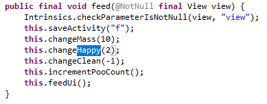
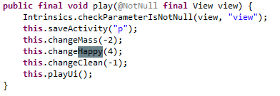
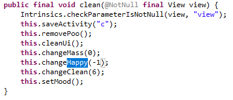
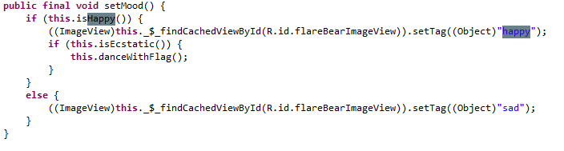
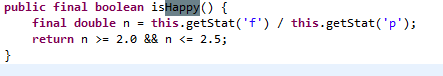
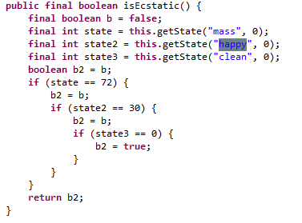

# Flarebear

## Problem
  

## Solution

拿到了一個apk檔，用apktool解開，再用dex2jar分析出下面的關鍵:  
  
  
  
  
  
  

```python
from z3 import *

f, p, c = Ints("f p c")
x = Solver()
x.add(10 * f - 2 * p == 72)
x.add(2 * f + 4 * p - c == 30)
x.add(-1 * f + -1 * p + 6 * c == 0)
x.add(f / p >= 2.0)
x.add(f / p <= 2.5)
x.check()
x.model()
# [f = 8, p = 4, c = 2]
```
然後按feed 8次 play 4次 clean 2次，就拿到flag囉!  

  
