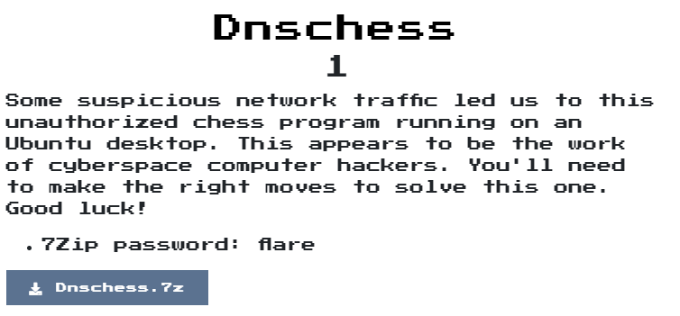
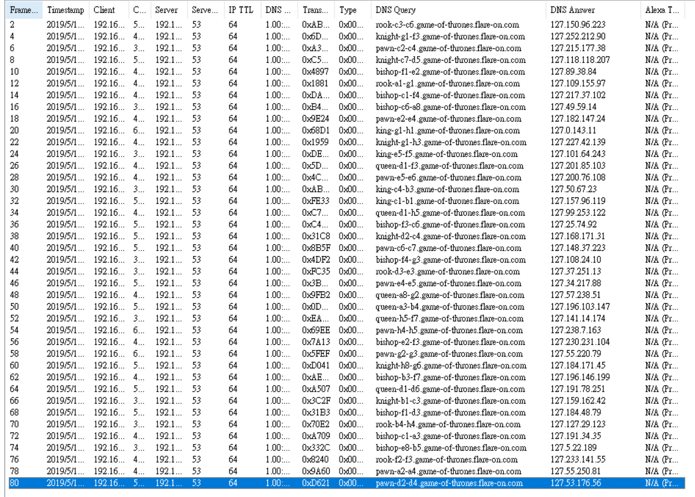
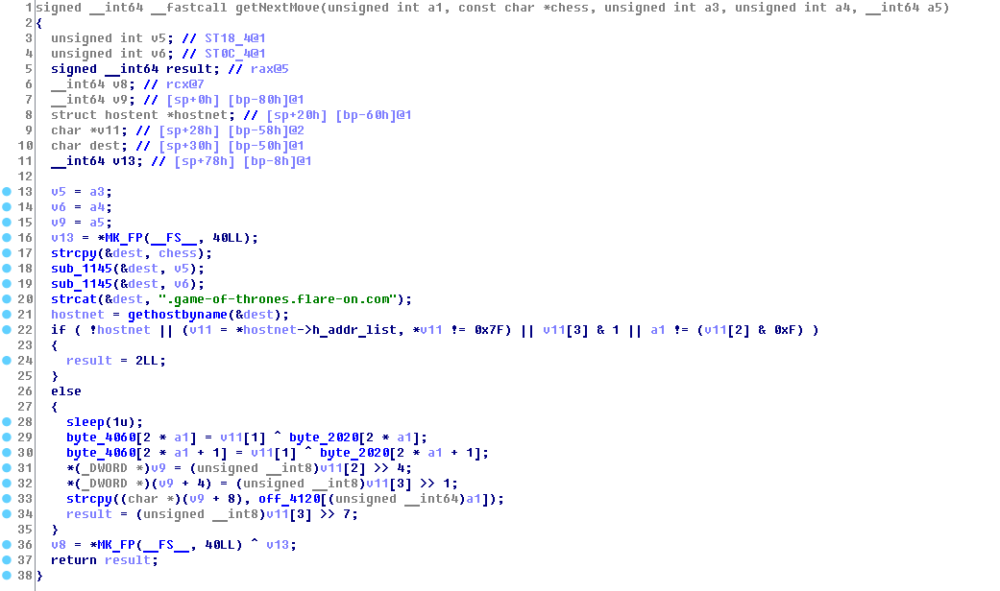
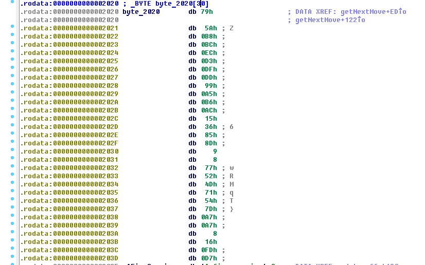
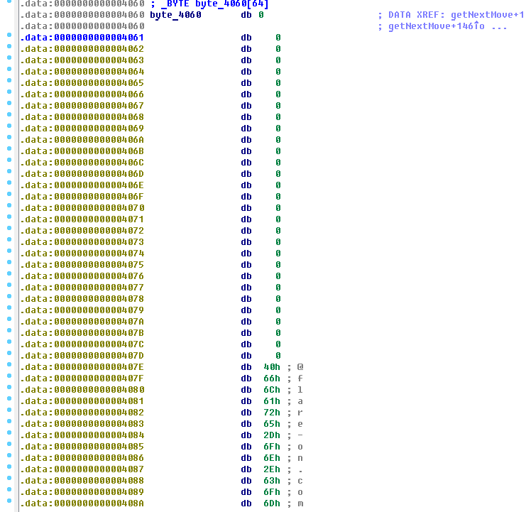

# Dnschess

## Problem
  

## Solution

他有附一個pcap檔案，打開後都是dns的query封包:  
  

分析程式後，可以發現關鍵在`getNextMove`:
  
  
  

寫個解析程式，flag就出來囉  

```python
crypto_table = [
  121,
  90,
  184,
  188,
  236,
  211,
  223,
  221,
  153,
  165,
  182,
  172,
  21,
  54,
  133,
  141,
  9,
  8,
  119,
  82,
  77,
  113,
  84,
  125,
  167,
  167,
  8,
  22,
  253,
  215
]

ip_list = [
    "127.150.96.223",
    "127.252.212.90",
    "127.215.177.38",
    "127.118.118.207",
    "127.89.38.84",
    "127.109.155.97",
    "127.217.37.102",
    "127.49.59.14",
    "127.182.147.24",
    "127.0.143.11",
    "127.227.42.139",
    "127.101.64.243",
    "127.201.85.103",
    "127.200.76.108",
    "127.50.67.23",
    "127.157.96.119",
    "127.99.253.122",
    "127.25.74.92",
    "127.168.171.31",
    "127.148.37.223",
    "127.108.24.10",
    "127.37.251.13",
    "127.34.217.88",
    "127.57.238.51",
    "127.196.103.147",
    "127.141.14.174",
    "127.238.7.163",
    "127.230.231.104",
    "127.55.220.79",
    "127.184.171.45",
    "127.196.146.199",
    "127.191.78.251",
    "127.159.162.42",
    "127.184.48.79",
    "127.127.29.123",
    "127.191.34.35",
    "127.5.22.189",
    "127.233.141.55",
    "127.55.250.81",
    "127.53.176.56",
]

answer = [""] * 30
for idx, ip in enumerate(ip_list):
    a, b, c, d = ip.split(".")
    if int(a) == 127 and (((int(d) & 0xf) & 0x1) == 0):
        crypto_table_idx = (int(c) & 0xf)
        idx1 = 2 * crypto_table_idx
        idx2 = 2 * crypto_table_idx + 1
        answer[idx1] = chr(int(b) ^ crypto_table[idx1])
        answer[idx2] = chr(int(b) ^ crypto_table[idx2])

flag1 = "".join(answer)
print(f"Flag: {flag1}@flare-on.com")
# LooksLikeYouLockedUpTheLookupZ@flare-on.com
```