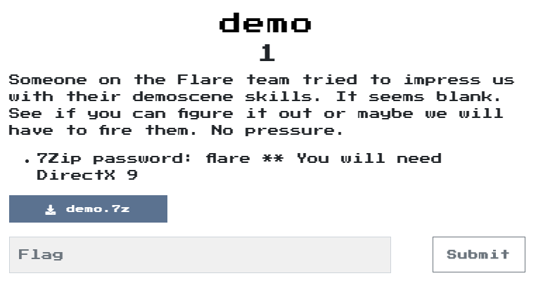
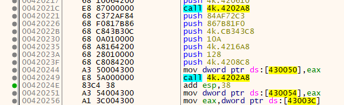
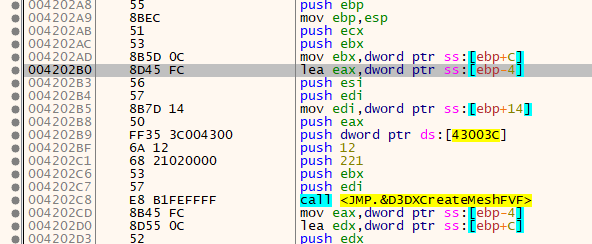
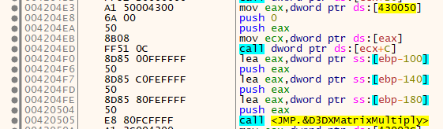

# demo

## Problem
  

## Solution

一打開使一個A一直在旋轉:  
  

分析了很久後，發現他會create 2次 mesh，繼續觀察後發現他只會用到第一次create的，後來將第二次的資料蓋過第一個後，就噴出flag了。  

create two:
  
Call createMeshFVF:  
  
Call only one:  
  

Answer:  
  