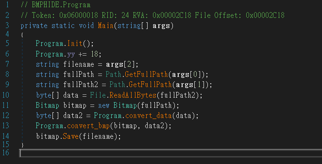
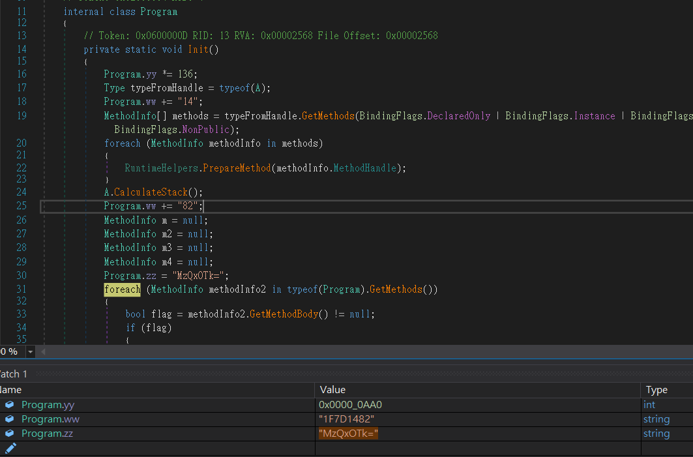
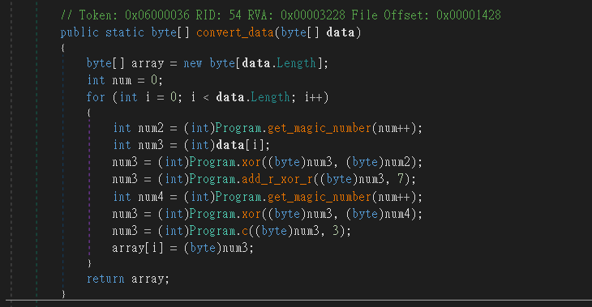
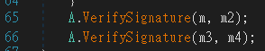
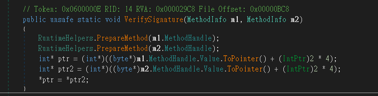
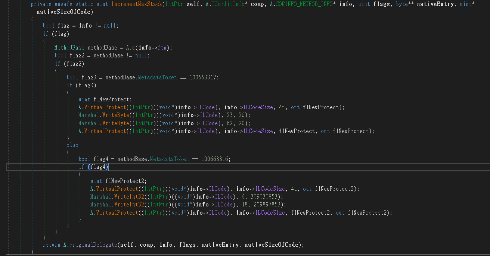

# bmphide

## Problem
  

## Solution

  
  

將program.j算出來後，發現他會將RGB的末3, 3, 2位換成data[num][:3], data[num][3:6], data[num][6:8]  
  

```python
import base64

def func_b(b, r):
    for i in range(r):
        b2 = (b & 128) / 128
        b = (b * 2 & 255) + b2
    return b

def get_magic_number(idx):
    num = 0
    num2 = 0
    result = 0
    array = [
        121, 255, 214, 60, 106, 216, 149, 89, 96, 29,
        81, 123, 182, 24, 167, 252, 88, 212, 43, 85,
        181, 86, 108, 213, 50, 78, 247, 83, 193, 35,
        135, 217, 0, 64, 45, 236, 134, 102, 76, 74,
        153, 34, 39, 10, 192, 202, 71, 183, 185, 175,
        84, 118, 9, 158, 66, 128, 116, 117, 4, 13,
        46, 227, 132, 240, 122, 11, 18, 186, 30, 157,
        1, 154, 144, 124, 152, 187, 32, 87, 141, 103,
        189, 12, 53, 222, 206, 91, 20, 174, 49, 223,
        155, 250, 95, 31, 98, 151, 179, 101, 47, 17,
        207, 142, 199, 3, 205, 163, 146, 48, 165, 225,
        62, 33, 119, 52, 241, 228, 162, 90, 140, 232,
        129, 114, 75, 82, 190, 65, 2, 21, 14, 111, 115,
        36, 107, 67, 126, 80, 110, 23, 44, 226, 56,
        7, 172, 221, 239, 161, 61, 93, 94, 99, 171,
        97, 38, 40, 28, 166, 209, 229, 136, 130, 164,
        194, 243, 220, 25, 169, 105, 238, 245, 215, 195,
        203, 170, 16, 109, 176, 27, 184, 148, 131, 210,
        231, 125, 177, 26, 246, 127, 198, 254, 6, 69,
        237, 197, 54, 59, 137, 79, 178, 139, 235, 249,
        230, 233, 204, 196, 113, 120, 173, 224, 55, 92,
        211, 112, 219, 208, 77, 191, 242, 133, 244, 168,
        188, 138, 251, 70, 150, 145, 248, 180, 218, 42,
        15, 159, 104, 22, 37, 72, 63, 234, 147, 200,
        253, 100, 19, 73, 5, 57, 201, 51, 156, 41,
        143, 68, 8, 160, 58
    ]
    for i in range(idx+1):
        num += 1
        num %= 256
        num2 += array[num]
        num2 %= 256
        num3 = array[num]
        array[num] = array[num2]
        array[num2] = num3
        result = array[(array[num] + array[num2]) % 256]
    return result

def func_j(z):
    yy = 20 * 136 + 18
    ww = "1F7D1482"
    zz = "MzQxOTk="

    num = int(ww, 16)
    num *= yy
    value = int(base64.b64decode(zz).decode())
    num += value
    num += 4
    num += get_magic_number(6)
    new_z = func_b(z, 1)
    return (int(new_z) ^ int(num % 4294967296)) & 255

# func_j(103): 0
# func_j(27): 248
# func_j(228): 7
# func_j(231): 1
# func_j(25): 252
# func_j(230): 3
# func_j(100): 6
```

因此我們將image.bmp的RGB讀出來並取出3, 3, 2組一個byte，就可以將convert後的data2拿到手，之後再逆推回去就會得到關鍵的file囉!  
Note: 程式有偷偷將add_r_xor_rc換成Program.b及Program.c換成Program.d  

  
  

```C#
public static byte[] convert_data(byte[] data)
{
    byte[] array = new byte[data.Length];
    int num = 0;
    for (int i = 0; i < data.Length; i++)
    {
        int num2 = (int)Program.get_magic_number(num++);
        int num3 = (int)data[i];
        num3 = (int)Program.xor((byte)num3, (byte)num2);
        num3 = (int)Program.add_r_xor_r((byte)num3, 7);
        int num4 = (int)Program.get_magic_number(num++);
        num3 = (int)Program.xor((byte)num3, (byte)num4);
        num3 = (int)Program.c((byte)num3, 3);
        array[i] = (byte)num3;
    }
    return array;
```

```python
def func_b(b, r):
    for i in range(r):
        b2 = int((b & 128) / 128)
        b = (int(b * 2) & 255) + b2
    return b

def func_c(b, r):
    b2 = 1
    for i in range(8):
        if (b & 1) == 1:
            b2 = b2 * 2 + 1 & 255
        else:
            b2 = b2 - 1 & 255
    return b2

def func_d(b, r):
    for i in range(r):
        b2 = (b & 1) * 128
        b = (int(b / 2) & 255) + b2
    return b

def convert_data(data):
    array = b""
    num = 0
    for i in range(len(data)):
        num2 = get_magic_number(num)
        num += 1
        num3 = data[i]
        num3 = (num3 ^ num2) & 255
        num3 = func_b(num3, 7) & 255
        num4 = get_magic_number(num)
        num += 1
        num3 = (num3 ^ num4) & 255
        num3 = func_d(num3, 3)
        array += chr(num3).encode()
    return array
```

後來發現還是一直解不開，但在twitter上有人給了我一點小提示，
繼續分析後發現還有其他地方被動手腳，  
  
發現他去修改Program.h的function以及Program.g的數值。  
他將Program.h中Program.f改成Program.g，將g的2個數值都改掉，稍微修正後就完成囉!  

```python
def func_g(idx):
    b = ((idx + 1) * 309030853) & 255
    k = ((idx + 2) * 209897853) & 255
    return (b ^ k) & 255

def convert_data(data):
    array = b""
    num = 0
    for i in range(len(data)):
        num2 = func_g(num)
        num += 1
        num3 = data[i]
        num3 = (num3 ^ num2) & 255
        num3 = func_b(num3, 7) & 255
        num4 = func_g(num)
        num += 1
        num3 = (num3 ^ num4) & 255
        num3 = func_d(num3, 3)
        array += chr(num3).encode()
    return array
```

寫了個程式逆推回去  

```python
from PIL import Image

encode_data_list = []
with Image.open("image.bmp") as bmp_f:
    for x in range(bmp_f.width):
        for y in range(bmp_f.height):
            r, g, b = bmp_f.getpixel((x, y))
            encode_data = ((b & 3) << 6) | ((g & 7) << 3) | (r & 7)
            encode_data_list.append(encode_data)

def decode_b(b, r):
    for i in range(r):
        if b & 1:
            b = (b - 1) // 2 + 128
        else:
            b = b // 2
    return b

def decode_d(b, r):
    for i in range(r):
        if b >= 128:
            b = (b - 128) * 2 + 1
        else:
            b = b * 2
    return b

def func_g(idx):
    b = ((idx + 1) * 309030853) & 255
    k = ((idx + 2) * 209897853) & 255
    return (b ^ k) & 255

array = []
num = 0
for encode_data in encode_data_list:
    num2 = func_g(num)
    num += 1
    num4 = func_g(num)
    num += 1
    num3 = decode_d(encode_data, 3) & 255
    num3 = (num3 ^ num4) & 255
    num3 = decode_b(num3, 7) & 255
    data = (num3 ^ num2) & 255
    array.append(data)

with open("key1.bmp", "wb") as f:
    for i in array:
        f.write(i.to_bytes(1, 'big'))
```

第一次解時，會跳出另一張圖片，再拿新的圖片解第二次時，flag就跳出來囉!  
  
