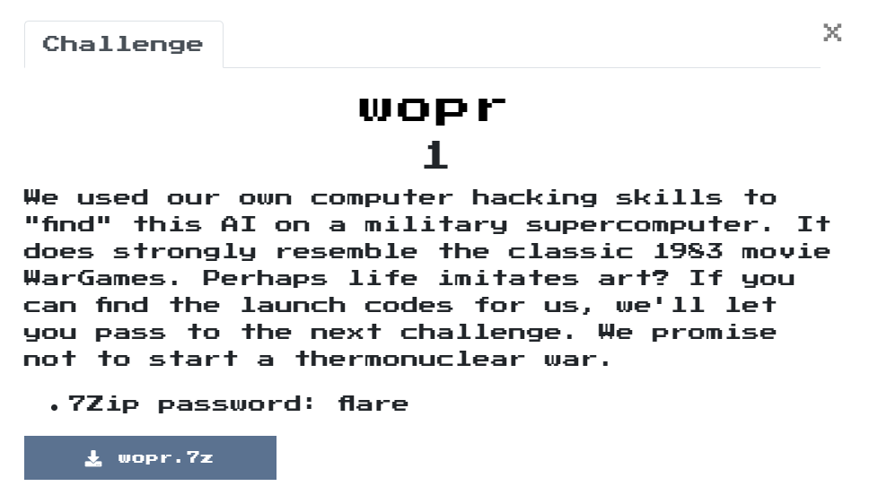
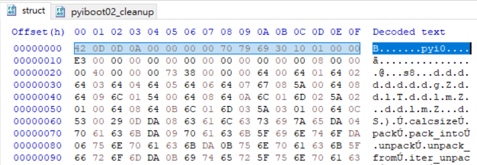
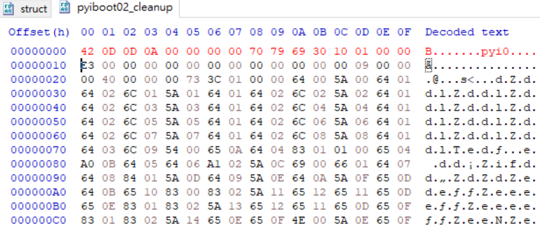
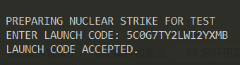
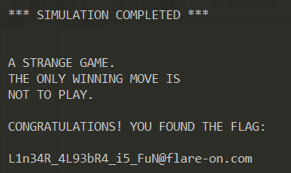

# wopr

## Problem
  

## Solution

把binary打開後，發現Pyinstaller的字樣，猜測是python寫的，
因此解開來看看，解開的方法可以參考我的[github.io](https://zondatw.github.io/2019/pyinstaller_decompile/)  

| package     | version |
| ----------- | ------- |
| PyInstaller | 3.5     |
| uncompyle6  | 3.4.0   |

```text
λ python pyinstxtractor.py wopr.exe
pyinstxtractor.py:86: DeprecationWarning: the imp module is deprecated in favour of importlib; see the module's documentation for alternative uses
  import imp
[*] Processing wopr.exe
[*] Pyinstaller version: 2.1+
[*] Python version: 37
[*] Length of package: 5068358 bytes
[*] Found 64 files in CArchive
[*] Beginning extraction...please standby
[+] Possible entry point: pyiboot01_bootstrap
[+] Possible entry point: pyiboot02_cleanup
[*] Found 135 files in PYZ archive
[*] Successfully extracted pyinstaller archive: wopr.exe

You can now use a python decompiler on the pyc files within the extracted directory
```

依據以前的經驗主要檔案會是第二個entry point，所以針對pyiboot02_cleanup進行分析。  
再來有點不一樣，不知道是不是因為是3.7的緣故，patch的東西有點不一樣，剛開始用舊方法一直沒辦法decompiler，後來試著用struct的格式就成功了。
  
  

```text
λ uncompyle6.exe pyiboot02_cleanup.pyc >> pyiboot02_cleanup.py
```

```python
# uncompyle6 version 3.4.0
# Python bytecode 3.7 (3394)
# Decompiled from: Python 3.7.2 (tags/v3.7.2:9a3ffc0492, Dec 23 2018, 22:20:52) [MSC v.1916 32 bit (Intel)]
# Embedded file name: pyiboot02_cleanup.py
# Size of source mod 2**32: 272 bytes
"""
Once upon a midnight dreary, while I pondered, weak and weary,                                                                                                                                                                                                                                                                                                                                                                                                                                                                                                                                                                                                                                                                                                                                                                                                                                                                                                                                                                                  
Over many a quaint and curious volume of forgotten lore-                                                                                                                                                                                                                                                                                                                                                                                                                                                                                                                                                                                                                                                                                                                                                                                                                                                                                                                                                        
While I nodded, nearly napping, suddenly there came a tapping,                                                                                                                                                                                                                                                                                                                                                                                                                                                                                                                                                                                                                                                                                                                                                                                                                                                                                                                                                                                                                                                                                                                    
As of some one gently rapping, rapping at my chamber door-                                                                                                                                                                                                                                                                                                                                                                                                                                                                                                                                                                                                                                                                                                                                                                                                                                                                                                                                                               
"'Tis some visitor," I muttered, "tapping at my chamber door-                                                                                                                                                                                                                                                                                                                                                                                                                                                                                                                                                                                                                                                                                                                                                                                                                                                                                                                           
               Only this and nothing more."                                                                                                                                                                                                                                                                                                                                                                                                                                                                                                                                                                                                                                                                                                                                                                                                                                                                                                                                                                              
                                                                                                                                                                                                                                                                                                                                                                                                                                                                                                                                                                                                                                                                                                                                                                                                                                                                                                                                                                                                                                  
Ah, distinctly I remember it was in the bleak December;                                                                                                                                                                                                                                                                                                                                                                                                                                                                                                                                                                                                                                                                                                                                                                                                                                                                                                                                                                                         
And each separate dying ember wrought its ghost upon the floor.                                                                                                                                                                                                                                                                                                                                                                                                                                                                                                                                                                                                                                                                                                                                                                                                                                                                                                                                                                                                   
Eagerly I wished the morrow;-vainly I had sought to borrow                                                                                                                                                                                                                                                                                                                                                                                                                                                                                                                                                                                                                                                                                                                                                                                                                                                                                                                                                                                              
From my books surcease of sorrow-sorrow for the lost Lenore-                                                                                                                                                                                                                                                                                                                                                                                                                                                                                                                                                                                                                                                                                                                                                                                                                                                                                                                                                                                                                                                                     
For the rare and radiant maiden whom the angels name Lenore-                                                                                                                                                                                                                                                                                                                                                                                                                                                                                                                                                                                                                                                                                                                                                                                                                                                                                                                                                                    
               Nameless here for evermore.                                                                                                                                                                                                                                                                                                                                                                                                                                                                                                                                                                                                                                                                                                                                                                                                                                                                                                                                                                              
                                                                                                                                                                                                                                                                                                                                                                                                                                                                                                                                                                                                                                                                                                                                                                                                                                                                                                                                                                                                                                          
And the silken, sad, uncertain rustling of each purple curtain                                                                                                                                                                                                                                                                                                                                                                                                                                                                                                                                                                                                                                                                                                                                                                                                                                                                                                                                                                                                                                          
Thrilled me-filled me with fantastic terrors never felt before;                                                                                                                                                                                                                                                                                                                                                                                                                                                                                                                                                                                                                                                                                                                                                                                                                                                                                                                                         
So that now, to still the beating of my heart, I stood repeating,                                                                                                                                                                                                                                                                                                                                                                                                                                                                                                                                                                                                                                                                                                                                                                                                                                                                                                                                                                                                                                               
"'Tis some visitor entreating entrance at my chamber door-                                                                                                                                                                                                                                                                                                                                                                                                                                                                                                                                                                                                                                                                                                                                                                                                                                                                                                                                                                                 
Some late visitor entreating entrance at my chamber door;-                                                                                                                                                                                                                                                                                                                                                                                                                                                                                                                                                                                                                                                                                                                                                                                                                                                                                                                                                                                                                                      
               This it is and nothing more."                                                                                                                                                                                                                                                                                                                                                                                                                                                                                                                                                                                                                                                                                                                                                                                                                                                                                                                                                                                                                            
                                                                                                                                                                                                                                                                                                                                                                                                                                                                                                                                                                                                                                                                                                                                                                                                                                                                                                                                                                                          
Presently my soul grew stronger; hesitating then no longer,                                                                                                                                                                                                                                                                                                                                                                                                                                                                                                                                                                                                                                                                                                                                                                                                                                                                                                                                                                                                                                                             
"Sir," said I, "or Madam, truly your forgiveness I implore;                                                                                                                                                                                                                                                                                                                                                                                                                                                                                                                                                                                                                                                                                                                                                                                                                                                                                                                                                                                     
But the fact is I was napping, and so gently you came rapping,                                                                                                                                                                                                                                                                                                                                                                                                                                                                                                                                                                                                                                                                                                                                                                                                                                                                                                                                                                                               
And so faintly you came tapping, tapping at my chamber door,                                                                                                                                                                                                                                                                                                                                                                                                                                                                                                                                                                                                                                                                                                                                                                                                                                                                                                                                                                                                                             
That I scarce was sure I heard you"-here I opened wide the door;-                                                                                                                                                                                                                                                                                                                                                                                                                                                                                                                                                                                                                                                                                                                                                                                                                                                                                                                                                                                                       
               Darkness there and nothing more.                                                                                                                                                                                                                                                                                                                                                                                                                                                                                                                                                                                                                                                                                                                                                                                                                                                                   
                                                                                                                                                                                                                                                                                                                                                                                                                                                                                                                                                                                                                                                                                                                                                                                                                                                                                                                                                                                                                  
Deep into that darkness peering, long I stood there wondering, fearing,                                                                                                                                                                                                                                                                                                                                                                                                                                                                                                                                                                                                                                                                                                                                                                                                                                                                                                                                                                            
Doubting, dreaming dreams no mortal ever dared to dream before;                                                                                                                                                                                                                                                                                                                                                                                                                                                                                                                                                                                                                                                                                                                                                                                                                                                                                                                                                                                                                           
But the silence was unbroken, and the stillness gave no token,                                                                                                                                                                                                                                                                                                                                                                                                                                                                                                                                                                                                                                                                                                                                                                                                                                                                                                                                                           
And the only word there spoken was the whispered word, "Lenore?"                                                                                                                                                                                                                                                                                                                                                                                                                                                                                                                                                                                                                                                                                                                                                                                                                                                                                                                                                                                         
This I whispered, and an echo murmured back the word, "Lenore!"-                                                                                                                                                                                                                                                                                                                                                                                                                                                                                                                                                                                                                                                                                                                                                                                                                                                                                                                                                                                                                                                                        
               Merely this and nothing more.                                                                                                                                                                                                                                                                                                                                                                                                                                                                                                                                                                                                                                                                                                                                                                                                                                                                                                                                                                                                                            
                                                                                                                                                                                                                                                                                                                                                                                                                                                                                                                                                                                                                                                                                                                                                                                                                                                                                                                                                                                                                                                                                          
Back into the chamber turning, all my soul within me burning,                                                                                                                                                                                                                                                                                                                                                                                                                                                                                                                                                                                                                                                                                                                                                                                                                                                                                                                                                                                                                                                                           
Soon again I heard a tapping somewhat louder than before.                                                                                                                                                                                                                                                                                                                                                                                                                                                                                                                                                                                                                                                                                                                                                                                                                                                                                                                                                                                               
"Surely," said I, "surely that is something at my window lattice;                                                                                                                                                                                                                                                                                                                                                                                                                                                                                                                                                                                                                                                                                                                                                                                                                                                                                                                                                                                                                                                        
Let me see, then, what thereat is, and this mystery explore-                                                                                                                                                                                                                                                                                                                                                                                                                                                                                                                                                                                                                                                                                                                                                                                                                                                                                                                                                                                                      
Let my heart be still a moment and this mystery explore;-                                                                                                                                                                                                                                                                                                                                                                                                                                                                                                                                                                                                                                                                                                                                                                                                                                                                                                                                                               
               'Tis the wind and nothing more!"                                                                                                                                                                                                                                                                                                                                                                                                                                                                                                                                                                                                                                                                                                                                                                                                                                                                                          
                                                                                                                                                                                                                                                                                                                                                                                                                                                                                                                                                                                                                                                                                                                                                                                                                                                                                                                                        
Open here I flung the shutter, when, with many a flirt and flutter,                                                                                                                                                                                                                                                                                                                                                                                                                                                                                                                                                                                                                                                                                                                                                                                                                                                                                                                                                                                                                                                                                     
In there stepped a stately Raven of the saintly days of yore;                                                                                                                                                                                                                                                                                                                                                                                                                                                                                                                                                                                                                                                                                                                                                                                                                                                                                                                                                   
Not the least obeisance made he; not a minute stopped or stayed he;                                                                                                                                                                                                                                                                                                                                                                                                                                                                                                                                                                                                                                                                                                                                                                                                                                                                                                                                                                                                                                                     
But, with mien of lord or lady, perched above my chamber door-                                                                                                                                                                                                                                                                                                                                                                                                                                                                                                                                                                                                                                                                                                                                                                                                                                                                                                                                                                                                          
Perched upon a bust of Pallas just above my chamber door-                                                                                                                                                                                                                                                                                                                                                                                                                                                                                                                                                                                                                                                                                                                                                                                                                                                                                                                                                                                                                                                       
                Perched, and sat, and nothing more.                                                                                                                                                                                                                                                                                                                                                                                                                                                                                                                                                                                                                                                                                                                                                                                                                                                                                                                                                                                                                                                                                                                     
                                                                                                                                                                                                                                                                                                                                                                                                                                                                                                                                                                                                                                                                                                                                                                                                                                                                                                                                                                                                                                                        
Then this ebony bird beguiling my sad fancy into smiling,                                                                                                                                                                                                                                                                                                                                                                                                                                                                                                                                                                                                                                                                                                                                                                                                                                                                                                                                                                                                       
By the grave and stern decorum of the countenance it wore,                                                                                                                                                                                                                                                                                                                                                                                                                                                                                                                                                                                                                                                                                                                                                                                                                                                                                                                                                                                                                                                              
"Though thy crest be shorn and shaven, thou," I said, "art sure no craven,                                                                                                                                                                                                                                                                                                                                                                                                                                                                                                                                                                                                                                                                                                                                                                                                                                                                                                                                
Ghastly grim and ancient Raven wandering from the Nightly shore-                                                                                                                                                                                                                                                                                                                                                                                                                                                                                                                                                                                                                                                                                                                                                                                                                                                                                                                                                                                                                        
Tell me what thy lordly name is on the Night's Plutonian shore!"                                                                                                                                                                                                                                                                                                                                                                                                                                                                                                                                                                                                                                                                                                                                                                                                                                                                                                                                                                                   
               Quoth the Raven "Nevermore."                                                                                                                                                                                                                                                                                                                                                                                                                                                                                                                                                                                                                                                                                                                                                                                                                                                                                                                                                                                             
                                                                                                                                                                                                                                                                                                                                                                                                                                                                                                                                                                                                                                                                                                                                                                                                                                                                                                                                                                          
Much I marvelled this ungainly fowl to hear discourse so plainly,                                                                                                                                                                                                                                                                                                                                                                                                                                                                                                                                                                                                                                                                                                                                                                                                                                                                                                                                        
Though its answer little meaning-little relevancy bore;                                                                                                                                                                                                                                                                                                                                                                                                                                                                                                                                                                                                                                                                                                                                                                                                                                                                                                                                          
For we cannot help agreeing that no living human being                                                                                                                                                                                                                                                                                                                                                                                                                                                                                                                                                                                                                                                                                                                                                                                                                                                                                                                                                                                                                                                                  
Ever yet was blest with seeing bird above his chamber door-                                                                                                                                                                                                                                                                                                                                                                                                                                                                                                                                                                                                                                                                                                                                                                                                                                                                                                                                                                                                                             
Bird or beast upon the sculptured bust above his chamber door,                                                                                                                                                                                                                                                                                                                                                                                                                                                                                                                                                                                                                                                                                                                                                                                                                                                                                                                                                          
               With such name as "Nevermore."                                                                                                                                                                                                                                                                                                                                                                                                                                                                                                                                                                                                                                                                                                                                                                                                                                                                                                                                                                                   
                                                                                                                                                                                                                                                                                                                                                                                                                                                                                                                                                                                                                                                                                                                                                                                                                                                                                                                                                                                                                  
But the Raven, sitting lonely on the placid bust, spoke only                                                                                                                                                                                                                                                                                                                                                                                                                                                                                                                                                                                                                                                                                                                                                                                                                                                                                                                                                            
That one word, as if his soul in that one word he did outpour.                                                                                                                                                                                                                                                                                                                                                                                                                                                                                                                                                                                                                                                                                                                                                                                                                                                                                                                                                                                                  
Nothing further then he uttered-not a feather then he fluttered-                                                                                                                                                                                                                                                                                                                                                                                                                                                                                                                                                                                                                                                                                                                                                                                                                                                                                                                                                                                                                                                         
Till I scarcely more than muttered "Other friends have flown before-                                                                                                                                                                                                                                                                                                                                                                                                                                                                                                                                                                                                                                                                                                                                                                                                                                                                                                                                                            
On the morrow he will leave me, as my hopes have flown before."                                                                                                                                                                                                                                                                                                                                                                                                                                                                                                                                                                                                                                                                                                                                                                                                                                                                                                                                                                                                                          
               Then the bird said "Nevermore."                                                                                                                                                                                                                                                                                                                                                                                                                                                                                                                                                                                                                                                                                                                                                                                                                                                                                                                                                                           
                                                                                                                                                                                                                                                                                                                                                                                                                                                                                                                                                                                                                                                                                                                                                                                                                                                                                                                                                                                                                                        
Startled at the stillness broken by reply so aptly spoken,                                                                                                                                                                                                                                                                                                                                                                                                                                                                                                                                                                                                                                                                                                                                                                                                                                                                                                               
"Doubtless," said I, "what it utters is its only stock and store                                                                                                                                                                                                                                                                                                                                                                                                                                                                                                                                                                                                                                                                                                                                                                                                                                                                                                                                                                                         
Caught from some unhappy master whom unmerciful Disaster                                                                                                                                                                                                                                                                                                                                                                                                                                                                                                                                                                                                                                                                                                                                                                                                                                                                                                                                                                                                                                                                                                        
Followed fast and followed faster till his songs one burden bore-                                                                                                                                                                                                                                                                                                                                                                                                                                                                                                                                                                                                                                                                                                                                                                                                                                                                                                                                                                                                                                                                                       
Till the dirges of his Hope that melancholy burden bore                                                                                                                                                                                                                                                                                                                                                                                                                                                                                                                                                                                                                                                                                                                                                                                                                                                                                                                                                                                                                                                                                                                                                  
               Of 'Never-nevermore.'"                                                                                                                                                                                                                                                                                                                                                                                                                                                                                                                                                                                                                                                                                                                                                                                                                                                                                                                   
                                                                                                                                                                                                                                                                                                                                                                                                                                                                                                                                                                                                                                                                                                                                                                                                                                                                                                                                                                                                                                                        
But the Raven still beguiling my sad fancy into smiling,                                                                                                                                                                                                                                                                                                                                                                                                                                                                                                                                                                                                                                                                                                                                                                                                                                                                                                                                                                                                                                                                         
Straight I wheeled a cushioned seat in front of bird, and bust and door;                                                                                                                                                                                                                                                                                                                                                                                                                                                                                                                                                                                                                                                                                                                                                                                                                                                                                   
Then, upon the velvet sinking, I betook myself to linking                                                                                                                                                                                                                                                                                                                                                                                                                                                                                                                                                                                                                                                                                                                                                                                                                                                                                                                                                                                       
Fancy unto fancy, thinking what this ominous bird of yore-                                                                                                                                                                                                                                                                                                                                                                                                                                                                                                                                                                                                                                                                                                                                                                                                                                                                                                                                                                                                                              
What this grim, ungainly, ghastly, gaunt and ominous bird of yore                                                                                                                                                                                                                                                                                                                                                                                                                                                                                                                                                                                                                                                                                                                                                                                                                                                                                                                                                                                               
               Meant in croaking "Nevermore."                                                                                                                                                                                                                                                                                                                                                                                                                                                                                                                                                                                                                                                                                                                                                                                                                                                                                                                                                                                      
                                                                                                                                                                                                                                                                                                                                                                                                                                                                                                                                                                                                                                                                                                                                                                                                                                                                                                                                                                                                                                                                
This I sat engaged in guessing, but no syllable expressing                                                                                                                                                                                                                                                                                                                                                                                                                                                                                                                                                                                                                                                                                                                                                                                                                                                                                                                                               
To the fowl whose fiery eyes now burned into my bosom's core;                                                                                                                                                                                                                                                                                                                                                                                                                                                                                                                                                                                                                                                                                                                                                                                                                                                                                                                                                                                                 
This and more I sat divining, with my head at ease reclining                                                                                                                                                                                                                                                                                                                                                                                                                                                                                                                                                                                                                                                                                                                                                                                                                                                                                                                                                                                                     
On the cushion's velvet lining that the lamp-light gloated o'er,                                                                                                                                                                                                                                                                                                                                                                                                                                                                                                                                                                                                                                                                                                                                                                                                                                                                                                                                                
But whose velvet violet lining with the lamp-light gloating o'er,                                                                                                                                                                                                                                                                                                                                                                                                                                                                                                                                                                                                                                                                                                                                                                                                                                                                                                                                                                                                                               
               She shall press, ah, nevermore!                                                                                                                                                                                                                                                                                                                                                                                                                                                                                                                                                                                                                                                                                                                                                                                                                                                                                                                                                                                                           
                                                                                                                                                                                                                                                                                                                                                                                                                                                                                                                                                                                                                                                                                                                                                                                                                                                                                                                                                 
Then, methought, the air grew denser, perfumed from an unseen censer                                                                                                                                                                                                                                                                                                                                                                                                                                                                                                                                                                                                                                                                                                                                                                                                                                                                                                                                                                                                     
Swung by Seraphim whose foot-falls tinkled on the tufted floor.                                                                                                                                                                                                                                                                                                                                                                                                                                                                                                                                                                                                                                                                                                                                                                                                                                                                                                                                                                                                                                  
"Wretch," I cried, "thy God hath lent thee-by these angels he hath sent thee                                                                                                                                                                                                                                                                                                                                                                                                                                                                                                                                                                                                                                                                                                                                                                                                                                                                                                                                                                                                                                                                            
Respite-respite and nepenthe, from thy memories of Lenore;                                                                                                                                                                                                                                                                                                                                                                                                                                                                                                                                                                                                                                                                                                                                                                                                                                                                                                               
Quaff, oh quaff this kind nepenthe and forget this lost Lenore!"                                                                                                                                                                                                                                                                                                                                                                                                                                                                                                                                                                                                                                                                                                                                                                                                                                                                                                                                                                                                                                                        
               Quoth the Raven "Nevermore."                                                                                                                                                                                                                                                                                                                                                                                                                                                                                                                                                                                                                                                                                                                                                                                                                                                                                                                                                                                                                     
                                                                                                                                                                                                                                                                                                                                                                                                                                                                                                                                                                                                                                                                                                                                                                                                                                                                                                                                                                                                                                         
"Prophet!" said I, "thing of evil!-prophet still, if bird or devil!-                                                                                                                                                                                                                                                                                                                                                                                                                                                                                                                                                                                                                                                                                                                                                                                                                                                                                                                                                                                            
Whether Tempter sent, or whether tempest tossed thee here ashore,                                                                                                                                                                                                                                                                                                                                                                                                                                                                                                                                                                                                                                                                                                                                                                                                                                                                                                                                                                        
Desolate yet all undaunted, on this desert land enchanted-                                                                                                                                                                                                                                                                                                                                                                                                                                                                                                                                                                                                                                                                                                                                                                                                                                                                                                                                                                                                      
On this home by Horror haunted-tell me truly, I implore-                                                                                                                                                                                                                                                                                                                                                                                                                                                                                                                                                                                                                                                                                                                                                                                                                                                                                                                                                                                                                                                     
Is there-is there balm in Gilead?-tell me-tell me, I implore!"                                                                                                                                                                                                                                                                                                                                                                                                                                                                                                                                                                                                                                                                                                                                                                                                                                                                                                                                                                                                                                                                                                                                                                  
               Quoth the Raven "Nevermore."                                                                                                                                                                                                                                                                                                                                                                                                                                                                                                                                                                                                                                                                                                                                                                                                                                                                                                                                                                                      
                                                                                                                                                                                                                                                                                                                                                                                                                                                                                                                                                                                                                                                                                                                                                                                                                                                                                                                                                                   
"Prophet!" said I, "thing of evil-prophet still, if bird or devil!                                                                                                                                                                                                                                                                                                                                                                                                                                                                                                                                                                                                                                                                                                                                                                                                                                                                                                                                                                         
By that Heaven that bends above us-by that God we both adore-                                                                                                                                                                                                                                                                                                                                                                                                                                                                                                                                                                                                                                                                                                                                                                                                                                                                                                                                                                                                                                                                           
Tell this soul with sorrow laden if, within the distant Aidenn,                                                                                                                                                                                                                                                                                                                                                                                                                                                                                                                                                                                                                                                                                                                                                                                                                                                                                                                                                                                                                                                                 
It shall clasp a sainted maiden whom the angels name Lenore-                                                                                                                                                                                                                                                                                                                                                                                                                                                                                                                                                                                                                                                                                                                                                                                                                                                                                                                                                                                                                                                              
Clasp a rare and radiant maiden whom the angels name Lenore."                                                                                                                                                                                                                                                                                                                                                                                                                                                                                                                                                                                                                                                                                                                                                                                                                                                                                                                                                                                                                   
                Quoth the Raven "Nevermore."                                                                                                                                                                                                                                                                                                                                                                                                                                                                                                                                                                                                                                                                                                                                                                                                                                                                                                                                                                                     
                                                                                                                                                                                                                                                                                                                                                                                                                                                                                                                                                                                                                                                                                                                                                                                                                                                                                                                                                                                                         
"Be that word our sign in parting, bird or fiend!" I shrieked, upstarting-                                                                                                                                                                                                                                                                                                                                                                                                                                                                                                                                                                                                                                                                                                                                                                                                                                                                                                                                                                                                      
"Get thee back into the tempest and the Night's Plutonian shore!                                                                                                                                                                                                                                                                                                                                                                                                                                                                                                                                                                                                                                                                                                                                                                                                                                                                                                                                                                                                                                                
Leave no black plume as a token of that lie thy soul hath spoken!                                                                                                                                                                                                                                                                                                                                                                                                                                                                                                                                                                                                                                                                                                                                                                                                                                                                                                                                                                                                                                                                                                       
Leave my loneliness unbroken!-quit the bust above my door!                                                                                                                                                                                                                                                                                                                                                                                                                                                                                                                                                                                                                                                                                                                                                                                                                                                                                                                                                                                                                                                              
Take thy beak from out my heart, and take thy form from off my door!"                                                                                                                                                                                                                                                                                                                                                                                                                                                                                                                                                                                                                                                                                                                                                                                                                                                                                                                                                                                                             
               Quoth the Raven "Nevermore."                                                                                                                                                                                                                                                                                                                                                                                                                                                                                                                                                                                                                                                                                                                                                                                                                                                                                                                                                                                                                                              
                                                                                                                                                                                                                                                                                                                                                                                                                                                                                                                                                                                                                                                                                                                                                                                                                                                                                                                                                 
And the Raven, never flitting, still is sitting, still is sitting                                                                                                                                                                                                                                                                                                                                                                                                                                                                                                                                                                                                                                                                                                                                                                                                                                                                                                                       
On the pallid bust of Pallas just above my chamber door;                                                                                                                                                                                                                                                                                                                                                                                                                                                                                                                                                                                                                                                                                                                                                                                                                                                                                                                                                                                                  
And his eyes have all the seeming of a demon's that is dreaming,                                                                                                                                                                                                                                                                                                                                                                                                                                                                                                                                                                                                                                                                                                                                                                                                                                                                                                                                                                                                                                                                                                  
And the lamp-light o'er him streaming throws his shadow on the floor;                                                                                                                                                                                                                                                                                                                                                                                                                                                                                                                                                                                                                                                                                                                                                                                                                                                                                                                                                                                                    
And my soul from out that shadow that lies floating on the floor                                                                                                                                                                                                                                                                                                                                                                                                                                                                                                                                                                                                                                                                                                                                                                                                                                                                                                                                                                         
               Shall be lifted-nevermore!                                                                                                                                                                                                                                                                                                                                                                                                                                                                                                                                        """
import hashlib, io, lzma, pkgutil, random, struct, sys, time
from ctypes import *
print('LOADING...')
BOUNCE = pkgutil.get_data('this', 'key')

def ho(h, g={}):
    k = bytes.fromhex(format(h, 'x')).decode()
    return g.get(k, k)


a = 1702389091
b = 482955849332
g = ho(29516388843672123817340395359, globals())
aa = getattr(g, ho(a))
bb = getattr(g, ho(b))
a ^= b
b ^= a
a ^= b
setattr(g, ho(a), aa)
setattr(g, ho(b), bb)

def eye(face):
    leg = io.BytesIO()
    for arm in face.splitlines():
        arm = arm[len(arm.rstrip(b' \t')):]
        leg.write(arm)

    face = leg.getvalue()
    bell = io.BytesIO()
    x, y = (0, 0)
    for chuck in face:
        taxi = {9:0, 
         32:1}.get(chuck)
        if taxi is None:
            continue
        x, y = x | taxi << y, y + 1
        if y > 7:
            bell.write(bytes([x]))
            x, y = (0, 0)

    return bell.getvalue()


def fire(wood, bounce):
    meaning = bytearray(wood)
    bounce = bytearray(bounce)
    regard = len(bounce)
    manage = list(range(256))

    def prospect(*financial):
        return sum(financial) % 256

    def blade(feel, cassette):
        cassette = prospect(cassette, manage[feel])
        manage[feel], manage[cassette] = manage[cassette], manage[feel]
        return cassette

    cassette = 0
    for feel in range(256):
        cassette = prospect(cassette, bounce[(feel % regard)])
        cassette = blade(feel, cassette)

    cassette = 0
    for pigeon, _ in enumerate(meaning):
        feel = prospect(pigeon, 1)
        cassette = blade(feel, cassette)
        meaning[pigeon] ^= manage[prospect(manage[feel], manage[cassette])]

    return bytes(meaning)


for i in range(256):
    try:
        print(lzma.decompress(fire(eye(__doc__.encode()), bytes([i]) + BOUNCE)))
    except Exception:
        pass
# okay decompiling pyiboot02_cleanup.pyc
```

這段主要是將print跟exec執行的位址互調  

```python
a = 1702389091 # exec
b = 482955849332 # print
g = ho(29516388843672123817340395359, globals()) # __builtins__
aa = getattr(g, ho(a))
bb = getattr(g, ho(b))
a ^= b
b ^= a
a ^= b
setattr(g, ho(a), aa)
setattr(g, ho(b), bb)
```

直接執行是會一直出錯的，找了很久發現原因是，uncompyle6會將tab去掉，所以在下面這行code時，永遠都是1，分析這段code應該是指source code藏在空白和tab中:
```
taxi = {9:0, 
         32:1}.get(chuck)
```
後來找到一個線上的python decompiler網站([https://tool.lu/pyc](https://tool.lu/pyc))才將tab還原回來成功解出source code

```python
GREETINGS = ["HI", "HELLO", "'SUP", "AHOY", "ALOHA", "HOWDY", "GREETINGS", "ZDRAVSTVUYTE"]
STRATEGIES = ['U.S. FIRST STRIKE', 'USSR FIRST STRIKE', 'NATO / WARSAW PACT', 'FAR EAST STRATEGY', 'US USSR ESCALATION', 'MIDDLE EAST WAR', 'USSR CHINA ATTACK', 'INDIA PAKISTAN WAR', 'MEDITERRANEAN WAR', 'HONGKONG VARIANT', 'SEATO DECAPITATING', 'CUBAN PROVOCATION', 'ATLANTIC HEAVY', 'CUBAN PARAMILITARY', 'NICARAGUAN PREEMPTIVE', 'PACIFIC TERRITORIAL', 'BURMESE THEATERWIDE', 'TURKISH DECOY', 'ARGENTINA ESCALATION', 'ICELAND MAXIMUM', 'ARABIAN THEATERWIDE', 'U.S. SUBVERSION', 'AUSTRALIAN MANEUVER', 'SUDAN SURPRISE', 'NATO TERRITORIAL', 'ZAIRE ALLIANCE', 'ICELAND INCIDENT', 'ENGLISH ESCALATION', 'MIDDLE EAST HEAVY', 'MEXICAN TAKEOVER', 'CHAD ALERT', 'SAUDI MANEUVER', 'AFRICAN TERRITORIAL', 'ETHIOPIAN ESCALATION', 'TURKISH HEAVY', 'NATO INCURSION', 'U.S. DEFENSE', 'CAMBODIAN HEAVY', 'PACT MEDIUM', 'ARCTIC MINIMAL', 'MEXICAN DOMESTIC', 'TAIWAN THEATERWIDE', 'PACIFIC MANEUVER', 'PORTUGAL REVOLUTION', 'ALBANIAN DECOY', 'PALESTINIAN LOCAL', 'MOROCCAN MINIMAL', 'BAVARIAN DIVERSITY', 'CZECH OPTION', 'FRENCH ALLIANCE', 'ARABIAN CLANDESTINE', 'GABON REBELLION', 'NORTHERN MAXIMUM', 'DANISH PARAMILITARY', 'SEATO TAKEOVER', 'HAWAIIAN ESCALATION', 'IRANIAN MANEUVER', 'NATO CONTAINMENT', 'SWISS INCIDENT', 'CUBAN MINIMAL', 'CHAD ALERT', 'ICELAND ESCALATION', 'VIETNAMESE RETALIATION', 'SYRIAN PROVOCATION', 'LIBYAN LOCAL', 'GABON TAKEOVER', 'ROMANIAN WAR', 'MIDDLE EAST OFFENSIVE', 'DENMARK MASSIVE', 'CHILE CONFRONTATION', 'S.AFRICAN SUBVERSION', 'USSR ALERT', 'NICARAGUAN THRUST', 'GREENLAND DOMESTIC', 'ICELAND HEAVY', 'KENYA OPTION', 'PACIFIC DEFENSE', 'UGANDA MAXIMUM', 'THAI SUBVERSION', 'ROMANIAN STRIKE', 'PAKISTAN SOVEREIGNTY', 'AFGHAN MISDIRECTION', 'ETHIOPIAN LOCAL', 'ITALIAN TAKEOVER', 'VIETNAMESE INCIDENT', 'ENGLISH PREEMPTIVE', 'DENMARK ALTERNATE', 'THAI CONFRONTATION', 'TAIWAN SURPRISE', 'BRAZILIAN STRIKE', 'VENEZUELA SUDDEN', 'MALAYSIAN ALERT', 'ISREAL DISCRETIONARY', 'LIBYAN ACTION', 'PALESTINIAN TACTICAL', 'NATO ALTERNATE', 'CYPRESS MANEUVER', 'EGYPT MISDIRECTION', 'BANGLADESH THRUST', 'KENYA DEFENSE', 'BANGLADESH CONTAINMENT', 'VIETNAMESE STRIKE', 'ALBANIAN CONTAINMENT', 'GABON SURPRISE', 'IRAQ SOVEREIGNTY', 'VIETNAMESE SUDDEN', 'LEBANON INTERDICTION', 'TAIWAN DOMESTIC', 'ALGERIAN SOVEREIGNTY', 'ARABIAN STRIKE', 'ATLANTIC SUDDEN', 'MONGOLIAN THRUST', 'POLISH DECOY', 'ALASKAN DISCRETIONARY', 'CANADIAN THRUST', 'ARABIAN LIGHT', 'S.AFRICAN DOMESTIC', 'TUNISIAN INCIDENT', 'MALAYSIAN MANEUVER', 'JAMAICA DECOY', 'MALAYSIAN MINIMAL', 'RUSSIAN SOVEREIGNTY', 'CHAD OPTION', 'BANGLADESH WAR', 'BURMESE CONTAINMENT', 'ASIAN THEATERWIDE', 'BULGARIAN CLANDESTINE', 'GREENLAND INCURSION', 'EGYPT SURGICAL', 'CZECH HEAVY', 'TAIWAN CONFRONTATION', 'GREENLAND MAXIMUM', 'UGANDA OFFENSIVE', 'CASPIAN DEFENSE', 'CRIMEAN GAMBIT', 'BRITISH ANTICS', 'HUNGARIAN EXPULSION', 'VENEZUELAN COLLAPSE']

def wrong():
    trust = windll.kernel32.GetModuleHandleW(None)

    computer = string_at(trust, 1024)
    dirty, = struct.unpack_from('=I', computer, 60)

    _, _, organize, _, _, _, variety, _ =  struct.unpack_from('=IHHIIIHH', computer, dirty)
    assert variety >= 144

    participate, = struct.unpack_from('=I', computer, dirty + 40)
    for insurance in range(organize):
        name, tropical, inhabitant, reader, chalk, _, _, _, _, _ = struct.unpack_from('=8sIIIIIIHHI', computer, 40 * insurance + dirty + variety + 24)
        if inhabitant <= participate < inhabitant + tropical:
            break

    spare = bytearray(string_at(trust + inhabitant, tropical))
    
    issue, digital = struct.unpack_from('=II', computer, dirty + 0xa0)
    truth = string_at(trust + issue, digital)

    expertise = 0
    while expertise <= len(truth) - 8:
        nuance, seem = struct.unpack_from('=II', truth, expertise)

        if nuance == 0 and seem == 0:
            break

        slot = truth[expertise + 8:expertise + seem]

        for i in range(len(slot) >> 1):
            diet, = struct.unpack_from('=H', slot, 2 * i)
            fabricate = diet >> 12
            if fabricate != 3: continue
            diet = diet & 4095
            ready = nuance + diet - inhabitant
            if 0 <= ready < len(spare): 
                struct.pack_into('=I', spare, ready, struct.unpack_from('=I', spare, ready)[0] - trust)

        expertise += seem

    return hashlib.md5(spare).digest()

class Terminal(object):
        
    DELAY = 0.02

    def write(self, text):
        for line in text.splitlines(True):
            sys.stdout.write(line)
            sys.stdout.flush()
            time.sleep(self.DELAY)     

    def typewrite(self, text):
        for char in text:
            if char == '\n':
                sys.stdout.write(char)
                sys.stdout.flush()
                time.sleep(self.DELAY)
            else:
                sys.stdout.write(char.lower())
                sys.stdout.flush()
                time.sleep(self.DELAY)
                sys.stdout.write('\b' + char)
                sys.stdout.flush()
        
    def typewriteln(self, text):
        self.typewrite(text + '\n')
        
    def read(self):
        return ' '.join(''.join(_ for _ in input().upper() if _ in ' 0123456789ABCDEFGHIJKLMNOPQRSTUVWXZY?').split())
t = Terminal()

xor = [212, 162, 242, 218, 101, 109, 50, 31, 125, 112, 249, 83, 55, 187, 131, 206]
h = list(wrong())
h = [h[i] ^ xor[i] for i in range(16)]

t.write('''
      _/\/\______/\/\____/\/\/\/\____/\/\/\/\/\____/\/\/\/\/\___
     _/\/\__/\__/\/\__/\/\____/\/\__/\/\____/\/\__/\/\____/\/\_
    _/\/\/\/\/\/\/\__/\/\____/\/\__/\/\/\/\/\____/\/\/\/\/\___
   _/\/\/\__/\/\/\__/\/\____/\/\__/\/\__________/\/\__/\/\___
  _/\/\______/\/\____/\/\/\/\____/\/\__________/\/\____/\/\_
 __________________________________________________________

''')

t.typewrite('GREETINGS PROFESSOR FALKEN.\n')

while True:
    t.typewrite('\n> ')
    cmd = t.read()
    if cmd.rstrip('!?') in GREETINGS:
        t.typewriteln(random.choice(GREETINGS))
    elif cmd == 'HELP GAMES':
        t.typewriteln("'GAMES' REFERS TO MODELS, SIMULATIONS AND GAMES\nWHICH HAVE TACTICAL AND STRATEGIC APPLICATIONS.")
    elif cmd == 'LIST GAMES':
        t.typewriteln('FALKEN\'S MAZE\nTIC-TAC-TOE\nGLOBAL THERMONUCLEAR WAR')
    elif cmd in ('HELP', '?'):
        t.typewriteln('AVAILABLE COMMANDS:\nHELP\nHELP GAMES\nLIST GAMES\nPLAY <game>')
    elif cmd.startswith('HELP '):
        t.typewriteln('HELP NOT AVAILABLE')
    elif cmd == 'PLAY':
        t.typewriteln('WHICH GAME?')
    elif cmd.startswith('PLAY F') or cmd == 'PLAY 1':
        t.typewriteln('GAME IS TEMPORARILY UNAVAILABLE DUE TO MAINTENANCE')
    elif cmd.startswith('PLAY T') or cmd == 'PLAY 2':
        t.typewriteln('GAME IS TEMPORARILY UNAVAILABLE DUE TO MAINTENANCE')
    elif cmd.startswith('PLAY G') or cmd in ('PLAY ARMAGEDDON', 'PLAY 3'):
        t.typewriteln('*** GAME ROUTINE RUNNING ***')
        break
    elif cmd.startswith('PLAY '):
        t.typewriteln('THAT GAME IS NOT AVAILABLE')
    else:
        t.typewriteln('COMMAND NOT RECOGNIZED')


t.write('''
r"""""""""""""""""""7ooooo"""oooooo"""""""""""""""""""""""""""""""""""""""""""7
|           .__Looooooo ""7oooooooo`     'ooo"   ""._,    .JooL_,    .___     |
o  __L______oLoooooooo7o_, |oooor""       ._____,,Jo__JoooooooooooooJoooL_____J
r7._ooooooooooooooo"JoJoo|  oor   'o`   .Jooo7oooooooooooooooooooooooooooo"oo"7
| '`"'`   ooooooooooL,Jooo_,         _oL.ooLoooooooooooooooooooooooooo_  |r`  |
|         ''ooooooooooooooJo         ""oooooooooor"ooooooooooooooooooo7       |
|           7oooooooooo"             |or`oo'ooJoJo |ooooooooooooooro ./       |
|            "oooooo7o`              JooooJ_JLJoooLJoooooooooooooo, or        |
|             '"oo|  oo            .oooooooooooroooJo"7oooooooooo7,           |
|   ""          ""`oorL|L,         |ooooooooooooooo"`  7or` 7ooo |,           |
|                   '\_oL__         7ooooooooooooLr     7|   L"` |o|          |
|                    .Jooooo|            7ooooooo"       `  'o|_oL"L          |
|                    |oooooooooL         'oooooo|            'o_J7Lrooo_J_,   |
|                     7oooooooo`          Jooooo|._            "`"7LJ/7r  "`, |
|                       oooooor           7oooo|.o|             __oooooo_  _| 7
|                      |ooooo             'ooor  "              7oooooooo|    |
|                      Jooor               |o|                  '""  "oor    .J
|                      oo|                                            "o|   _oo
|                     'or _                           |                     " |
|                      ""`                                                    |
|                       .,'                       ___.   .______________      |
|        ______________ooo`        ._JLooooooooooooooooooooooooooooooooooooo" |
|  |L7ooooooooooooooooL___,.Jo_Jooooooooooooooooooooooooooooooooooooooooooor` |
ooooooooooooooooooooooooooooooooooooooooooooooooooooooooooooooooooooooooooooooo

AWAITING FIRST STRIKE COMMAND
-----------------------------
                
PLEASE SPECIFY PRIMARY TARGET
BY CITY AND/OR COUNTRY NAME:

''')
target = input()

t.typewriteln("\nPREPARING NUCLEAR STRIKE FOR " + target.upper())
t.typewrite("ENTER LAUNCH CODE: ")
launch_code = input().encode()

# encoding map coordinates
x = list(launch_code.ljust(16, b'\0'))
b = 16 * [None]

# calculate missile trajectory
b[0] = x[2] ^ x[3] ^ x[4] ^ x[8] ^ x[11] ^ x[14]
b[1] = x[0] ^ x[1] ^ x[8] ^ x[11] ^ x[13] ^ x[14]
b[2] = x[0] ^ x[1] ^ x[2] ^ x[4] ^ x[5] ^ x[8] ^ x[9] ^ x[10] ^ x[13] ^ x[14] ^ x[15]
b[3] = x[5] ^ x[6] ^ x[8] ^ x[9] ^ x[10] ^ x[12] ^ x[15]
b[4] = x[1] ^ x[6] ^ x[7] ^ x[8] ^ x[12] ^ x[13] ^ x[14] ^ x[15]
b[5] = x[0] ^ x[4] ^ x[7] ^ x[8] ^ x[9] ^ x[10] ^ x[12] ^ x[13] ^ x[14] ^ x[15]
b[6] = x[1] ^ x[3] ^ x[7] ^ x[9] ^ x[10] ^ x[11] ^ x[12] ^ x[13] ^ x[15]
b[7] = x[0] ^ x[1] ^ x[2] ^ x[3] ^ x[4] ^ x[8] ^ x[10] ^ x[11] ^ x[14]
b[8] = x[1] ^ x[2] ^ x[3] ^ x[5] ^ x[9] ^ x[10] ^ x[11] ^ x[12]
b[9] = x[6] ^ x[7] ^ x[8] ^ x[10] ^ x[11] ^ x[12] ^ x[15]
b[10] = x[0] ^ x[3] ^ x[4] ^ x[7] ^ x[8] ^ x[10] ^ x[11] ^ x[12] ^ x[13] ^ x[14] ^ x[15]
b[11] = x[0] ^ x[2] ^ x[4] ^ x[6] ^ x[13]
b[12] = x[0] ^ x[3] ^ x[6] ^ x[7] ^ x[10] ^ x[12] ^ x[15]
b[13] = x[2] ^ x[3] ^ x[4] ^ x[5] ^ x[6] ^ x[7] ^ x[11] ^ x[12] ^ x[13] ^ x[14]
b[14] = x[1] ^ x[2] ^ x[3] ^ x[5] ^ x[7] ^ x[11] ^ x[13] ^ x[14] ^ x[15]
b[15] = x[1] ^ x[3] ^ x[5] ^ x[9] ^ x[10] ^ x[11] ^ x[13] ^ x[15]

if b == h:
    t.typewriteln("LAUNCH CODE ACCEPTED.\n\n*** RUNNING SIMULATION ***\n")
    random.shuffle(STRATEGIES)
    for i in range(0, len(STRATEGIES), 6):
        t.write('\n'.join('{:24} {:8}'.format(k, v) for k, v in ([('STRATEGY:', 'WINNER:'), ('-' * 24, '-' * 8)] + [(_, 'NONE') for _ in STRATEGIES[i:i+6]])) + '\n\n')
        time.sleep(0.5)
    t.typewriteln("*** SIMULATION COMPLETED ***\n")
    t.typewriteln('\nA STRANGE GAME.\nTHE ONLY WINNING MOVE IS\nNOT TO PLAY.\n')
    eye = [219, 232, 81, 150, 126, 54, 116, 129, 3, 61, 204, 119, 252, 122, 3, 209, 196, 15, 148, 173, 206, 246, 242, 200, 201, 167, 2, 102, 59, 122, 81, 6, 24, 23]
    flag = fire(eye, launch_code).decode()
    t.typewrite(f"CONGRATULATIONS! YOU FOUND THE FLAG:\n\n{flag}\n")
else:
    t.typewrite("\nIDENTIFICATION NOT RECOGNIZED BY SYSTEM\n--CONNECTION TERMINATED--\n")
```

首先找出wrong計算出來的值為何，分析後:
```python
import hashlib, io, lzma, pkgutil, random, struct, sys, time
from ctypes import *

filename = "wopr.exe"

def wrong():
    trust = windll.kernel32.GetModuleHandleW(None)
    with open(filename, "rb") as f:
        computer = f.read()[:1024]
    dirty, = struct.unpack_from('=I', computer, 60) # get SizeOfHeaders
    #print(computer)
    print(f"SizeOfHeaders: {hex(dirty)}")

    # parse PE header: NumberOfSections, SizeOfOptionalHeaders
    _, _, organize, _, _, _, variety, _ =  struct.unpack_from('=IHHIIIHH', computer, dirty)
    assert variety >= 144
    print(f"NumberOfSections: {hex(organize)}")
    print(f"SizeOfOptionalHeaders: {hex(variety)}")

    participate, = struct.unpack_from('=I', computer, dirty + 40) # get AddressOfEntryPoint
    for insurance in range(organize):
         # parse header: header_name, VirtualSize, VirtualAddress, SizeOfRawData, PointerToRawData
        name, tropical, inhabitant, reader, chalk, _, _, _, _, _ = struct.unpack_from('=8sIIIIIIHHI', computer, 40 * insurance + dirty + variety + 24)
        if inhabitant <= participate < inhabitant + tropical: # find first section: .text
            break

    with open("wopr.dump", "rb") as f:
        spare = bytearray(f.read()[:tropical])
    #spare = bytearray(string_at(trust + inhabitant, tropical)) # get .text
    print(spare[:100])
    print(f"AddressOfEntryPoint: {hex(participate)}")
    print(f"VirtualAddress: {hex(inhabitant)}")
    print(f"VirtualSize: {hex(tropical)}")

    issue, digital = struct.unpack_from('=II', computer, dirty + 0xa0) # get .reloc offset(image), .reloc size (image)
    issue = 0x49A00
    digital = 0x0001800
    with open(filename, "rb") as f:
        f.seek(issue)
        truth = f.read()[:digital]
    print(hex(issue))
    print(hex(digital))
    print(truth[:100])


    #truth = string_at(trust + issue, digital) # get relocation table

    expertise = 0
    while expertise <= len(truth) - 8:
        nuance, seem = struct.unpack_from('=II', truth, expertise)
        print(f"VirtualAddress: {hex(nuance)}, SizeOfBlock: {hex(seem)}")
        if nuance == 0 and seem == 0:
            break

        slot = truth[expertise + 8:expertise + seem]
        print(slot)
        for i in range(len(slot) >> 1):
            diet, = struct.unpack_from('=H', slot, 2 * i)
            fabricate = diet >> 12
            if fabricate != 3: continue
            diet = diet & 4095
            ready = nuance + diet - inhabitant
            if 0 <= ready < len(spare):
                print(f"diet: {hex(diet)}, ready: {hex(ready)}: {hex(struct.unpack_from('=I', spare, ready)[0])}")
                struct.pack_into('=I', spare, ready, struct.unpack_from('=I', spare, ready)[0] - 0x9e0000)
        expertise += seem

    return hashlib.md5(spare).digest()

xor = [212, 162, 242, 218, 101, 109, 50, 31, 125, 112, 249, 83, 55, 187, 131, 206]
h = list(wrong())
h = [h[i] ^ xor[i] for i in range(16)]
print(h)
```

他會去解析relocation table，但因為這是執行後才會配置的，所以我們要去dump memory的內容，我是採用x32dbg去做dump，  
分析過程中發現spare為.text的內容，所以就直接把.text dump出wopr.dump  
解出h為[115, 29, 32, 68, 106, 108, 89, 76, 21, 71, 78, 51, 75, 1, 55, 102]  

接下來的輸入要經過一連串的計算，這邊直接寫個z3 script做解析  

```python
from z3 import *
# http://3xp10it.cc/auxilary/2017/11/14/z3-solver学习/
#h = [14, 97, 105, 140, 73, 250, 3, 180, 198, 42, 254, 176, 219, 100, 103, 212]
h = [115, 29, 32, 68, 106, 108, 89, 76, 21, 71, 78, 51, 75, 1, 55, 102]
x = [BitVec(f"b{i}", 8) for i in range(16)]

solver = Solver()
solver.add(x[2] ^ x[3] ^ x[4] ^ x[8] ^ x[11] ^ x[14] == h[0])
solver.add(x[0] ^ x[1] ^ x[8] ^ x[11] ^ x[13] ^ x[14] == h[1])
solver.add(x[0] ^ x[1] ^ x[2] ^ x[4] ^ x[5] ^ x[8] ^ x[9] ^ x[10] ^ x[13] ^ x[14] ^ x[15] == h[2])
solver.add(x[5] ^ x[6] ^ x[8] ^ x[9] ^ x[10] ^ x[12] ^ x[15] == h[3])
solver.add(x[1] ^ x[6] ^ x[7] ^ x[8] ^ x[12] ^ x[13] ^ x[14] ^ x[15] == h[4])
solver.add(x[0] ^ x[4] ^ x[7] ^ x[8] ^ x[9] ^ x[10] ^ x[12] ^ x[13] ^ x[14] ^ x[15] == h[5])
solver.add(x[1] ^ x[3] ^ x[7] ^ x[9] ^ x[10] ^ x[11] ^ x[12] ^ x[13] ^ x[15] == h[6])
solver.add(x[0] ^ x[1] ^ x[2] ^ x[3] ^ x[4] ^ x[8] ^ x[10] ^ x[11] ^ x[14] == h[7])
solver.add(x[1] ^ x[2] ^ x[3] ^ x[5] ^ x[9] ^ x[10] ^ x[11] ^ x[12] == h[8])
solver.add(x[6] ^ x[7] ^ x[8] ^ x[10] ^ x[11] ^ x[12] ^ x[15] == h[9])
solver.add(x[0] ^ x[3] ^ x[4] ^ x[7] ^ x[8] ^ x[10] ^ x[11] ^ x[12] ^ x[13] ^ x[14] ^ x[15] == h[10])
solver.add(x[0] ^ x[2] ^ x[4] ^ x[6] ^ x[13] == h[11])
solver.add(x[0] ^ x[3] ^ x[6] ^ x[7] ^ x[10] ^ x[12] ^ x[15] == h[12])
solver.add(x[2] ^ x[3] ^ x[4] ^ x[5] ^ x[6] ^ x[7] ^ x[11] ^ x[12] ^ x[13] ^ x[14] == h[13])
solver.add(x[1] ^ x[2] ^ x[3] ^ x[5] ^ x[7] ^ x[11] ^ x[13] ^ x[14] ^ x[15] == h[14])
solver.add(x[1] ^ x[3] ^ x[5] ^ x[9] ^ x[10] ^ x[11] ^ x[13] ^ x[15] == h[15])

print(solver.check())
answer = solver.model()
print(answer)
print("".join([chr(int(str(answer[variable]))) for variable in x]))
print([int(str(answer[variable])) for variable in x])
```

解析出`5C0G7TY2LWI2YXMB`  

輸入後flag就出來了:  
  
  