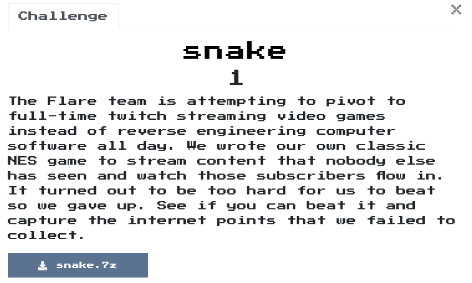
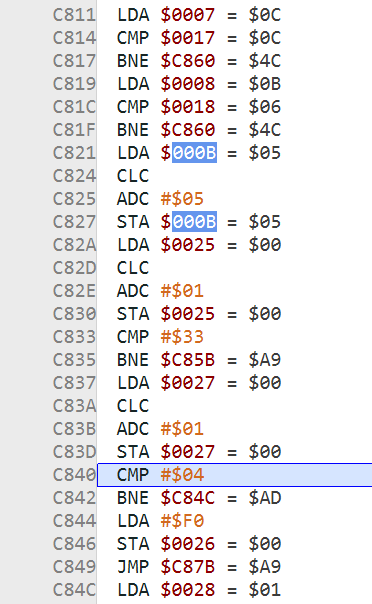
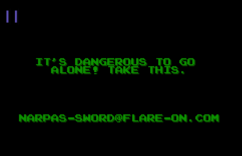

# snake

## Problem
  

## Solution

因為是第一次碰NES Game的題目，所以剛開始先用[nes-asm-tutorials](https://patater.com/nes-asm-tutorials/)學習NES game的asm，以及[Mesen](https://www.mesen.ca/docs/gettingstarted.html)來執行Nes Game，學習完後就用Mesen來Debug，先從觀察Memory的情況，分析出

```text
牆 x: 0xff, 0x18
牆 y: 0xff, 0x16
x: 0x00 ~ 0x17
y: 0x00 ~ 0x15

UP: 2
LEFT: 1
DOWN: 3
RIGHT: 0

0x03: keyboard now
0x04: direct
0x05: direct
0x07: snake x
0x08: snake y

0x0A: snake now length
0x0B: snake max length

0x17: apple x
0x18: apple y
```

仔細思考後，覺得應該跟分數有關，因此在Disassembly視窗搜尋會動$000B的區塊，發現以下關鍵區塊:  

  
發現他會去比對snake x y和apple x y的位置是不是一樣，是的話snake max length的長度就+5。  

而繼續往下觀察後，他會繼續判斷$00025+1是不是等於#$33以及$0027+1是不是等於#$4，故意讓他們成立後，flag就噴出來了。  

  