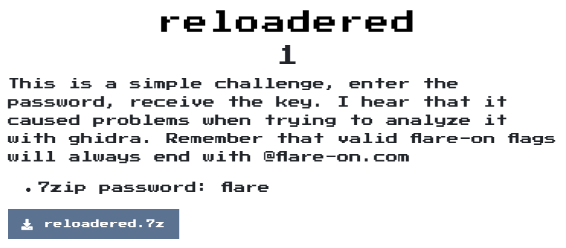
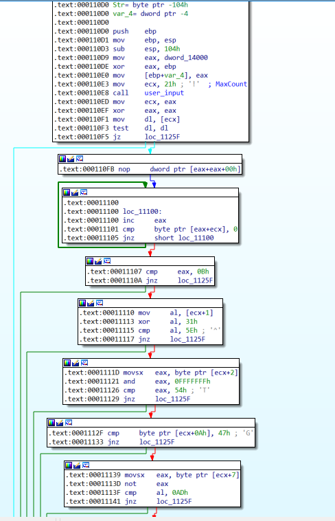
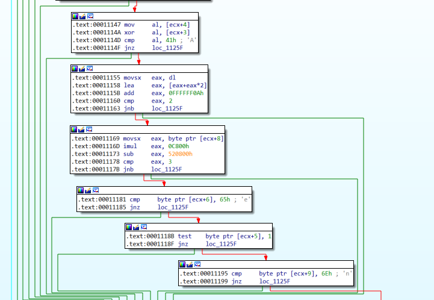
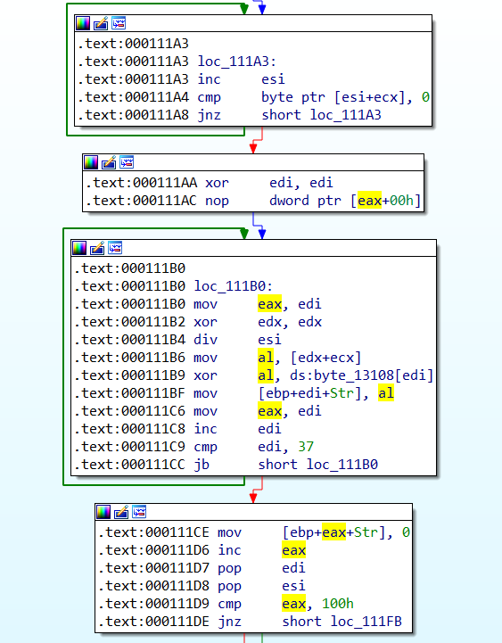
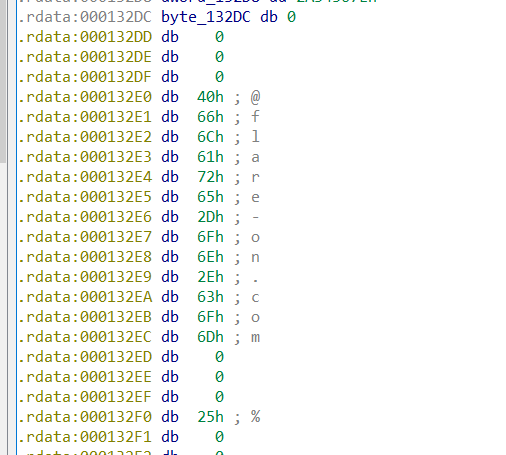
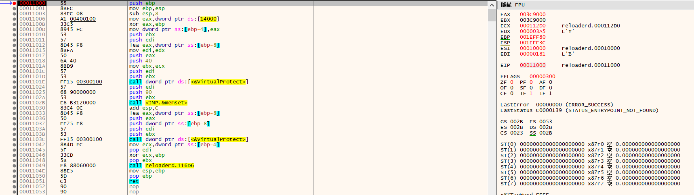
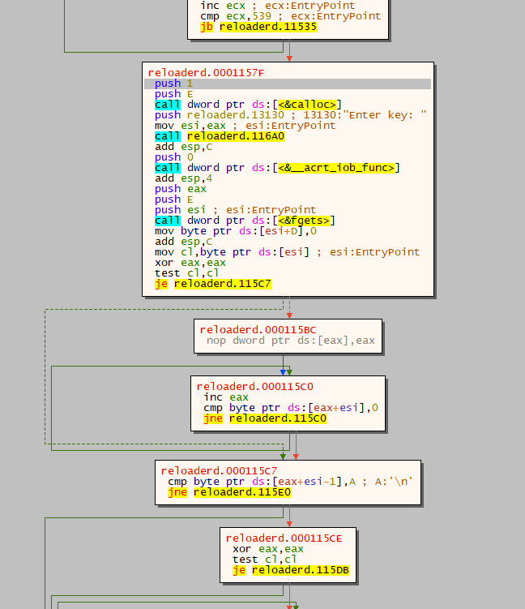
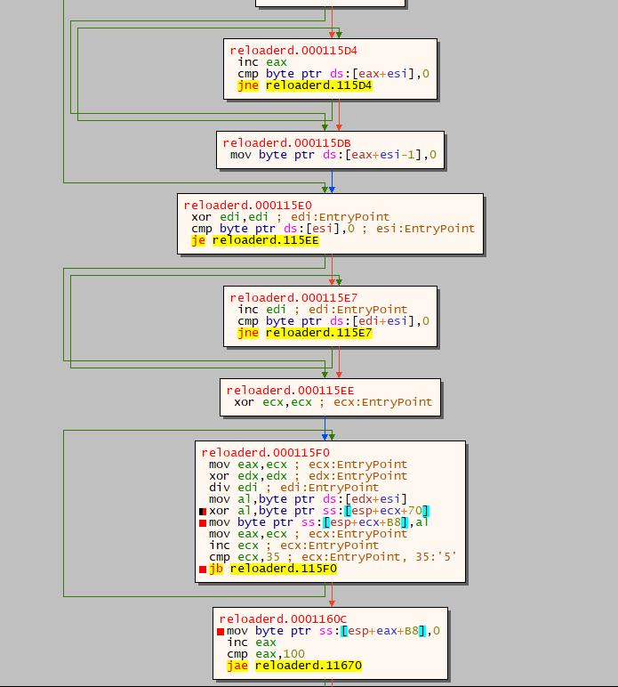
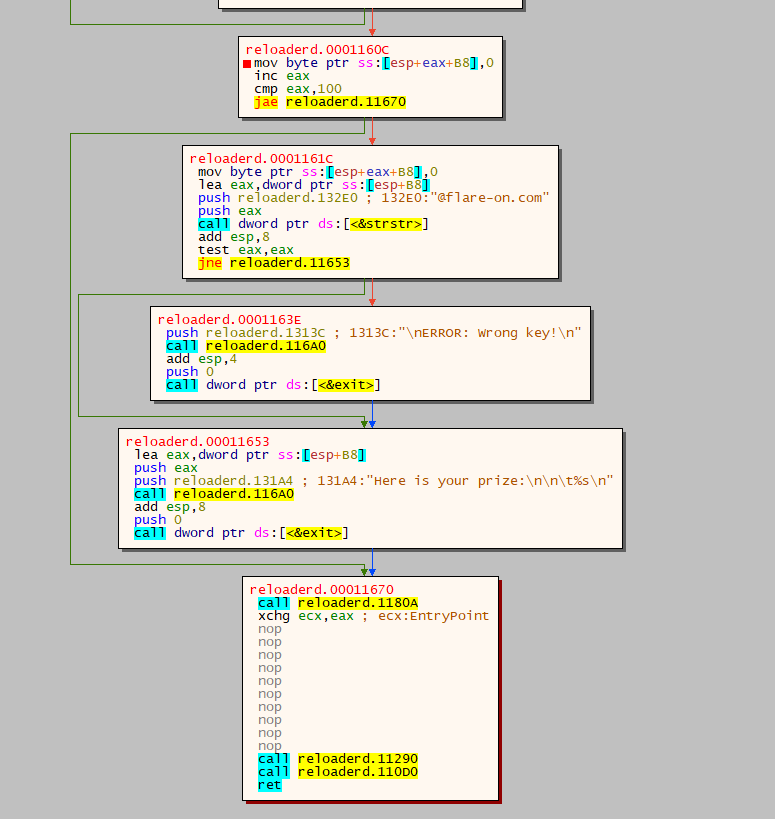
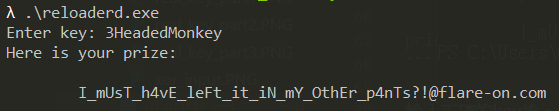

# reloadered

## Problem
  

## Solution

分析了一下程式，發現他會去比對一些規則:  
  
  

統整如下:
```text
輸入長度等於0xb

user_input[1] xor 0x31 == 0x5E
user_input[2] and 0xFFFFFFF == 0x54
user_input[0xA] == 0x47
not user_input[7] == 0xAD
user_input[0x3] xor user_input[0x4] == 0x41
user_input[0] * 3 add 0xFFFFFF0A < 2
user_input[8] * 0xc800 - 0x520800 < 3
user_input[6] == 0x65
user_input[5] and 1 == 0
user_input[9] == 0x6e
```

先隨便解出一組輸入`RoTt5beRinG`  
輸入後噴出一筆奇怪的flag，繼續分析後，發現他會去xor一個array，而array的長度為0x25，並且xor我們的輸入0x25次，因為flag後面一定是`@flare-on.com`，因此我們倒者解flag就噴出來囉!  

  

```python
xor_list = ["\x1c", "\x5c", "\x22", "\x00", "\x00", "\x17", "\x02", "\x62", "\x07",
            "\x00", "\x06", "\x0d", "\x08", "\x75", "\x45", "\x17", "\x17", "\x3c",
            "\x3d", "\x1c", "\x31", "\x32", "\x02", "\x2f", "\x12", "\x72", "\x39",
            "\x0d", "\x23", "\x1e", "\x28", "\x29", "\x69", "\x31", "\x00","\x39"]

flag = "@flare-on.com"

key = ""
for x, y in zip(flag[::-1], xor_list[::-1]):
    temp = chr(ord(x) ^ ord(y))
    print(f"{x} ^ {y}: {temp}")

```
後來發現上面的東西是假的，被騙了好久，  
用x32dbg debug的過程中發現，有一段code會去把0x112d0的memory內容全部變成0x90，也有一個小問題是我在debug的過程中輸入上面的key會噴出奇怪的flag，但直接跑會噴出`ERROR: Wrong key!`，以及在ida pro中，有個`@flare-on.com`的字串，查詢引用的地方落在會被改成0x90的範圍內，猜測可能在debug時會對code產生混淆之類的機制。

  
  

試著斷在entry後，開始分析，結果在x32dbg的graph中發現，原來有另一條路徑，試著將路徑中的判斷改成能到新路經後，分析一下code，  
大致是將我們的輸入不斷地做xor，最後判斷結尾是不是`@flare-on.com`即得到flag


  
  
  


```python
xor_list = ["\x7a", "\x17", "\x08", "\x34", "\x17", "\x31", "\x3b", "\x25",
            "\x5b", "\x18", "\x2e", "\x3a", "\x15", "\x56", "\x0e", "\x11",
            "\x3e", "\x0d", "\x11", "\x3b", "\x24", "\x21", "\x31", "\x06",
            "\x3c", "\x26", "\x7c", "\x3c", "\x0d", "\x24", "\x16", "\x3a",
            "\x14", "\x79", "\x01", "\x3a", "\x18", "\x5a", "\x58", "\x73",
            "\x2e", "\x09", "\x00", "\x16", "\x00", "\x49", "\x22", "\x01",
            "\x40", "\x08", "\x0a", "\x14",]

flag = "@flare-on.com"
key = ""
for x, y in zip(flag[::-1], xor_list[::-1]):
    temp = chr(ord(x) ^ ord(y))
    key += temp
    print(f"{repr(x)} ^ {repr(y)}: {temp}")
print(f"Key: {key[::-1]}")
```

輸入正確的key後，flag就噴出來囉!  
  