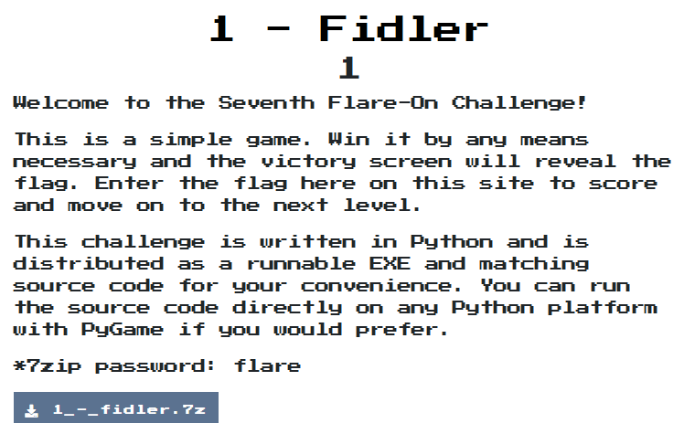
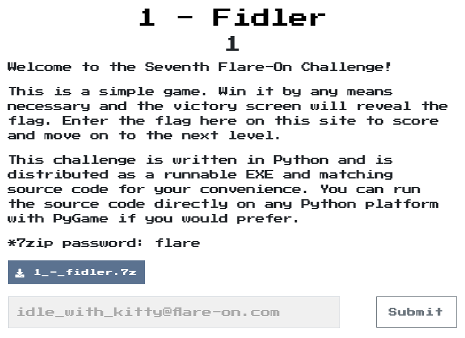

# Fidler

## Problem
  

## Solution

他是給了一個像是遊戲的程式，執行後會跳出個視窗要輸入密碼，有找到密碼，但一直輸入不進去
```python
def password_check(input):
    altered_key = 'hiptu'
    key = ''.join([chr(ord(x) - 1) for x in altered_key])
    return input == key

# key is ghost
```

換個想法直接找有沒有decode的相關東西，就真的找到了
```python
def decode_flag(frob):
    last_value = frob
    encoded_flag = [1135, 1038, 1126, 1028, 1117, 1071, 1094, 1077, 1121, 1087, 1110, 1092, 1072, 1095, 1090, 1027,
                    1127, 1040, 1137, 1030, 1127, 1099, 1062, 1101, 1123, 1027, 1136, 1054]
    decoded_flag = []

    for i in range(len(encoded_flag)):
        c = encoded_flag[i]
        val = (c - ((i%2)*1 + (i%3)*2)) ^ last_value
        decoded_flag.append(val)
        last_value = c

    return ''.join([chr(x) for x in decoded_flag])
```

分析一下，除了第一個字以外，其他都可以直接算出
```python
encoded_flag = [1135, 1038, 1126, 1028, 1117, 1071, 1094, 1077, 1121, 1087, 1110, 1092, 1072, 1095, 1090, 1027,
                    1127, 1040, 1137, 1030, 1127, 1099, 1062, 1101, 1123, 1027, 1136, 1054]

decoded_flag = []
last_value = encoded_flag[0]

for i in range(1, len(encoded_flag)):
    c = encoded_flag[i]
    val = (c - ((i%2)*1 + (i%3)*2)) ^ last_value
    decoded_flag.append(val)
    last_value = c

print(''.join([chr(x) for x in decoded_flag]))
```
得到flag是`dle_with_kitty@flare-on.com`，但剛剛有說第一個字算不出來，所以就猜吧!  
猜個`idle_with_kitty@flare-on.com`
就答對囉!

