# garbage

## Problem
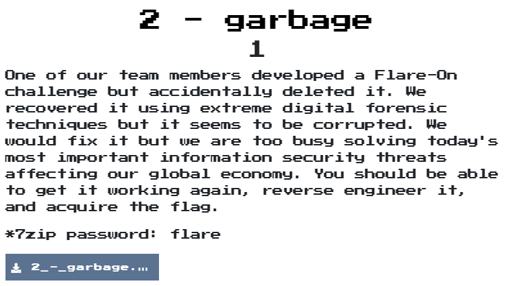  

## Solution

直接把他丟進ida時發現他好像有用UPX，觀察binary後真的有UPX的字樣，所以得先脫殼
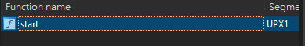  
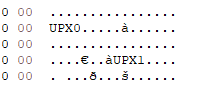  

要脫殼時發現他是壞掉的
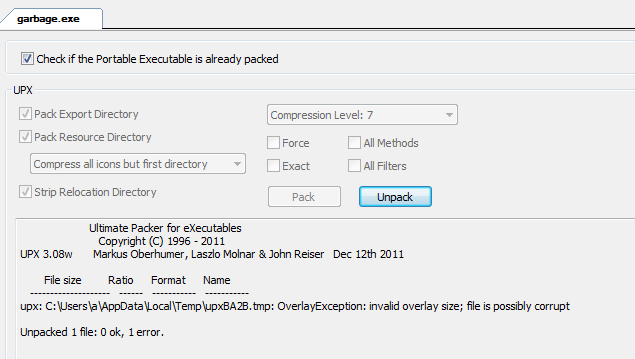  
接著看到他的Data Directories有invalid的字樣  
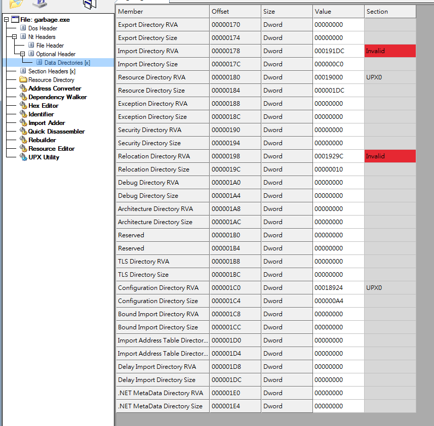  

為了知道他缺少什麼來build個hello world，因有觀察到他有NT header以及他是用upx3.94版本，所以hello world也要注意用MSVC build以及用upx3.94版pack  
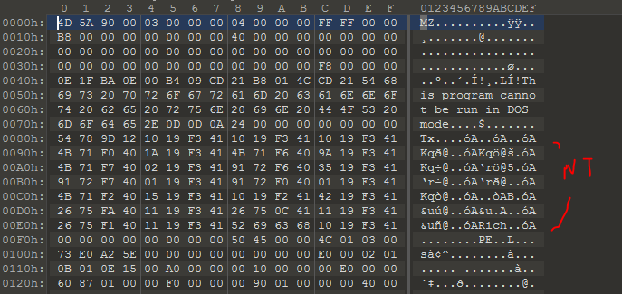  
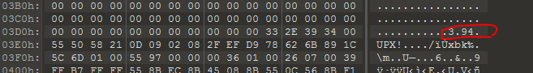  

build完後比對一下，發現garbage後面有東西不見了，貼過去後就正常囉
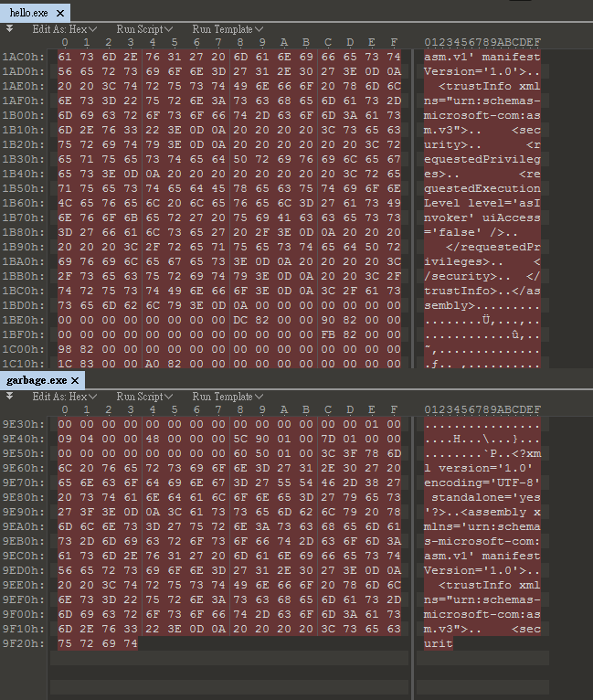  
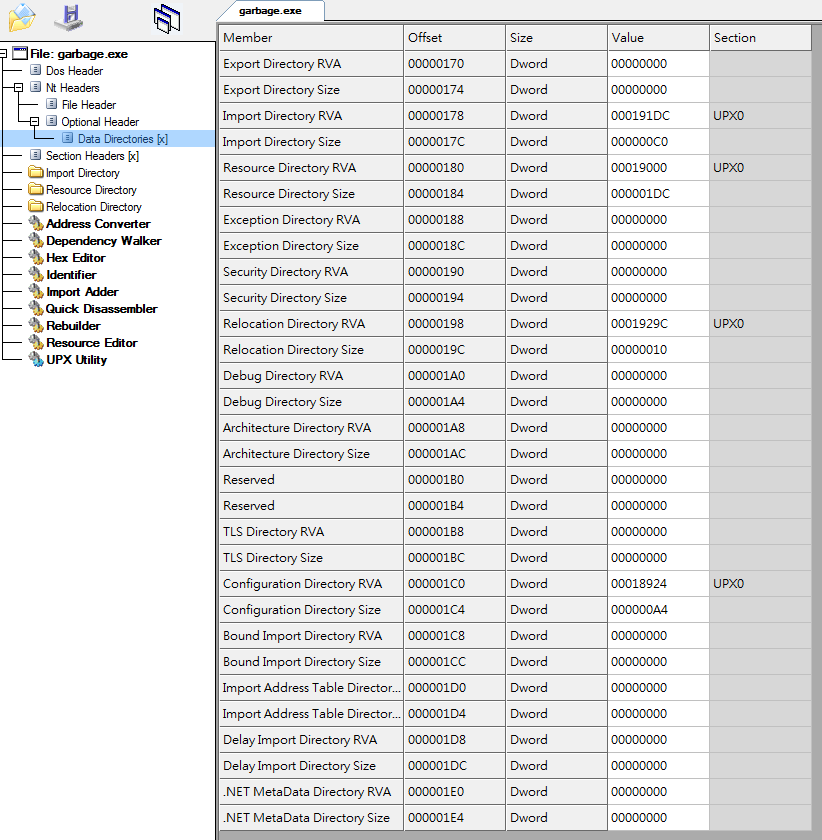  

接著在unpack後，就開始來分析吧，我這邊用Ghidra，[Decompiled.c](decompiled.c)
發現他有2個意義不明的字串跟一堆數值，而解析其他call function後，發現FUN_00401000主要是在decode那2個字串的，以及發現他們分別為檔案名稱與程式內容  
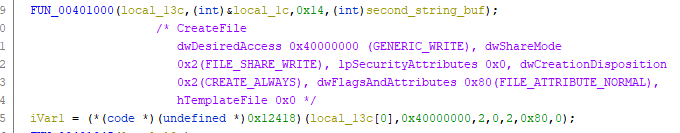  
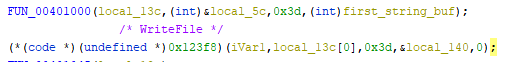  

接著寫個python script來decode，就出來囉  

```python
def func401000(buf, ptr, val, str_buf):
    buf[0] = ptr
    buf[1] = val
    buf[2] = str_buf
    buf[3] = 0x66
    if val != 0:
        for idx in range(val):
            buf[0][idx] = buf[0][idx] ^ ord(buf[2][idx])


first_str = "nPTnaGLkIqdcQwvieFQKGcTGOTbfMjDNmvibfBDdFBhoPaBbtfQuuGWYomtqTFqvBSKdUMmciqKSGZaosWCSoZlcIlyQpOwkcAgw "
second_str = "KglPFOsQDxBPXmclOpmsdLDEPMRWbMDzwhDGOyqAkVMRvnBeIkpZIhFznwVylfjrkqprBPAdPuaiVoVugQAlyOQQtxBNsTdPZgDH "


buf = [None, None, None, None]
ptr = [0x38, 0x0e, 0x0b, 0x3b, 0x19, 0x3b, 0x1b, 0x34, 0x1b, 0x0c, 0x23, 0x3e, 0x33, 0x08, 0x11, 0x42, 0x39, 0x12, 0x1e, 0x73]
val = 0x14
str_buf = second_str
func401000(buf, ptr, val, str_buf)
print(''.join([chr(x) for x in buf[0]]))

buf = [None, None, None, None]
ptr = [0x23, 0x23, 0x33, 0x2c,
 0x0e, 0x3f, 0x64, 0x49,
 0x0a, 0x1e, 0x0a, 0x04,
 0x23, 0x16, 0x02, 0x1a,
 0x44, 0x66, 0x08, 0x24,
 0x32, 0x11, 0x74, 0x2c,
 0x2a, 0x2d, 0x42, 0x0f,
 0x3e, 0x50, 0x64, 0x0d,
 0x5d, 0x04, 0x1b, 0x17,
 0x16, 0x36, 0x03, 0x05,
 0x34, 0x20, 0x09, 0x08,
 0x63, 0x21, 0x24, 0x0e,
 0x15, 0x14, 0x34, 0x58,
 0x1a, 0x29, 0x79, 0x3a,
 0x00, 0x00, 0x56, 0x58,
 0x54,
]
val = 0x3d
str_buf = first_str
func401000(buf, ptr, val, str_buf)
print(''.join([chr(x) for x in buf[0]]))

'''
sigk_the_tanker.vbs
MsgBox("Congrats! Your key is: C0rruptGarbag3@flare-on.com")
'''
```

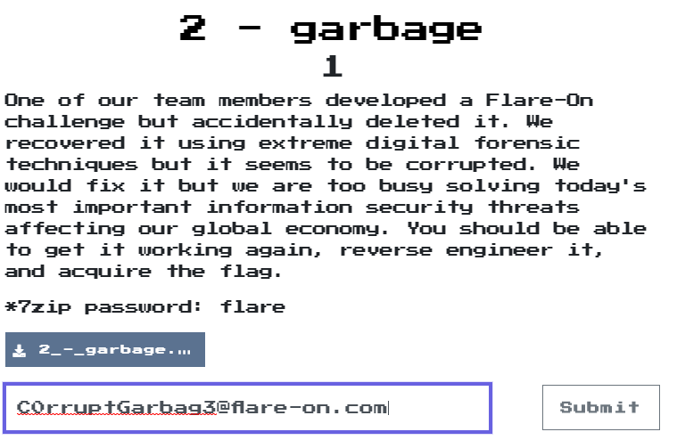