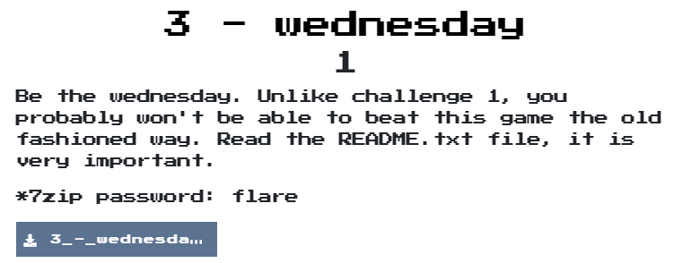
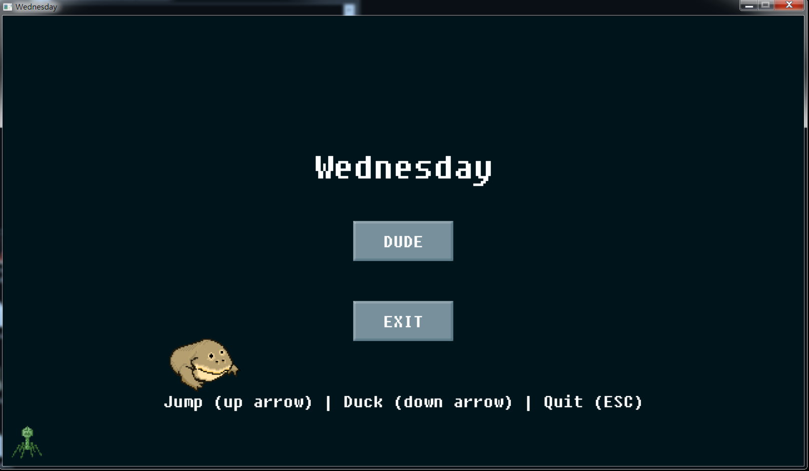
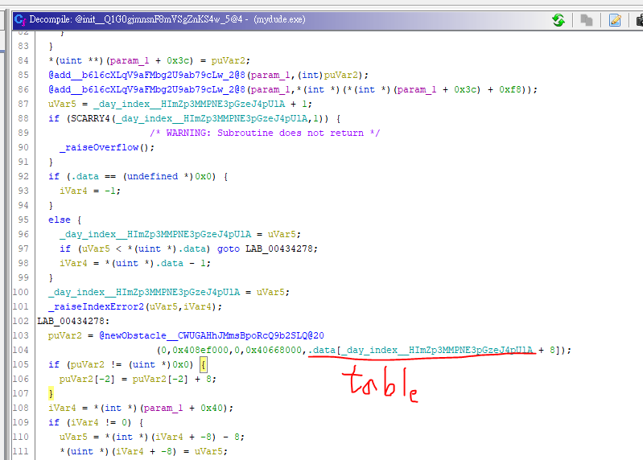
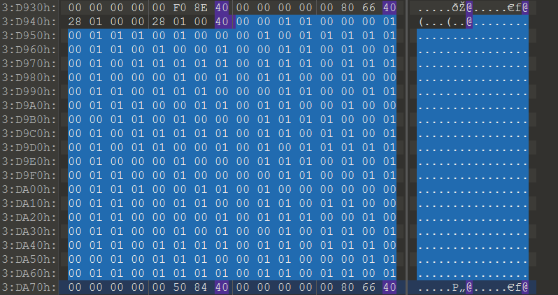

# wednesday

## Problem
  

## Solution
剛打開是一個遊戲畫面

在經過很多冤妄路後，在分析障礙物產生時，發現他有一個table，本來想說直接把那個table弄成全部都是down，方便通關，後來發先table本身竟然就是flag
  
  


寫個script就解開囉  
```python
obstacle_table="00110001011101000101111101101001001101010101111101110111010001010110010001101110001100110111001101100100001101000111100101011111011011010101100101011111010001000111010101100100001100110111001101000000011001100110110001100001011100100110010100101101011011110110111000101110011000110110111101101101"

flag = ""
for i in range(0, len(obstacle_table), 8):
    flag += chr(int(obstacle_table[i:i+8], 2))

# 1t_i5_wEdn3sd4y_mY_Dud3s@flare-on.com
```

