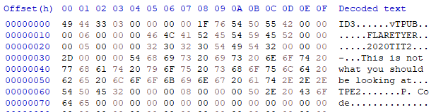
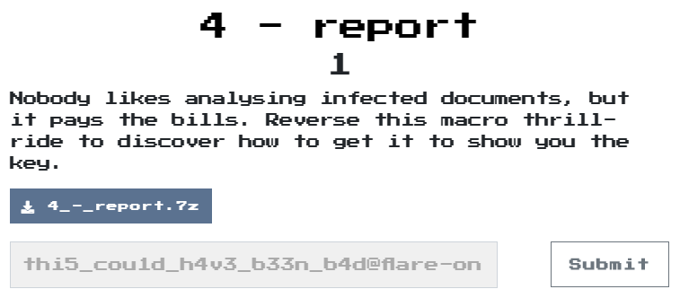

# report

## Problem
  

## Solution

拿到了一個report.xls，所以就拿olevba來分析看看，
解析出的檔案[analyze.txt](analyze.txt)  
大致是
```VB
VBA MACRO ThisWorkbook.cls 
in file: report.xls - OLE stream: u'_VBA_PROJECT_CUR/VBA/ThisWorkbook'
- - - - - - - - - - - - - - - - - - - - - - - - - - - - - - - - - - - - - - - 
Sub Workbook_Open()
Sheet1.folderol
End Sub

Sub Auto_Open()
Sheet1.folderol
End Sub
-------------------------------------------------------------------------------
VBA MACRO Sheet1.cls 
in file: report.xls - OLE stream: u'_VBA_PROJECT_CUR/VBA/Sheet1'
- - - - - - - - - - - - - - - - - - - - - - - - - - - - - - - - - - - - - - - 
Private Declare Function InternetGetConnectedState Lib "wininet.dll" _
(ByRef dwflags As Long, ByVal dwReserved As Long) As Long

Private Declare PtrSafe Function mciSendString Lib "winmm.dll" Alias _
   "mciSendStringA" (ByVal lpstrCommand As String, ByVal _
   lpstrReturnString As Any, ByVal uReturnLength As Long, ByVal _
   hwndCallback As Long) As Long

Private Declare Function GetShortPathName Lib "kernel32" Alias "GetShortPathNameA" _
    (ByVal lpszLongPath As String, ByVal lpszShortPath As String, ByVal lBuffer As Long) As Long

Public Function GetInternetConnectedState() As Boolean
  GetInternetConnectedState = InternetGetConnectedState(0&, 0&)
End Function

Function rigmarole(es As String) As String
    Dim furphy As String
    Dim c As Integer
    Dim s As String
    Dim cc As Integer
    furphy = ""
    For i = 1 To Len(es) Step 4
        c = CDec("&H" & Mid(es, i, 2))
        s = CDec("&H" & Mid(es, i + 2, 2))
        cc = c - s
        furphy = furphy + Chr(cc)
    Next i
    rigmarole = furphy
End Function

Function folderol()
    Dim wabbit() As Byte
    Dim fn As Integer: fn = FreeFile
    Dim onzo() As String
    Dim mf As String
    Dim xertz As Variant
    
    onzo = Split(F.L, ".")
    
    If GetInternetConnectedState = False Then
        MsgBox "Cannot establish Internet connection.", vbCritical, "Error"
        End
    End If

    Set fudgel = GetObject(rigmarole(onzo(7)))
    Set twattling = fudgel.ExecQuery(rigmarole(onzo(8)), , 48)
    For Each p In twattling
        Dim pos As Integer
        pos = InStr(LCase(p.Name), "vmw") + InStr(LCase(p.Name), "vmt") + InStr(LCase(p.Name), rigmarole(onzo(9)))
        If pos > 0 Then
            MsgBox rigmarole(onzo(4)), vbCritical, rigmarole(onzo(6))
            End
        End If
    Next
        
    xertz = Array(&H11, &H22, &H33, &H44, &H55, &H66, &H77, &H88, &H99, &HAA, &HBB, &HCC, &HDD, &HEE)

    wabbit = canoodle(F.T.Text, 0, 168667, xertz)
    mf = Environ(rigmarole(onzo(0))) & rigmarole(onzo(1))
    Open mf For Binary Lock Read Write As #fn
      Put #fn, , wabbit
    Close #fn
    
    mucolerd = mciSendString(rigmarole(onzo(2)) & mf, 0&, 0, 0)
End Function

Function canoodle(panjandrum As String, ardylo As Integer, s As Long, bibble As Variant) As Byte()
    Dim quean As Long
    Dim cattywampus As Long
    Dim kerfuffle() As Byte
    ReDim kerfuffle(s)
    quean = 0
    For cattywampus = 1 To Len(panjandrum) Step 4
        kerfuffle(quean) = CByte("&H" & Mid(panjandrum, cattywampus + ardylo, 2)) Xor bibble(quean Mod (UBound(bibble) + 1))
        quean = quean + 1
        If quean = UBound(kerfuffle) Then
            Exit For
        End If
    Next cattywampus
    canoodle = kerfuffle
End Function
```

把關鍵的2個function轉成python執行看看  
首先是rigmarole  
```python
rigmarole_encode_str = "9655B040B64667238524D15D6201.B95D4E01C55CC562C7557405A532D768C55FA12DD074DC697A06E172992CAF3F8A5C7306B7476B38.C555AC40A7469C234424.853FA85C470699477D3851249A4B9C4E.A855AF40B84695239D24895D2101D05CCA62BE5578055232D568C05F902DDC74D2697406D7724C2CA83FCF5C2606B547A73898246B4BC14E941F9121D464D263B947EB77D36E7F1B8254.853FA85C470699477D3851249A4B9C4E.9A55B240B84692239624.CC55A940B44690238B24CA5D7501CF5C9C62B15561056032C468D15F9C2DE374DD696206B572752C8C3FB25C3806.A8558540924668236724B15D2101AA5CC362C2556A055232AE68B15F7C2DC17489695D06DB729A2C723F8E5C65069747AA389324AE4BB34E921F9421.CB55A240B5469B23.AC559340A94695238D24CD5D75018A5CB062BA557905A932D768D15F982D.D074B6696F06D5729E2CAE3FCF5C7506AD47AC388024C14B7C4E8F1F8F21CB64"
for s in rigmarole_encode_str.split('.'):
    decode_str = ""
    for i in range(0, len(s), 4):
        f_value = int(s[i:i+2], 16)
        s_value = int(s[i+2:i+4], 16)
        decode_str += chr(f_value - s_value)

    print(decode_str)

'''
AppData
\Microsoft\stomp.mp3
play
FLARE-ON
Sorry, this machine is not supported.
FLARE-ON
Error
winmgmts:\\.\root\CIMV2
SELECT Name FROM Win32_Process
vbox
WScript.Network
\Microsoft\v.png
'''
```

可以先解析出主程式  
前面大致是一些反分析技術，像是確認有沒有網路以及執行的環境是不是虛擬機，後面就是decode一些資料存成一個MP3檔
```VB
Function folderol()
    Dim wabbit() As Byte
    Dim fn As Integer: fn = FreeFile
    Dim onzo() As String
    Dim mf As String
    Dim xertz As Variant
    
    onzo = Split(F.L, ".")
    
    If GetInternetConnectedState = False Then
        MsgBox "Cannot establish Internet connection.", vbCritical, "Error"
        End
    End If

    Set fudgel = GetObject(rigmarole(onzo(7)))
    Set twattling = fudgel.ExecQuery(rigmarole(onzo(8)), , 48)
    For Each p In twattling
        Dim pos As Integer
        pos = InStr(LCase(p.Name), "vmw") + InStr(LCase(p.Name), "vmt") + InStr(LCase(p.Name), rigmarole(onzo(9)))
        If pos > 0 Then
            MsgBox rigmarole(onzo(4)), vbCritical, rigmarole(onzo(6))
            End
        End If
    Next
        
    xertz = Array(&H11, &H22, &H33, &H44, &H55, &H66, &H77, &H88, &H99, &HAA, &HBB, &HCC, &HDD, &HEE)

    wabbit = canoodle(F.T.Text, 0, 168667, xertz)
    mf = Environ(rigmarole(onzo(0))) & rigmarole(onzo(1))
    Open mf For Binary Lock Read Write As #fn
      Put #fn, , wabbit
    Close #fn
    
    mucolerd = mciSendString(rigmarole(onzo(2)) & mf, 0&, 0, 0)
End Function
```

轉譯第2個function  
canoodle
```python
encode_str = too long...
decode_table = [0x11, 0x22, 0x33, 0x44, 0x55, 0x66, 0x77, 0x88, 0x99, 0xaa, 0xbb, 0xcc ,0xdd, 0xee]
decode = []
count = 0
base = 0
for i in range(0, len(encode_str), 4):
    first_value = int(encode_str[base+i:base+i+2], 16)
    second_value = decode_table[count % len(decode_table)]
    decode.append(first_value ^ second_value)
    count += 1
    if count == 168667:
        break

with open("test.mp3", "wb") as f:
    f.write(bytearray(decode))
```

可以得到一個mp3檔，但他檔案內容是`This is not what you should be looking at`  
  

本來想說應該是將`encode_str[base+i:base+i+2]`改成`encode_str[base+i+2:base+i+4]`，就會找出另一個關鍵，結果沒有，後來試了很多方法後，得到twitter網友的一個提示，key可能不太一樣

接著想到在rigmarole中有2個字串`FLARE-ON`和`\Microsoft\v.png`，猜測另一個檔案會是png檔以及key可能是`FLARE-ON`，在嘗試一下後真的找到囉
```python
encode_str = too long...
decode_table = [0x46, 0x4c, 0x41, 0x52, 0x45, 0x2d, 0x4f, 0x4e][::-1]
decode = []
count = 0
base = 0
for i in range(0, len(encode_str), 4):
    first_value = int(encode_str[base+i+2:base+i+4], 16)
    second_value = decode_table[count % len(decode_table)]
    decode.append(first_value ^ second_value)
    count += 1

with open("ans.png", "wb") as f:
    f.write(bytearray(decode))
```

  
  