# TKApp

## Problem
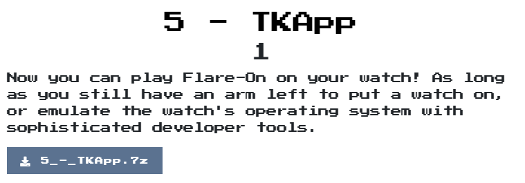  

## Solution

解開7z檔後是一個TKapp.tpk檔，再解開後，在`TKApp.deps.json`中可以觀察到僅`TKApp.dll`是自己寫的其他都是外部import的，因此先專注在它上面，同時也觀察到他是.net檔，所以就丟進dnSpy分析

首先看到他有一個`UnlockPage`，裡面主要是判斷輸入的密碼正確的話就登入  
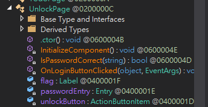  
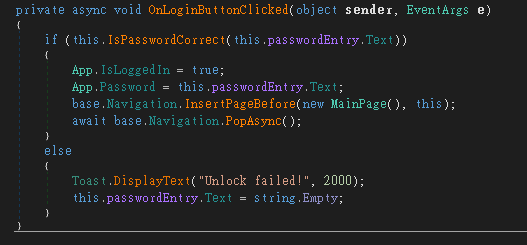  
分析了一下，寫個decode的程式
```python
password = [62, 38, 63, 63, 54, 39, 59, 50, 39]

text = ""
for p in password:
    text += chr(p ^ 83)
# mullethat
```

接著在`MainPage`中發現GetImage的內容有點特殊  
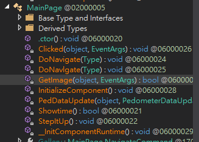  
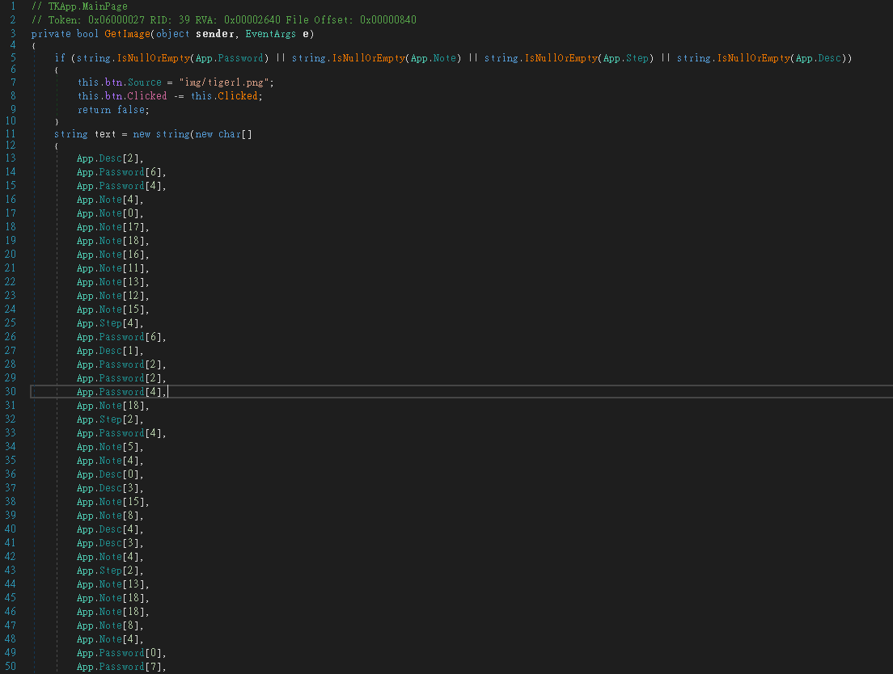  
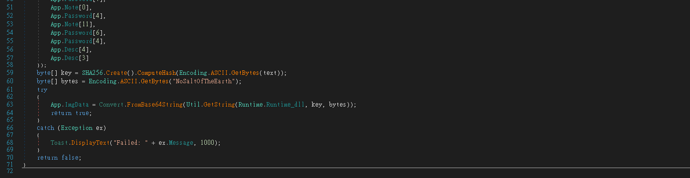  

看起來像是要取得`App.Password`, `App.Note`, `App.Step`, `App.Desc`就可以得到關鍵，我們目前有取得Password，來找出剩下的三個吧  

接著在`TodoPage`中看到SetupList  
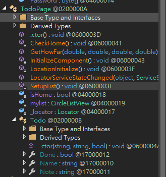  
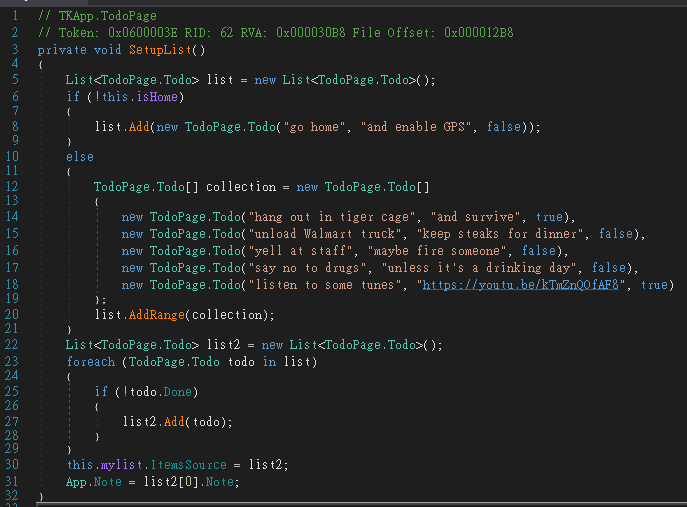  
觀察一下，沒意外Note就是`keep steaks for dinner`

接著在GalleryPage中看到IndexPage_CurrentPageChanged
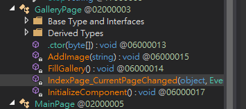  
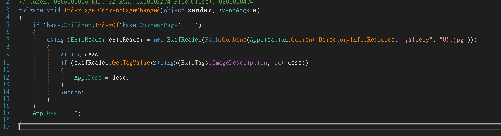  
他是要從res/gallery/05.jpg中取得EXIF的ImageDescription訊息  
因此用個online 工具 [metapicz](http://metapicz.com#landing)  
取得ImageDescription，所以desc為`water`  

接著在MainPage中看到PedDataUpdate  
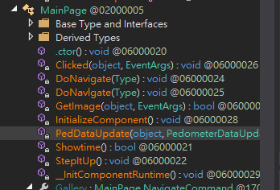  
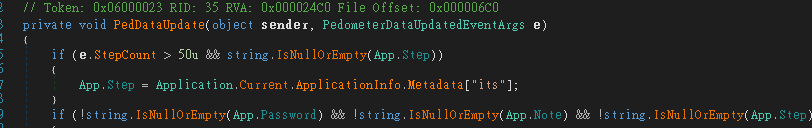  
然後在`tizen-manifest.xml`中找到its，所以Step是`magic`  
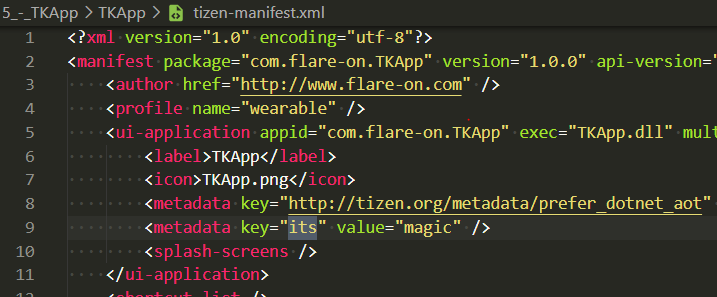  

現在4個值分別為:
* Password: `mullethat`
* Note: `keep steaks for dinner`
* Step: `magic`
* Desc: `water`

可以先用另一個function來確認一下  
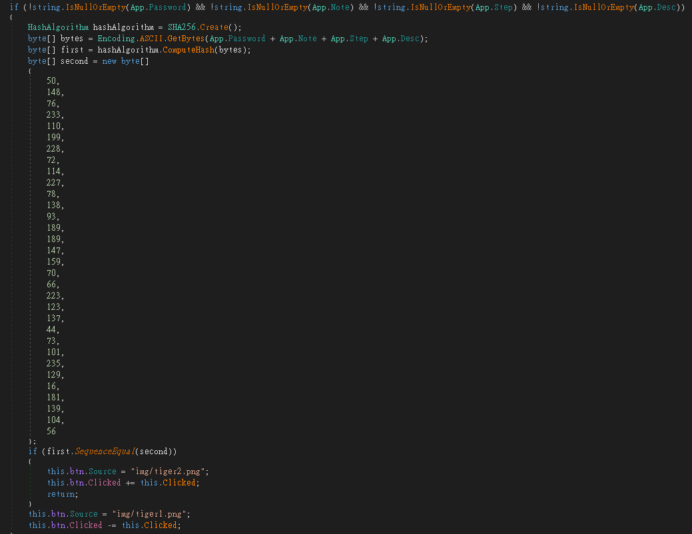  
確認後確定沒問題，來正式解密囉

直接寫C#比較快，記得先將Runtime.dll從dnSpy上dump出來後，並加入到專案的resource中  
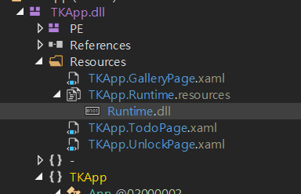  
```C#
using System;
using System.Security.Cryptography;
using System.Text;
using System.IO;
using System.Reflection;
using System.Resources;


namespace flare
{
    class Program
    {
        public static string GetString(byte[] cipherText, byte[] Key, byte[] IV)
        {
            string result = null;
            using (RijndaelManaged rijndaelManaged = new RijndaelManaged())
            {
                rijndaelManaged.Key = Key;
                rijndaelManaged.IV = IV;
                ICryptoTransform cryptoTransform = rijndaelManaged.CreateDecryptor(rijndaelManaged.Key, rijndaelManaged.IV);
                using (MemoryStream memoryStream = new MemoryStream(cipherText))
                {
                    using (CryptoStream cryptoStream = new CryptoStream(memoryStream, cryptoTransform, 0))
                    {
                        using (StreamReader streamReader = new StreamReader(cryptoStream))
                        {
                            result = streamReader.ReadToEnd();
                        }
                    }
                }
            }
            return result;
        }

        static void Main(string[] args)
        {
            string Password = "mullethat";
            string Note = "keep steaks for dinner";
            string Step = "magic";
            string Desc = "water";
            string text = new string(new char[]
            {
                Desc[2],
                Password[6],
                Password[4],
                Note[4],
                Note[0],
                Note[17],
                Note[18],
                Note[16],
                Note[11],
                Note[13],
                Note[12],
                Note[15],
                Step[4],
                Password[6],
                Desc[1],
                Password[2],
                Password[2],
                Password[4],
                Note[18],
                Step[2],
                Password[4],
                Note[5],
                Note[4],
                Desc[0],
                Desc[3],
                Note[15],
                Note[8],
                Desc[4],
                Desc[3],
                Note[4],
                Step[2],
                Note[13],
                Note[18],
                Note[18],
                Note[8],
                Note[4],
                Password[0],
                Password[7],
                Note[0],
                Password[4],
                Note[11],
                Password[6],
                Password[4],
                Desc[4],
                Desc[3]
            });
            Console.WriteLine(text);
            byte[] key = SHA256.Create().ComputeHash(Encoding.ASCII.GetBytes(text));
            byte[] bytes = Encoding.ASCII.GetBytes("NoSaltOfTheEarth");
            byte[] image;

            image = Convert.FromBase64String(GetString(Properties.Resources.Runtime, key, bytes));

            var path = @"flag";
            File.WriteAllBytes(path, image);
            Console.ReadLine();
        }
    }
}
```

拿到flag檔案後，發現他是jpg格式，改一下附檔名，就得到flag囉  

  
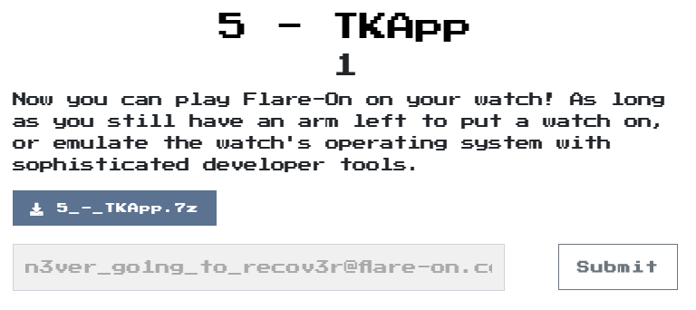  
