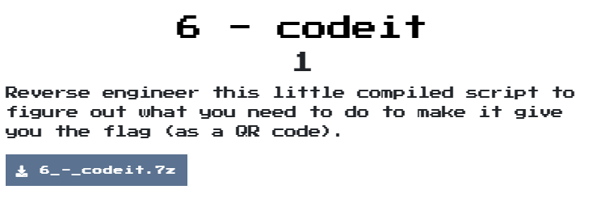
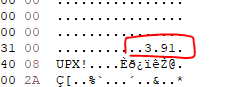
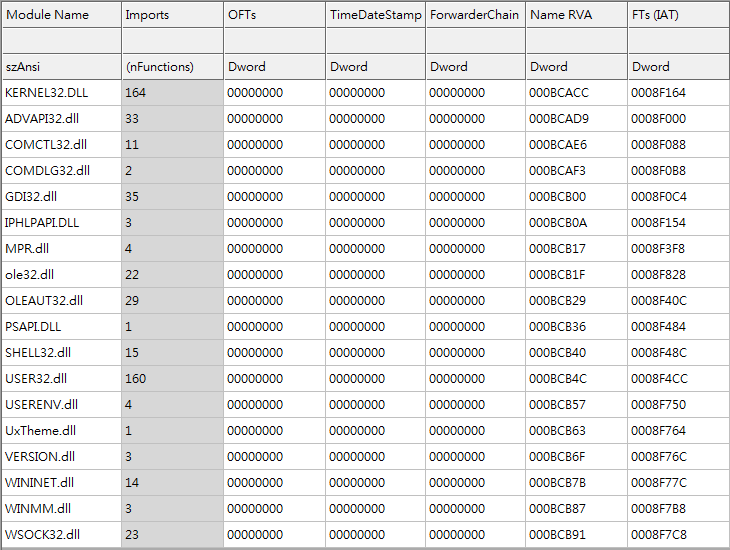
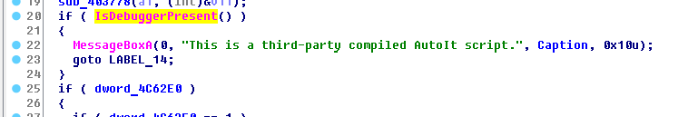
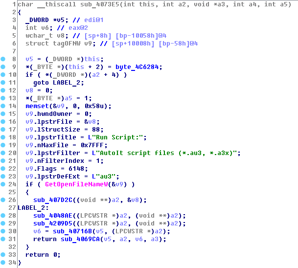
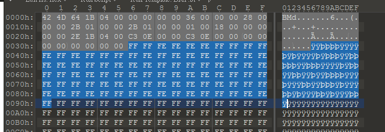
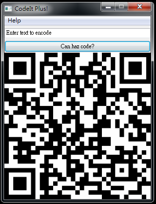

# codeit

## Problem
  

## Solution

這次給了一個upx加殼起來的檔案，版本為3.91  
  

解開後來分析一下  
觀察他的import directory:
  
GUI相關: COMCTL32、GDI32
網路相關: IPHLPAPI

執行時，發現它會產生亂數名稱的dll檔和bmp檔
用upx程式脫殼會無法執行，可能要手脫  
手脫一樣不能執行，放棄  

在分析過程中有看到`AutoIt v3`的字樣  
有anti debugger  
  

看到一個function，要達成某條件會去打開他
  

後來發現自己太傻了，原來有exe2aut這個專門用來decompile autoit v3的工具，  
取得了autoit的程式以及qr_encoder.dll和sprite.bmp，接著來分析程式[origin](origin)  
發現他自己的string table，寫個script來解析出來[parse_string_table.py](parse_string_table.py)  
解開後，發現`arehdidxrgk` function其實是查表得到string的功能，因此再寫個置換的script來轉換現在的程式[replace.py](replace.py)來取得[new](new)  

繼續分析後，發現關鍵在
```autoit
Func areyzotafnf(ByRef $flodiutpuy)
	Local $flisilayln = areuznaqfmn()
	If $flisilayln <> -1 Then
		$flisilayln = Binary(StringLower(BinaryToString($flisilayln)))
		Local $flisilaylnraw = DllStructCreate("struct;byte[" & BinaryLen($flisilayln) & "];endstruct")
		DllStructSetData($flisilaylnraw, 1, $flisilayln)
		aregtfdcyni($flisilaylnraw)
		Local $flnttmjfea = DllStructCreate("struct;ptr;ptr;dword;byte[32];endstruct")
		DllStructSetData($flnttmjfea, 3, 32)
		Local $fluzytjacb = DllCall("advapi32.dll", "int", "CryptAcquireContextA", "ptr", DllStructGetPtr($flnttmjfea, 1), "ptr", 0, "ptr", 0, "dword", 24, "dword", 4026531840)
		If $fluzytjacb[0] <> 0 Then
			$fluzytjacb = DllCall("advapi32.dll", "int", "CryptCreateHash", "ptr", DllStructGetData($flnttmjfea, 1), "dword", 32780, "dword", 0, "dword", 0, "ptr", DllStructGetPtr($flnttmjfea, 2))
			If $fluzytjacb[0] <> 0 Then
				$fluzytjacb = DllCall("advapi32.dll", "int", "CryptHashData", "ptr", DllStructGetData($flnttmjfea, 2), "struct*", $flisilaylnraw, "dword", DllStructGetSize($flisilaylnraw), "dword", 0)
				If $fluzytjacb[0] <> 0 Then
					$fluzytjacb = DllCall("advapi32.dll", "int", "CryptGetHashParam", "ptr", DllStructGetData($flnttmjfea, 2), "dword", 2, "ptr", DllStructGetPtr($flnttmjfea, 4), "ptr", DllStructGetPtr($flnttmjfea, 3), "dword", 0)
					If $fluzytjacb[0] <> 0 Then
						Local $flmtvyzrsy = Binary("0x" & "08020" & "00010" & "66000" & "02000" & "0000") & DllStructGetData($flnttmjfea, 4)
						Local $flkpzlqkch = Binary("0x" & "CD4B3" & "2C650" & "CF21B" & "DA184" & "D8913" & "E6F92" & "0A37A" & "4F396" & "3736C" & "042C4" & "59EA0" & "7B79E" & "A443F" & "FD189" & "8BAE4" & "9B115" & "F6CB1" & "E2A7C" & "1AB3C" & "4C256" & "12A51" & "9035F" & "18FB3" & "B1752" & "8B3AE" & "CAF3D" & "480E9" & "8BF8A" & "635DA" & "F974E" & "00135" & "35D23" & "1E4B7" & "5B2C3" & "8B804" & "C7AE4" & "D266A" & "37B36" & "F2C55" & "5BF3A" & "9EA6A" & "58BC8" & "F906C" & "C665E" & "AE2CE" & "60F2C" & "DE38F" & "D3026" & "9CC4C" & "E5BB0" & "90472" & "FF9BD" & "26F91" & "19B8C" & "484FE" & "69EB9" & "34F43" & "FEEDE" & "DCEBA" & "79146" & "0819F" & "B21F1" & "0F832" & "B2A5D" & "4D772" & "DB12C" & "3BED9" & "47F6F" & "706AE" & "4411A" & "52")
						Local $fluelrpeax = DllStructCreate("struct;ptr;ptr;dword;byte[8192];byte[" & BinaryLen($flmtvyzrsy) & "];dword;endstruct")
						DllStructSetData($fluelrpeax, 3, BinaryLen($flkpzlqkch))
						DllStructSetData($fluelrpeax, 4, $flkpzlqkch)
						DllStructSetData($fluelrpeax, 5, $flmtvyzrsy)
						DllStructSetData($fluelrpeax, 6, BinaryLen($flmtvyzrsy))
						Local $fluzytjacb = DllCall("advapi32.dll", "int", "CryptAcquireContextA", "ptr", DllStructGetPtr($fluelrpeax, 1), "ptr", 0, "ptr", 0, "dword", 24, "dword", 4026531840)
						If $fluzytjacb[0] <> 0 Then
							$fluzytjacb = DllCall("advapi32.dll", "int", "CryptImportKey", "ptr", DllStructGetData($fluelrpeax, 1), "ptr", DllStructGetPtr($fluelrpeax, 5), "dword", DllStructGetData($fluelrpeax, 6), "dword", 0, "dword", 0, "ptr", DllStructGetPtr($fluelrpeax, 2))
							If $fluzytjacb[0] <> 0 Then
								$fluzytjacb = DllCall("advapi32.dll", "int", "CryptDecrypt", "ptr", DllStructGetData($fluelrpeax, 2), "dword", 0, "dword", 1, "dword", 0, "ptr", DllStructGetPtr($fluelrpeax, 4), "ptr", DllStructGetPtr($fluelrpeax, 3))
								If $fluzytjacb[0] <> 0 Then
									Local $flsekbkmru = BinaryMid(DllStructGetData($fluelrpeax, 4), 1, DllStructGetData($fluelrpeax, 3))
									$flfzfsuaoz = Binary("FLARE")
									$fltvwqdotg = Binary("ERALF")
									$flgggftges = BinaryMid($flsekbkmru, 1, BinaryLen($flfzfsuaoz))
									$flnmiatrft = BinaryMid($flsekbkmru, BinaryLen($flsekbkmru) - BinaryLen($fltvwqdotg) + 1, BinaryLen($fltvwqdotg))
									If $flfzfsuaoz = $flgggftges AND $fltvwqdotg = $flnmiatrft Then
										DllStructSetData($flodiutpuy, 1, BinaryMid($flsekbkmru, 6, 4))
										DllStructSetData($flodiutpuy, 2, BinaryMid($flsekbkmru, 10, 4))
										DllStructSetData($flodiutpuy, 3, BinaryMid($flsekbkmru, 14, BinaryLen($flsekbkmru) - 18))
									EndIf
								EndIf
								DllCall("advapi32.dll", "int", "CryptDestroyKey", "ptr", DllStructGetData($fluelrpeax, 2))
							EndIf
							DllCall("advapi32.dll", "int", "CryptReleaseContext", "ptr", DllStructGetData($fluelrpeax, 1), "dword", 0)
						EndIf
					EndIf
				EndIf
				DllCall("advapi32.dll", "int", "CryptDestroyHash", "ptr", DllStructGetData($flnttmjfea, 2))
			EndIf
			DllCall("advapi32.dll", "int", "CryptReleaseContext", "ptr", DllStructGetData($flnttmjfea, 1), "dword", 0)
		EndIf
	EndIf
EndFunc
```

這邊只要能夠成功CryptDecrypt，就能得到flag，  
剛開始思考很久，後來twitter的網友給點小提示可以注意讀取bmp檔案的function，也就`aregtfdcyni`  
```autoit
Func aregtfdcyni(ByRef $flkqaovzec)
	Local $flqvizhezm = aregfmwbsqd(14)
	Local $flfwezdbyc = arerujpvsfp($flqvizhezm)
	If $flfwezdbyc <> -1 Then
		Local $flvburiuyd = arenwrbskll($flfwezdbyc)
		If $flvburiuyd <> -1 AND DllStructGetSize($flkqaovzec) < $flvburiuyd - 54 Then
			Local $flnfufvect = DllStructCreate("struct;byte[" & $flvburiuyd & "];endstruct")
			Local $flskuanqbg = aremlfozynu($flfwezdbyc, $flnfufvect)
			If $flskuanqbg <> -1 Then
				Local $flxmdchrqd = DllStructCreate("struct;byte[54];byte[" & $flvburiuyd - 54 & "];endstruct", DllStructGetPtr($flnfufvect))
				Local $flqgwnzjzc = 1
				Local $floctxpgqh = ""
				For $fltergxskh = 1 To DllStructGetSize($flkqaovzec)
					Local $flydtvgpnc = Number(DllStructGetData($flkqaovzec, 1, $fltergxskh))
					For $fltajbykxx = 6 To 0 Step -1
						$flydtvgpnc += BitShift(BitAND(Number(DllStructGetData($flxmdchrqd, 2, $flqgwnzjzc)), 1), -1 * $fltajbykxx)
						$flqgwnzjzc += 1
					Next
					$floctxpgqh &= Chr(BitShift($flydtvgpnc, 1) + BitShift(BitAND($flydtvgpnc, 1), -7))
				Next
				DllStructSetData($flkqaovzec, 1, $floctxpgqh)
			EndIf
		EndIf
		arevtgkxjhu($flfwezdbyc)
	EndIf
	arebbytwcoj($flqvizhezm)
EndFunc
```

可以發現他讀取sprite.bmp header之後的程式來解析出新資料，  
  

再寫個script來解析出真正的key [get_key.py](get_key.py)  
取得了`aut01tfan1999`，為了讓他可以用這組key去解析，我們稍微改一下值  
```autoit
Func areyzotafnf(ByRef $flodiutpuy)
	Local $flisilayln = areuznaqfmn()
	If $flisilayln <> -1 Then
		$flisilayln = Binary(StringLower("aut01tfan1999"))
		Local $flisilaylnraw = DllStructCreate("struct;byte[" & BinaryLen($flisilayln) & "];endstruct")
		DllStructSetData($flisilaylnraw, 1, $flisilayln)
		aregtfdcyni($flisilaylnraw)
```
然後執行起來，就可以取得key囉  
  
flag: `L00ks_L1k3_Y0u_D1dnt_Run_Aut0_Tim3_0n_Th1s_0ne!@flare-on.com`  

我有解析其他的function在做什麼，可以參考[ref_new](ref_new)  

  