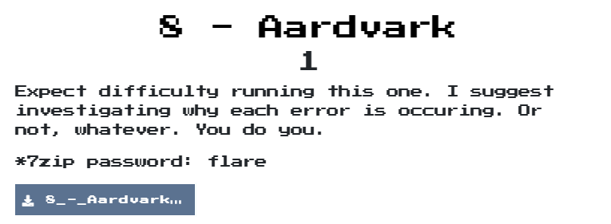
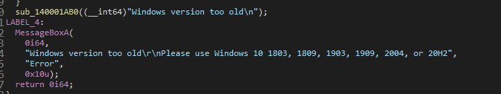
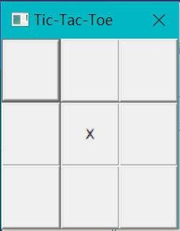
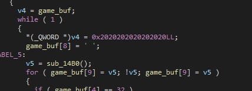
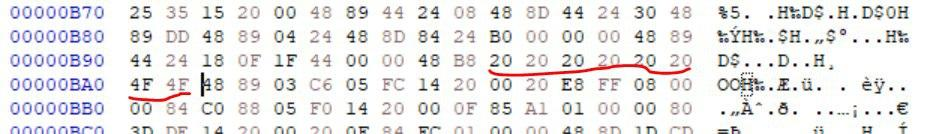
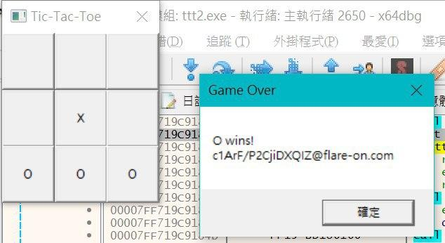
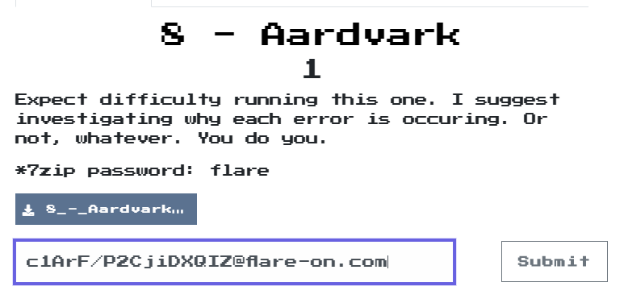

# Aardvark

## Problem
  

## Solution

剛開始分析時都打不開，所以剛開始用靜態分析，發現他主體會去打開af_unix的socket，並且會在temp資料夾中創建一個elf檔案，分析那個elf檔案後發現他是一個井字遊戲，如果要拿到flag的話，必須贏過他，本來想說靜態反解，但他有些xor的資料來自/proc，所以還是放棄  
後來在程式中找到他會去判斷os要為windows 10，而且看版號以及會用到elf檔，直覺要支援WSL，所以就換台電腦來執行看看  
  

換了之後真的是井字遊戲  
  

為了讓他能通過，就下斷點在產生檔案後，再來修改elf檔案  
我這邊是在分析時發現他會init井字遊戲，所以就來修改吧  
  
將他最後2個改成0x4f也就是O  
  

改好後繼續執行，因為那2個是左下和中下，所以我再點右下就獲勝囉  
剛開始拿到flag時，還不知道那是正確的，搞了我超久，後來好險有twitter網友說，flag看起來很怪，才發現已經解開了  
  

  