# crackinstaller

## Problem
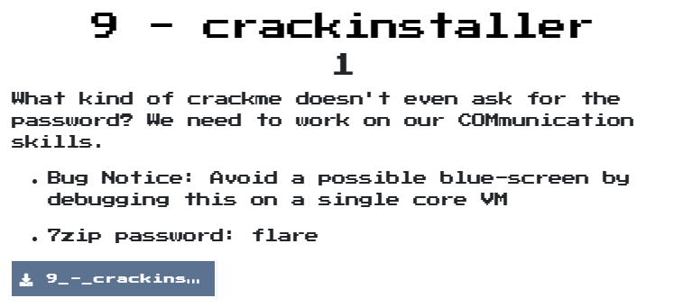  

## Solution

剛開始莫名的一直crash，所以想說先靜態分析  
分析時發現剛開始有個地方好像在decode什麼東西，解開後發現是個dll檔案  
  

在分析dll檔時，發現他有用到register的相關function，想說那改用admin權限開好了，就發現原來一開始會一直crash是因為沒用admin權限開  
而因為有用到register，因此就來比對一下執行前後的register吧，比對時發現一些很特殊的東西，感覺關鍵就在這  
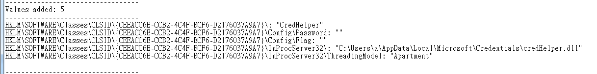  
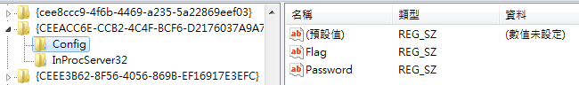  
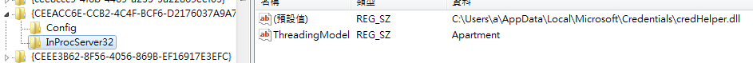  

之後在crackinstaller.exe中發現有個function負責decode被encode的字串，就大概解析一下  
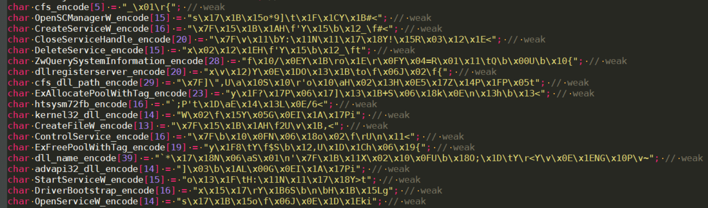  
decode script
```python
key = "<g~{<it"
encode_str = ""
decode_str = ""
idx = 0
for encode_chr in encode_str:
    decode_str += chr(ord(encode_chr) ^ ord(key[idx % len(key)]))
    idx += 1
```

看到一些SCManager的東西，就追去過去看，發現他會載入一個`\\\\.\\Htsysm72FB\`的driver，並開啟一個名稱為cfs的service執行cfs.dll，而且這個function在靜態分析中是找不到哪裡在Call他的，因為它會在程式開剛始時，由2個值算它的位址，再跳過來  
並且會將一個driver.sys透過DeviceIoControl載入service中  

觀察一下，它的control是用0xAA0313044，而在觀察cfs.dll的code發現還有其他的function  
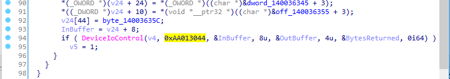  
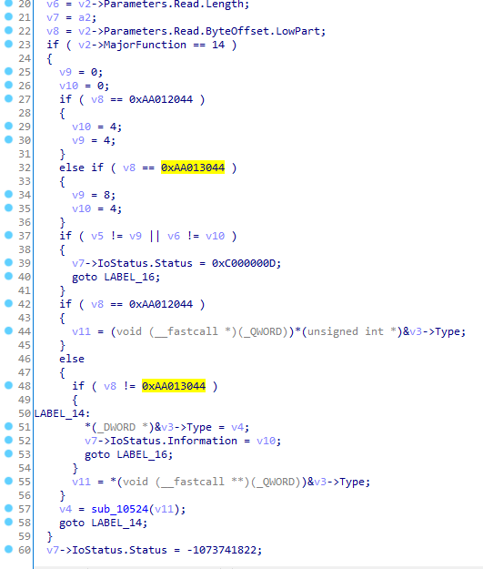  

試了一下，發現跟他無關，做白功了  

繼續分析後看到，一段跟CLSID PATH相關的code，分析一下發現他是chacha2 decrypt  
  
實際寫code還原時，拿到的是一個看起來超怪的字串`\x1d!)b\xbd\x9c;MR'K\xabs\xa4\xfd`  

後來在twitter網友的提示下，得知某個地方會偷偷修改driver.sys  
找了非常的久終於被我找到啦  
在off_140036355的值中，發現他是一個會去修改code的function  
他會把driver.sys中`0xDC16F3C3B57323`修改成`ABACABB`  
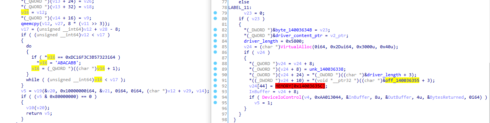  

修改後發現原來他原先driver.sys中chacha2的key是錯的，因此修正後script，就取得真正的password啦  
```python
import hashlib
from base64 import b64encode

from Crypto.Cipher import ChaCha20

key = b'BBACABA' # b'\x23\x73\xb5\xc3\xf3\x16\xdc'
nonce = b"\x00" * 8
ciphertext = b"\x10\x31\xf0\x8b\x89\x4e\x73\xb5\x30\x47\xad\x6e\x18\xa9\x5e"

secret = hashlib.sha256()

secret.update(key)

cipher = ChaCha20.new(key=secret.digest(), nonce=nonce)
plaintext = cipher.decrypt(ciphertext)
print("Decrypted: {plaintext}")
# Decrypted: H@n $h0t FiRst!
```

接著分析credHelp.dll時發現有個地方會去用到password並建立一個表  
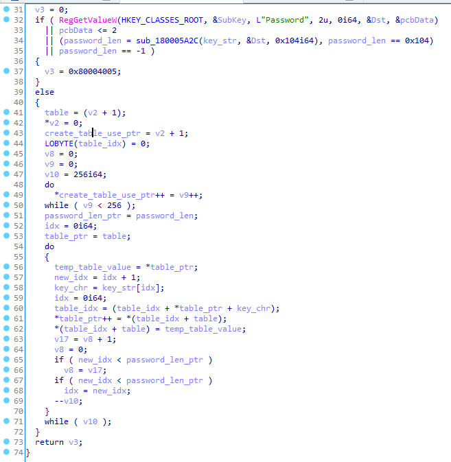  
而在另一個地方發現decode flag需要一張表，因此猜測要用password建立一張表並用來decode flag  
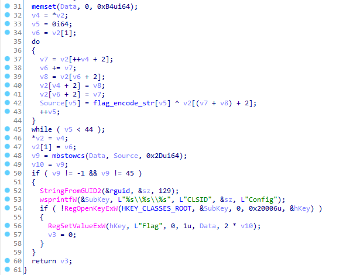  
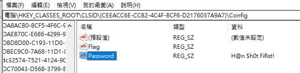  

剛開始修改流程，但一直解出怪字串  
後來twitter網友提示他們都會pass 一個buf，因此就嘗試抓一塊可用的空間pass過去  
才發現他的decode table 前面會先留2個空白  
因此就取得flag囉  
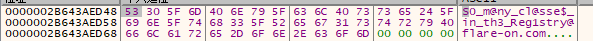  

decode script  
```python
encode_str = [
  22, 86, 188, 134, 158, 225, 209, 2, 101, 193, 105,
  159, 16, 10, 172, 193, 246, 233, 253, 180, 205, 34,
  74, 53, 156, 18, 115, 189, 43, 16, 84, 185, 67, 210,
  19, 154, 132, 101, 173, 176, 191, 90, 129, 16
]

key = "H@n $h0t FiRst!"

table = list(range(0x100))

print("-- original --")
for i in range(0, len(table), 16):
    print(", ".join([hex(val) for val in table[i:i+16]]))

idx = 0
table_idx = 0
for i in range(256):
    key_chr = key[idx]
    table_idx = (table[i] + table_idx + ord(key_chr)) & 0xff
    table[i], table[table_idx] = table[table_idx], table[i]
    idx = (idx + 1) % len(key)

print("-- new --")
for i in range(0, len(table), 16):
    print(", ".join([hex(val) for val in table[i:i+16]]))

flag =  ""
table = [0, 0] + table
v4 = table[0]
v5 = 0
v6 = table[1]
while v5 < 44:
    v4 += 1
    v7 = table[(v4 + 2) & 0xff]
    v6 = (v6 + v7) & 0xff
    v8 = table[(v6 + 2) & 0xff]
    table[(v4 + 2) & 0xff] = v8
    table[(v6 + 2) & 0xff] = v7

    xor_value = encode_str[v5] ^ table[(v7 + v8 + 2) & 0xff]
    flag += chr(xor_value)
    v5 += 1

print(flag)
# S0_m@ny_cl@sse$_in_th3_Reg1stry@flare-on.com
```

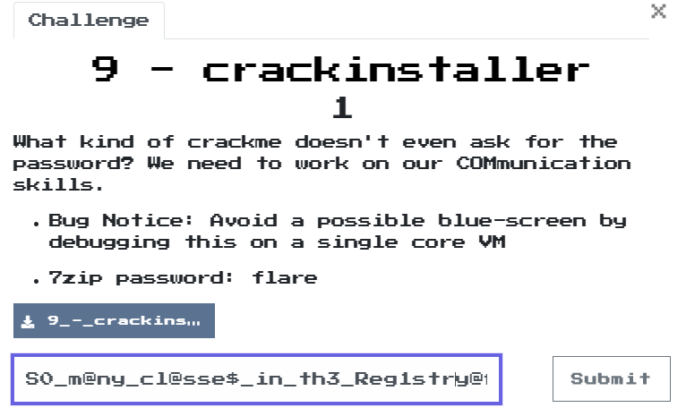  