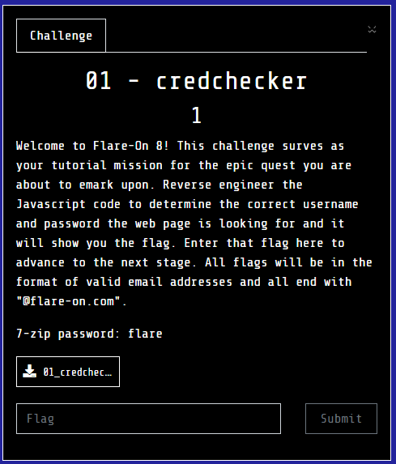
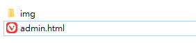
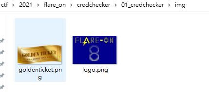
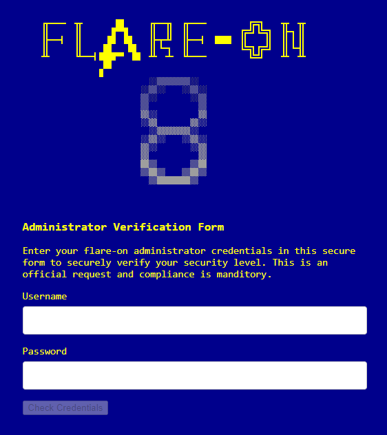
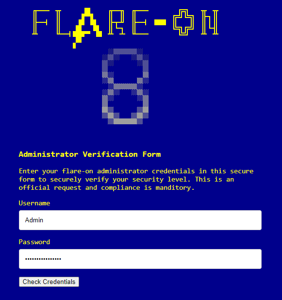
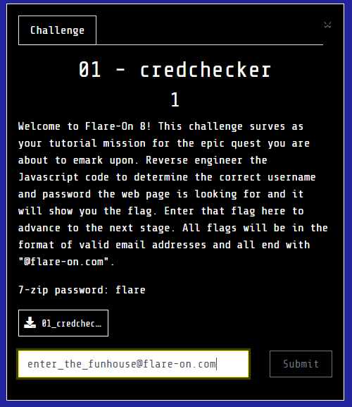

# credchecker

## Problem
  

## Solution

剛開始會拿到個一個html與兩張圖片  
  
  
打開`admin.html`  
  
蠻明顯的就是要通過登入驗證，而在圖片中有看到一張`GOLDEN TICKET`的圖片，應該就是過驗證後會有那張圖片，來分析CODE囉  
看了一下列出關鍵程式  

```javascript
var encoded_key = "P1xNFigYIh0BGAofD1o5RSlXeRU2JiQQSSgCRAJdOw=="

function checkCreds() {
	if (username.value == "Admin" && atob(password.value) == "goldenticket") 
	{
		var key = atob(encoded_key);
		var flag = "";
		for (let i = 0; i < key.length; i++)
		{
			flag += String.fromCharCode(key.charCodeAt(i) ^ password.value.charCodeAt(i % password.value.length))
		}
		document.getElementById("banner").style.display = "none";
		document.getElementById("formdiv").style.display = "none";
		document.getElementById("message").style.display = "none";
		document.getElementById("final_flag").innerText = flag;
		document.getElementById("winner").style.display = "block";
	}
	else
	{
		document.getElementById("message").style.display = "block";
	}
}
```

主要關鍵點在  

```javascript
atob(password.value) == "goldenticket"
```
只要讓這段通過驗證，應該就成功了，因此直接開browser的console  

```javascript
>> btoa("goldenticket")
<< "Z29sZGVudGlja2V0"
```

接著帳號輸入`Admin`密碼輸入`Z29sZGVudGlja2V0`，就通過囉  
  
  

  
