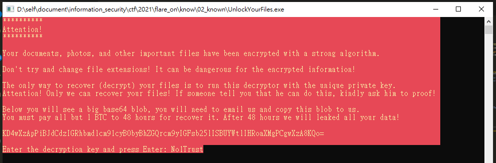

# know

## Problem

  

## Solution

剛開始會拿到個一個exe與一些被加密的檔案  
  
  

執行起來的畫面  
  

看到有個應該是base64的字串，解開看看  

```python
In [3]: base64.b64decode("KD4wXzApPiBJdCdzIGRhbmdlcm91cyB0byBhZGQrcm9yIGFsb25lISBUYWtlIHRoaXMgPCgwXzA8KQo=")
Out[3]: b"(>0_0)> It's dangerous to add+ror alone! Take this <(0_0<)\n"
```

接著開始分析程式，看到`00401370`是在找副檔名為`encrypted`的檔案，找到之後會去呼叫`00401220`  
  
  

而`00401220`會去判斷檔案存不存在，並且讀取內容後，呼叫`004011F0`後，將新的值寫進檔案中  
  

`004011F0`看了一下內容應該是解密程式，他是每次只做8bytes，因此猜測密碼只有8bytes  
  

解密程式  

```python
file_content = ""
key = ""
for index in range(8):
    fc = file_content[index]
    kc = key[index]
    fc = (fc ^ kc) & 0xff
    fc = rol(fc, index, 8) & 0xff
    fc = (fc - index) & 0xff
    file_content[index] = fc
```


接著來試著還原KEY，因為其中一個被加密的檔案剛好有PNG檔，而他的檔頭固定是`89 50 4E 47 0D 0A 1A 0A`，剛好為8位數，本來想自己寫還原的，後來發現用爆破的比較快，寫好爆破程式就找到KEY囉  

```python
def ror(data, shift, size=8):
    return ((data >> shift) | (data << (8 - shift))) & 0xff

def rol(data, shift, size=8):
    return ((data << shift) | (data >> (8 - shift))) & 0xff

def decrypt(value, key):
    content = []
    for index in range(8):
        vc = value[index]
        kc = key[index]
        vc = (vc ^ kc) & 0xff
        vc = rol(vc, index, 8) & 0xff
        vc = (vc - index) & 0xff
        content.append(vc)
    return content

def display_hex(value):
    s = ""
    for v in value:
        s += f"{hex(v)} "
    print(s)

def display_s(value):
    s = ""
    for v in value:
        s += chr(v)
    print(s)


encrypted_data = [0xc7, 0xc7, 0x25, 0x1d, 0x63, 0x0d, 0xf3, 0x56]
target_data = [0x89, 0x50, 0x4E, 0x47, 0x0D, 0x0A, 0x1A, 0x0A]

key = [0] * 8

for i in range(8):
    for v in range(0x100):
        key[i] = v
        temp = decrypt(encrypted_data, key)
        if temp[i] == target_data[i]:
            break


print("key".center(20, "="))
display_hex(key)
display_s(key)

"""
========key=========
0x4e 0x6f 0x31 0x54 0x72 0x75 0x73 0x74
No1Trust
"""
```

  

接著解密完後就在`critical_data.txt`中看到  
`(>0_0)> You_Have_Awakened_Me_Too_Soon_EXE@flare-on.com <(0_0<)`  

  
