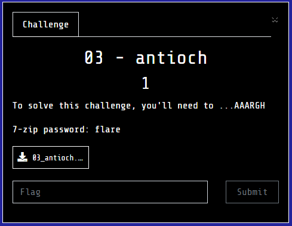
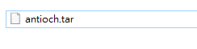
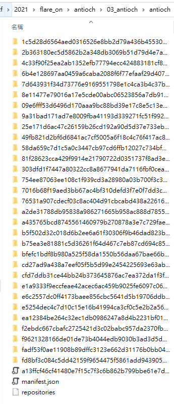
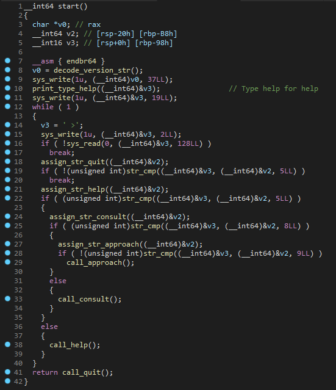
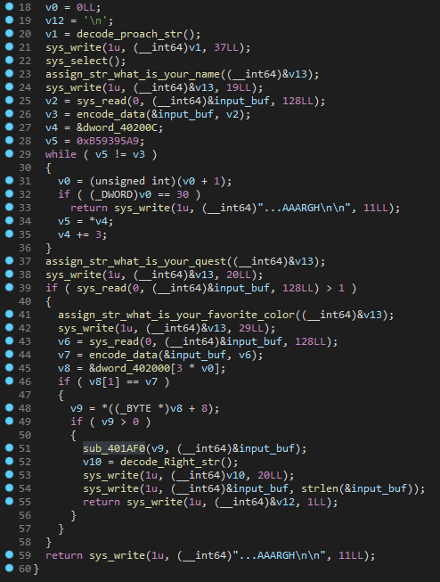
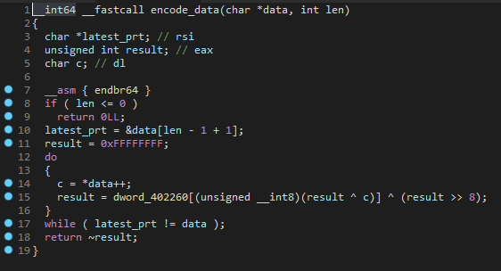
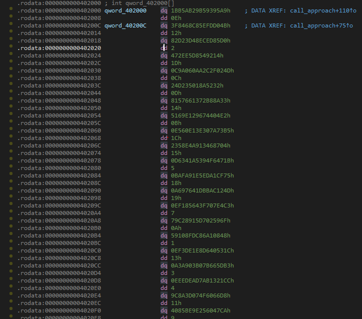
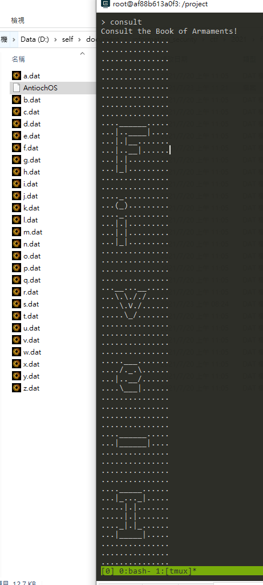
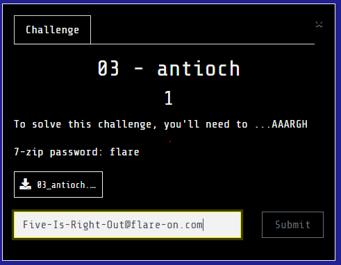

# antioch

## Problem

  

## Solution

裡面是個tar檔案  
  
接著解開看看  
  
檔案結構看起來很像是種版控，接著在repositories看到以下片段，因此判斷`7016b68f19aed3bb67ac4bf310defd3f7e0f7dd3ce544177c506d795f0b2acf3`應該是最後的版本  
```json
{"antioch":{"latest":"7016b68f19aed3bb67ac4bf310defd3f7e0f7dd3ce544177c506d795f0b2acf3"}}
```
接著看了一下``資料夾的內容，在json中看到  
```json
{
    "id": "7016b68f19aed3bb67ac4bf310defd3f7e0f7dd3ce544177c506d795f0b2acf3",
    "created": "2021-07-23T03:21:55.959771124Z",
    "container": "5a7d890eaf80df63166dedb6c0f0afaa26894ba10dd647671da887cfe2ce4349",
    "container_config": {
        "Hostname": "5a7d890eaf80",
        "Domainname": "",
        "User": "",
        "AttachStdin": false,
        "AttachStdout": false,
        "AttachStderr": false,
        "Tty": false,
        "OpenStdin": false,
        "StdinOnce": false,
        "Env": [
            "PATH=/usr/local/sbin:/usr/local/bin:/usr/sbin:/usr/bin:/sbin:/bin"
        ],
        "Cmd": [
            "/bin/sh",
            "-c",
            "#(nop) ",
            "CMD [\"/AntiochOS\"]"
        ],
        "Image": "sha256:72081c09b8504bda08787ba6ea0c5059e74464398cb92685b3c86a26230b8a1f",
        "Volumes": null,
        "WorkingDir": "",
        "Entrypoint": null,
        "OnBuild": null,
        "Labels": {}
    },
    "docker_version": "20.10.2",
    "config": {
        "Hostname": "",
        "Domainname": "",
        "User": "",
        "AttachStdin": false,
        "AttachStdout": false,
        "AttachStderr": false,
        "Tty": false,
        "OpenStdin": false,
        "StdinOnce": false,
        "Env": [
            "PATH=/usr/local/sbin:/usr/local/bin:/usr/sbin:/usr/bin:/sbin:/bin"
        ],
        "Cmd": [
            "/AntiochOS"
        ],
        "Image": "sha256:72081c09b8504bda08787ba6ea0c5059e74464398cb92685b3c86a26230b8a1f",
        "Volumes": null,
        "WorkingDir": "",
        "Entrypoint": null,
        "OnBuild": null,
        "Labels": null
    },
    "architecture": "amd64",
    "os": "linux"
}
```
有些docker相關字樣，猜這個可能是docker repository的結構，研究了一下發現是跟`docker manifest`有關的東西，之前沒碰過剛好來學學。  

可以用下面的命令將image建立起來  

```shell
$ docker load --input antioch.tar
d26c760acd6e: Loading layer  14.85kB/14.85kB
Loaded image: antioch:latest
```

剛開始先直接執行container

```shell
λ docker run --name antiochOS antioch
AntiochOS, version 1.32 (build 1975)
Type help for help
>
```

但不知道什麼原因會直接結束，因此直接分析主要程式囉!  

在分析完manifest.json後，可以得知會執行`CMD [\"/AntiochOS\"]`，現在目標要先找出執行檔在哪?  
在繼續看了後，可以看到在`repositories`中，latest為`7016b68f19aed3bb67ac4bf310defd3f7e0f7dd3ce544177c506d795f0b2acf3`，接著到該資料夾中，並解開`layer.tar`，發現到裡面確實有`AntiochOS`這個ELF檔案，接著就開始分析囉!  

在分析與整理好code後，在要功能會有`quit`, `help`, `consult`, `approach`  
  
再繼續分析的情況下發現關鍵在`approach`中  
  

這邊可以觀察到第一段29~35行的區塊，在執行到第30次會跳出這隻程式，所以注意這段!  
接著在39~58行這區塊可以觀察到開始做一些字串計算及判斷，當條件達成時還會顯示出來，因此猜測關鍵在這，就開始分析計算過程囉!  

在分析的過程中突然想到可以自己寫dockerfile去執行`AntiochOS`，這樣也可以方便之後要動態Debug  

```docker
# Dockerfile
FROM antioch:latest as antioch-container

FROM ubuntu:18.04

RUN mkdir /project
WORKDIR /project

COPY --from=antioch-container /AntiochOS AntiochOS
```

```shell
$ docker build -f Dockerfile -t ubantioch .
$ docker run -it --name ua ubantioch /bin/bash
root@cf2c385ce95c:/project# ls
AntiochOS
```

接著我們在先試著通過第一段(29~35行)，我們需要先逆推過encode_data(26行)  
  
分析了一下程式，來試試看能不能逆推，但思考了一整天還是想不出怎麼逆推回去，可能關鍵點不在這上面?  

想了很久，感覺可能出在那堆沒用到的layer，就開始來思考囉，接著找到程式中有某些片段，出現很像index的東西，以及個數剛好跟沒用到的layer個數一樣  
  

在跟twitter的網友討論後，發現approach的第一道題目`What is your name?`就是個layer的json上的`author`，而第二道題目無意義，主要是第三個題目`What is your favorite color?`，接著就來爆破囉!  

接著想因為上面的表有index相關的東西，而author丟進去運算後，猜測落在的點的第三個數字就是layer的index，因此就寫了個[script](decode.py)來解開這東西囉!

得出: (Bridge Keeper不知道為什麼有問題，因為只有一個有問題，就不管他了)  

```text
  4: Dragon of Angnor               | .\antioch\09e6fff53d6496d170aaa9bc88bd39e17c8e5c13ee9066935b089ab0312635ef\json
 13: Roger the Shrubber             | .\antioch\1c5d28d6564aed0316526e8bb2d79a436b45530d2493967c8083fea2b2e518ce\json
 28: Dinky                          | .\antioch\25e171d6ac47c26159b26cd192a90d5d37e733eb16e68d3579df364908db30f2\json
 27: Dennis the Peasant             | .\antioch\2b363180ec5d5862b2a348db3069b51d79d4e7a277d5cf5e4afe2a54fc04730e\json
 25: Sir Ector                      | .\antioch\303dfd1f7447a80322cc8a8677941da7116fbf0cea56e7d36a4f563c6f22e867\json
 17: A Famous Historian             | .\antioch\49fb821d2bf6d6841ac7cf5005a6f18c4c76f417ac8a53d9e6b48154b5aa1e76\json
  3: Tim the Enchanter              | .\antioch\4c33f90f25ea2ab1352efb77794ecc424883181cf8e6644946255738ac9f5dbd\json
 15: Sir Gawain                     | .\antioch\58da659c7d1c5a0c3447cb97cd6ffb12027c734bfba32de8b9b362475fe92fae\json
 11: Trojan Rabbit                  | .\antioch\6b4e128697aa0459a6caba2088f6f77efaaf29d407ec6b58939c9bc7814688ad\json
  7: Sir Robin                      | .\antioch\754ee87063ee108c1f939cd3a28980a03b700f3c3967df8058831edad2743fd7\json
 10: Green Knight                   | .\antioch\76531a907cdecf03c8ac404d91cbcabd438a226161e621fab103a920600372a8\json
  6: Sir Bedevere                   | .\antioch\7d643931f34d73776e9169551798e1c4ca3b4c37b730143e88171292dbe99264\json
  9: Squire Concorde                | .\antioch\81f28623cca429f9914e21790722d0351737f8ad3e823619a4f7019be72e2195\json
 21: Sir Not-Appearing-in-this-Film | .\antioch\8e11477e79016a17e5cde00abc06523856a7db9104c0234803d30a81c50d2b71\json
 16: Legendary Black Beast of Argh  | .\antioch\9a31bad171ad7e8009fba41193d339271fc51f992b8d574c501cae1bfa6c3fe2\json
 30: Sir Gallahad                   | .\antioch\a2de31788db95838a986271665b958ac888d78559aa07e55d2a98fc3baecf6e6\json
 19: Lady of the Lake               | .\antioch\a435765bcd8745561460979b270878a3e7c729fae46d9e878f4c2d42e5096a44\json
  8: Zoot                           | .\antioch\b5f502d32c018d6b2ee6a61f30306f9b46dad823ba503eea5b403951209fd59b\json
  1: Miss Islington                 | .\antioch\b75ea3e81881c5d36261f64d467c7eb87cd694c85dd15df946601330f36763a4\json
 12: Chicken of Bristol             | .\antioch\bfefc1bdf8b980a525f58da1550b56daa67bae66b56e49b993fff139faa1472c\json
 20: Rabbit of Caerbannog           | .\antioch\cd27ad9a438a7eef05f5b5d99e2454225693e63aba29ce8553800fed23575040\json
 29: Black Knight                   | .\antioch\cfd7ddb31ce44bb24b373645876ac7ea372da1f3f31758f2321cc8f5b29884fb\json
 22: Prince Herbert                 | .\antioch\e1a9333f9eccfeae42acec6ac459b9025fe6097c065ffeefe5210867e1e2317d\json
  5: Brother Maynard                | .\antioch\e5254dec4c7d10c15e16b41994ca3cf0c5e2b2a56c9d4dc2ef053eeff24333ff\json
 23: King Arthur                    | .\antioch\e6c2557dc0ff4173baee856cbc5641d5b19706ddb4368556fcdb046f36efd2e2\json
  2: Sir Bors                       | .\antioch\ea12384be264c32ec1db0986247a8d4b2231bf017742313c01b05a7e431d9c26\json
 26: Squire Patsy                   | .\antioch\f2ebdc667cbafc2725421d3c02babc957da2370fbd019a9e1993d8b0409f86dd\json
   : Bridge Keeper                  | .\antioch\f9621328166de01de73b4044edb9030b3ad3d5dbc61c0b79e26f177e9123d184\json
 24: Inspector End Of Film          | .\antioch\fadf53f0ae11908b89dffc3123e662d31176b0bb047182bfec51845d1e81beb9\json
 18: Sir Lancelot                   | .\antioch\fd8bf3c084c5dd42159f9654475f5861add943905d0ad1d3672f39e014757470\json
```

接著就按照index的順序，依序把裡面的.dat覆蓋到跟AntiochOS同一個資料夾當中，最後執行`consult`就得到flag囉!  

  
  
