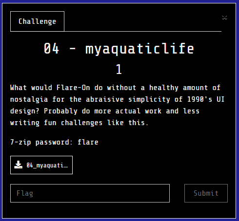
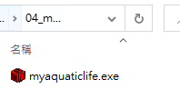
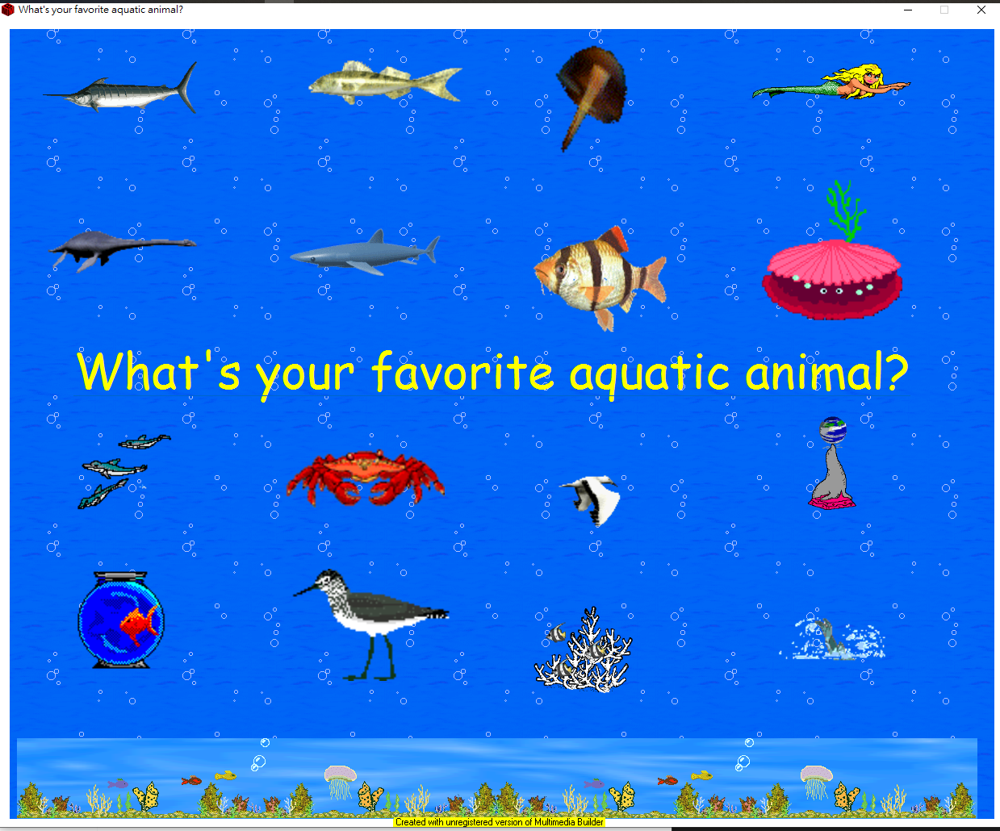
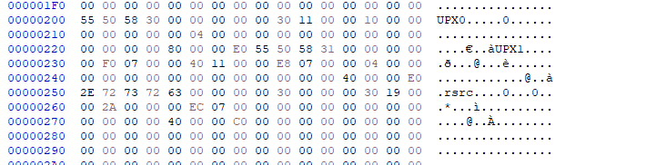
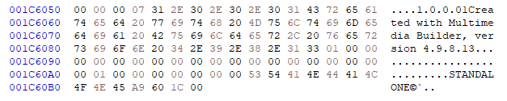
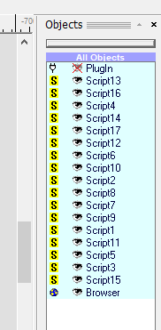
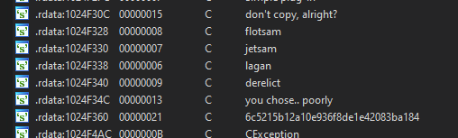

# myaquaticlife (unsolved)

## Problem

  

## Solution

剛開始拿到一個exe file  
  
程式執行畫面  
  

要分析時發現他有用upx包起來，所以要先unpack掉再繼續分析  
  

接著注意到程式底下寫著`Multimedia Builder`  
試著找找decompile程式: [MMUnbuilder](https://github.com/qprotex/MMUnbuilder)  
解開後看內容看到`1.0.0.01Created with Multimedia Builder, version 4.9.8.13`  
  

接著找找符合該版本的程式囉  

找到並開啟後，發現他有很多objects的東西  
  
分析了一下，看到按圖片時會載入特定的plugin，主要有四種類型的plugin: `flotsam`, `derelict`, `lagan`, `jetsam`，試了很多方式，都沒什麼反應，應該是還漏了什麼  

接著在程式的路經中(C:\Users\user\AppData\Local\Temp\MMBPlayer)找到一個`fathom.dll`檔案，並且在裡面發現上面提到的四種類型關鍵字  

  

