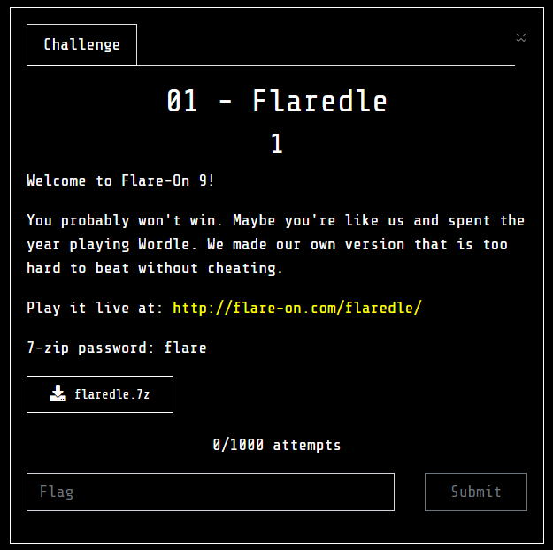
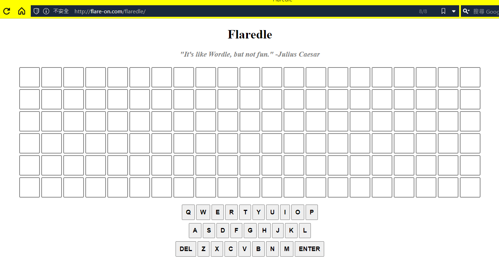
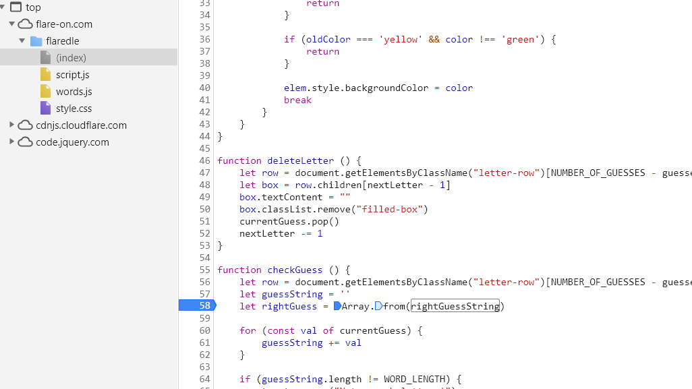
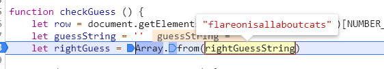
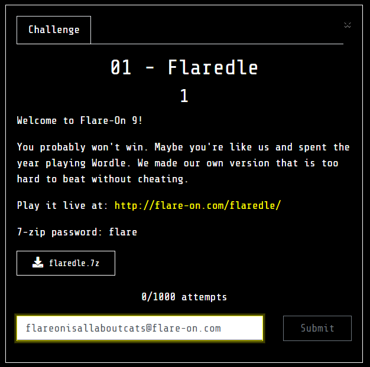

# flaredle

## Problem
  

## Solution

點選 live web 後會顯示:  

  

然後他附的 7z 裡面是該網站的 source code ，稍微看了一下找到幾個關鍵片段。

```js
let rightGuessString = WORDS[CORRECT_GUESS];
...
function checkGuess () {
    let row = document.getElementsByClassName("letter-row")[NUMBER_OF_GUESSES - guessesRemaining]
    let guessString = ''
    let rightGuess = Array.from(rightGuessString)
...
    if (guessString === rightGuessString) {
		let flag = rightGuessString + '@flare-on.com';
		toastr.options.timeOut = 0;
		toastr.options.onclick = function() {alert(flag);}
        toastr.success('You guessed right! The flag is ' + flag);
```

看起來他正確答案已經算好了，剛開始直接用 devtool 的 f12 沒辦法顯示，所以就改在 js file 下斷點，就解出來了。

  
  

得到 flag
  
