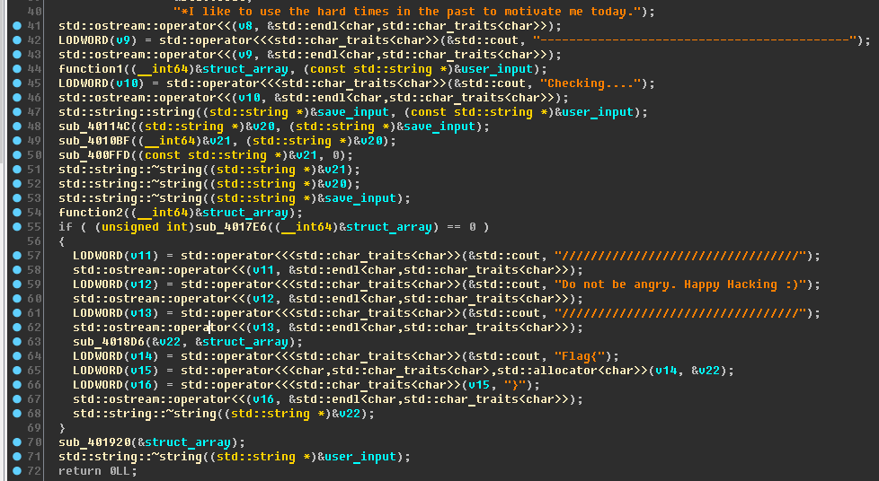
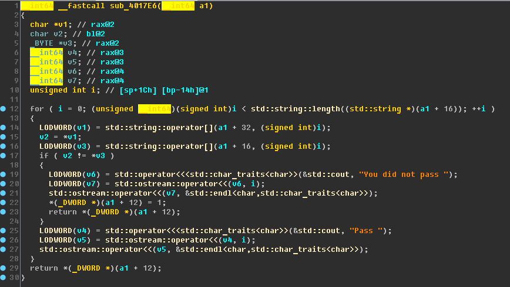

#The Rock [100]

##Problem

##Soultion

將程式丟進IDA:   
   

稍微分析一下，發現關鍵在44, 54, 55行。   

44行：   
   
它在第11行時，會把奇怪的字串丟進某個地方。

54行：   
   
它會把使用者輸入的東西做些計算再放回去。

55行:
   
它會將第44行的那個奇怪字串和54行轉換後的字串做比較，一樣的話就會輸出flag。

因此我們只要將那個奇怪的字串逆推回去就能拿到正確的輸入了。   
   

program:[pass.py](pass.py)  
