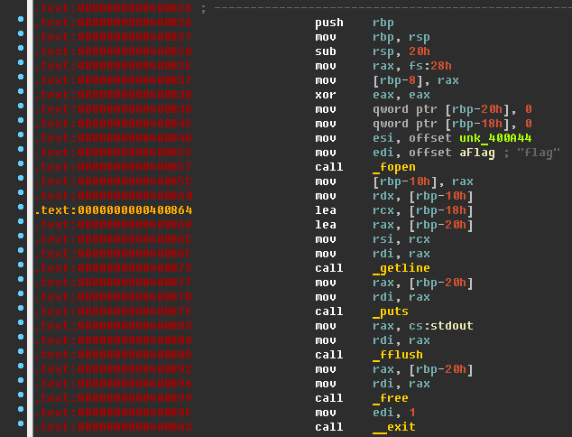
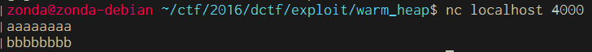
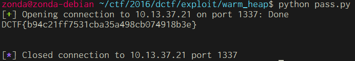

#Warm heap [100]

##Problem

  

##Soultion

將程式丟進IDA:  
  

可以看到它會先malloc一塊空間，給了一個數字後，然後再malloc一個空間，並且讓現在空間+1的地方指向它，一共做2次。
然後在將後來輸入的字串放入該空間+1所指向的地方，這也一共做2次後，就exit(0)離開程式。  

繼續翻找其他地方可以發現一個有趣的地方。  
  
主辦方幫我們把讀取並顯示flag的區段寫好在裡面了，所以之後只要跳過來這裡就可以噴出flag了。  

接下來開啟qira並試著輸入一些東西，再去看heap的內容。  

我試著輸入aaaaaaaa和bbbbbbbb  
  

然後從qira看heap的內容  
  

可以發現有4個heap的空間，分別是0x602000, 0x602020, 0x602040, 0x602060。  

根據我上面所講的，可以看到0x602010內容為1，也就是main的第10行，將1放入0x602010，而0x602018的地方為0x602030，就是main的第11行，將它指向新malloc出來的空間。  
再看到0x602030的內容為aaaaaaaa，是在main的15, 16行時，將輸入到s的字串，以strcpy的方式，放入0x602018所指向的0x602030中，後面bbbbbbbb的以此類推。  

現在仔細的觀察以及想一下，可以發現它輸入最大為4096個字，但它malloc的空間不但沒這麼大，而且它使用strcpy的關係，沒做長度限制，因此第一次輸入的東西可以蓋到後面heap的內容，甚至改變第2次輸入後，所要放入的空間位址，造成任意記憶體寫入。  

所以我們現在可以在第一次輸入時，將第2次要放入的空間位址改成exit的got位址，然後在第2次輸入時，將內容改成0x400826，就可以噴出flag了。  

Exploit: [pass.py](pass.py)

